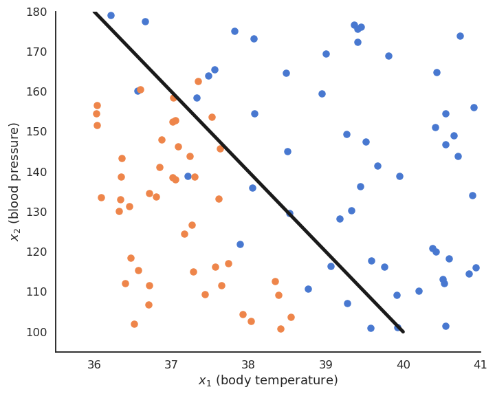

# 1 - Hard linear classification

#  Binary classification

* The training data $\mathcal{D}$ is composed of $N$ examples $(\mathbf{x}_i, t_i)_{i=1..N}$ , with a d-dimensional input vector $\mathbf{x}_i \in \Re^d$ and a binary output $t_i \in \{-1, +1\}$

* The data points where $t = + 1$ are called the **positive class**, the other the **negative class**.

{width=50%}

#  Binary classification

* For example, the inputs $\mathbf{x}_i$ can be images (one dimension per pixel) and the positive class corresponds to cats ($t_i = +1$), the negative class to dogs ($t_i = -1$).

::: footer
<http://adilmoujahid.com/posts/2016/06/introduction-deep-learning-python-caffe>
:::

#  Binary linear classification

* We want to find the hyperplane $(\mathbf{w}, b)$ of $\Re^d$ that correctly separates the two classes.

#  Binary linear classification

::: {.columns}
::: {.column width=50%}

* For a point $\mathbf{x} \in \mathcal{D}$, $\langle \mathbf{w} \cdot \mathbf{x} \rangle +b$  is the projection of $\mathbf{x}$  onto the hyperplane $(\mathbf{w}, b)$.

    * If $\langle \mathbf{w} \cdot \mathbf{x} \rangle +b > 0$, the point is
        above the hyperplane.

    * If $\langle \mathbf{w} \cdot \mathbf{x} \rangle +b < 0$, the point is
        below the hyperplane.

    * If $\langle \mathbf{w} \cdot \mathbf{x} \rangle +b = 0$, the point is
        on the hyperplane.

* By looking at the **sign** of $\langle \mathbf{w} \cdot \mathbf{x} \rangle +b$, we can predict the class of the input:

:::
::: {.column width=50%}

:::
:::

$$\text{sign}(\langle \mathbf{w} \cdot \mathbf{x} \rangle +b) = \begin{cases} +1 \; \text{if} \; \langle \mathbf{w} \cdot \mathbf{x} \rangle +b \geq 0 \\ -1 \; \text{if} \; \langle \mathbf{w} \cdot \mathbf{x} \rangle +b < 0 \\ \end{cases}$$

#  Binary linear classification

* Binary linear classification can be made by a single **artificial neuron** using the sign transfer function.

$$
y = f_{\mathbf{w}, b} (\mathbf{x}) = \text{sign} ( \langle \mathbf{w} \cdot \mathbf{x} \rangle +b )  = \text{sign} ( \sum_{j=1}^d w_j \, x_j +b )
$$

::: {.columns}
::: {.column width=50%}

:::
::: {.column width=50%}

* $\mathbf{w}$ is the weight vector and $b$ is the bias.

:::
:::

# Linearly separable datasets

* Linear classification is the process of finding an hyperplane $(\mathbf{w}, b)$ that correctly separates the two classes.

* If such an hyperplane can be found, the training set is said **linearly separable**.

* Otherwise, the problem is **non-linearly separable** and other methods have to be applied (MLP, SVM...).

# Linear classification as an optimization problem

* The Perceptron algorithm tries to find the weights and biases minimizing the **mean square error** (*mse*) or **quadratic loss**:

$$\mathcal{L}(\mathbf{w}, b) = \mathbb{E}_\mathcal{D} [(t_i - y_i)^2] \approx \frac{1}{N} \, \sum_{i=1}^{N} (t_i - y_i)^2$$

* When the prediction $y_i$ is the same as the data $t_i$ for all examples in the training set (perfect classification), the mse is minimal and equal to 0.

* We can apply gradient descent to find this minimum.

$$
\begin{cases}
    \Delta \mathbf{w} = - \eta \, \nabla_\mathbf{w} \, \mathcal{L}(\mathbf{w}, b)\\
    \\
    \Delta b = - \eta \, \nabla_b \, \mathcal{L}(\mathbf{w}, b)\\
\end{cases}
$$

# Linear classification as an optimization problem

* Let's search for the partial derivative of the quadratic error function with respect to the weight vector:

$$
    \nabla_\mathbf{w} \, \mathcal{L}(\mathbf{w}, b) = \nabla_\mathbf{w} \,  \frac{1}{N} \, \sum_{i=1}^{N} (t_i - y_i )^2 = \frac{1}{N} \, \sum_{i=1}^{N} \nabla_\mathbf{w} \,  (t_i - y_i )^2 = \frac{1}{N} \, \sum_{i=1}^{N} \nabla_\mathbf{w} \,  \mathcal{l}_i (\mathbf{w}, b)
$$

::: {.columns}
::: {.column width=60%}

* Everything is similar to linear regression until we get:

$$
    \nabla_\mathbf{w} \,  \mathcal{l}_i (\mathbf{w}, b) = - 2 \, (t_i - y_i) \, \nabla_\mathbf{w} \, \text{sign}( \langle \mathbf{w} \cdot \mathbf{x}_i \rangle +b)
$$

* In order to continue with the chain rule, we would need to differentiate $\text{sign}(x)$.

$$
    \nabla_\mathbf{w} \,  \mathcal{l}_i (\mathbf{w}, b) = - 2 \, (t_i - y_i) \, \text{sign}'( \langle \mathbf{w} \cdot \mathbf{x}_i \rangle +b) \,  \mathbf{x}_i 
$$

* But the sign function is **not** differentiable...

:::
::: {.column width=40%}

:::
:::

# Linear classification as an optimization problem

* We will simply pretend that the sign() function is linear, with a derivative of 1:

$$
    \nabla_\mathbf{w} \,  \mathcal{l}_i (\mathbf{w}, b) = - 2 \, (t_i - y_i) \,   \mathbf{x}_i 
$$

* The update rule for the weight vector $\mathbf{w}$ and the bias $b$ is therefore the same as in linear regression:

$$
\begin{cases}
    \Delta \mathbf{w} =  \eta \, \frac{1}{N} \, \sum_{i=1}^{N} (t_i - y_i) \, \mathbf{x}_i\\
    \\
    \Delta b = \eta \, \frac{1}{N} \, \sum_{i=1}^{N} (t_i - y_i )\\
\end{cases}
$$

# Batch version of linear classification

* By applying gradient descent on the quadratic error function, one obtains the following algorithm:

:::{.callout-tip}
### Batch linear classification

* **for** $M$ epochs:

    * $\mathbf{dw} = 0 \qquad db = 0$

    * **for** each sample $(\mathbf{x}_i, t_i)$:

        * $y_i =  \text{sign}( \langle \mathbf{w} \cdot \mathbf{x}_i \rangle + b)$

        * $\mathbf{dw} = \mathbf{dw} + (t_i - y_i) \, \mathbf{x}_i$

        * $db = db + (t_i - y_i)$

    * $\Delta \mathbf{w} = \eta \, \frac{1}{N} \, \mathbf{dw}$

    * $\Delta b = \eta \, \frac{1}{N} \, db$

:::

* This is called the **batch** version of the Perceptron algorithm.

* If the data is linearly separable and $\eta$ is well chosen, it converges to the minimum of the mean square error.

# Linear classification: batch version

# Linear classification: batch version

# Online version of linear classification : the Perceptron algorithm

* The **Perceptron algorithm** was invented by the psychologist Frank Rosenblatt in 1958. It was the first algorithmic neural network able to learn linear classification.

:::{.callout-tip}
### Perceptron algorithm

* **for** $M$ epochs:

    * **for** each sample $(\mathbf{x}_i, t_i)$:

        * $y_i =  \text{sign}( \langle \mathbf{w} \cdot \mathbf{x}_i \rangle + b)$

        * $\Delta \mathbf{w} = \eta \, (t_i - y_i) \, \mathbf{x}_i$

        * $\Delta b = \eta \, (t_i - y_i)$
:::

* This algorithm iterates over all examples of the training set and applies the **delta learning rule** to each of them immediately, not at the end on the whole training set.

* One could check whether there are still classification errors on the training set at the end of each epoch and stop the algorithm.

* The delta learning rule depends on the learning rate $\eta$, the error made by the prediction ($t_i - y_i$) and the input $\mathbf{x}_i$.

# Linear classification: online version

# Linear classification: online version

# Batch vs. Online learning

* The mean square error is defined as the **expectation** over the data:

$$\mathcal{L}(\mathbf{w}, b) = \mathbb{E}_\mathcal{D} [(t_i - y_i)^2]$$

::: {.columns}
::: {.column width=50%}

* **Batch learning** uses the whole training set as samples to estimate the mse:

$$\mathcal{L}(\mathbf{w}, b) \approx \frac{1}{N} \, \sum_{i=1}^{N} (t_i - y_i)^2$$

$$
    \Delta \mathbf{w} = \eta \, \frac{1}{N} \sum_{i=1}^{N} (t_i - y_i ) \, \mathbf{x_i}
$$

:::
::: {.column width=50%}

* **Online learning** uses a single sample to estimate the mse:

$$\mathcal{L}(\mathbf{w}, b) \approx (t_i - y_i)^2$$

$$
    \Delta \mathbf{w} = \eta \, (t_i - y_i) \, \mathbf{x_i}
$$

:::
:::

* Batch learning has less bias (central limit theorem) and is less sensible to noise in the data, but is very slow.

* Online learning converges faster, but can be instable and overfits (high variance). 

# Stochastic Gradient Descent - SGD

* In practice, we use a trade-off between batch and online learning called **Stochastic Gradient Descent (SGD)** or **Minibatch Gradient Descent**.

::: {.columns}
::: {.column width=50%}

* The training set is randomly split at each epoch into small chunks of data (a **minibatch**, usually 32 or 64 examples) and the batch learning rule is applied on each chunk.

$$
    \Delta \mathbf{w} = \eta \, \frac{1}{K} \sum_{i=1}^{K} (t_i - y_i) \, \mathbf{x_i}
$$

* If the **batch size** is well chosen, SGD is as stable as batch learning and as fast as online learning.

* The minibatches are randomly selected at each epoch (i.i.d).

:::
::: {.column width=50%}

:::
:::

* Online learning is a stochastic gradient descent with a batch size of 1.

# 2 - Maximum Likelihood Estimation

# Maximum Likelihood Estimation

::: {.columns}
::: {.column width=50%}

* Let's consider $N$ **samples** $\{x_i\}_{i=1}^N$ independently taken from a **normal distribution** $X$.

* The probability density function (pdf) of a normal distribution is:

$$
    f(x ; \mu, \sigma) =  \frac{1}{\sqrt{2\pi \sigma^2}} \, \exp{- \frac{(x - \mu)^2}{2\sigma^2}}
$$

where $\mu$ is the mean of the distribution and $\sigma$ its standard deviation.

:::
::: {.column width=50%}

:::
:::

* The problem is to find the values of $\mu$ and $\sigma$ which explain best the observations $\{x_i\}_{i=1}^N$.

# Maximum Likelihood Estimation

::: {.columns}
::: {.column width=50%}

* The idea of MLE is to maximize the joint density function for all observations. This function is expressed by the **likelihood function**:

$$
    L(\mu, \sigma) = P( x ; \mu , \sigma  )  = \prod_{i=1}^{N} f(x_i ; \mu, \sigma )
$$

* When the pdf takes high values for all samples, it is quite likely that the samples come from this particular distribution.

* The likelihood function reflects the probability that the parameters $\mu$ and $\sigma$ explain the observations $\{x_i\}_{i=1}^N$.

:::
::: {.column width=50%}

:::
:::

# Maximum Likelihood Estimation

* We therefore search for the values $\mu$ and $\sigma$ which **maximize** the likelihood function.

$$
    \text{max}_{\mu, \sigma} \quad L(\mu, \sigma) = \prod_{i=1}^{N} f(x_i ; \mu, \sigma )
$$

* For the normal distribution, the likelihood function is:

$$
\begin{aligned}
    L(\mu, \sigma) & = \prod_{i=1}^{N} f(x_i ; \mu, \sigma ) \\
                   & = \prod_{i=1}^{N} \frac{1}{\sqrt{2\pi \sigma^2}} \, \exp{- \frac{(x_i - \mu)^2}{2\sigma^2}}\\
                   & =  (\frac{1}{\sqrt{2\pi \sigma^2}})^N \, \prod_{i=1}^{N} \exp{- \frac{(x_i - \mu)^2}{2\sigma^2}}\\
                   & =  (\frac{1}{\sqrt{2\pi \sigma^2}})^N \, \exp{- \frac{\sum_{i=1}^{N}(x_i - \mu)^2}{2\sigma^2}}\\
\end{aligned}
$$

# Maximum Likelihood Estimation

* To find the maximum of $L(\mu, \sigma)$, we need to search where the gradient is equal to zero:

$$
\begin{cases}
    \dfrac{\partial L(\mu, \sigma)}{\partial \mu} = 0 \\
    \dfrac{\partial L(\mu, \sigma)}{\partial \sigma} = 0 \\
\end{cases}
$$

* The likelihood function is complex to differentiate, so we consider its logarithm $l(\mu, \sigma) = \log(L(\mu, \sigma))$ which has a maximum for the same value of $(\mu, \sigma)$ as the log function is monotonic.

$$
\begin{aligned}
    l(\mu, \sigma) & = \log(L(\mu, \sigma)) \\
                   & =  \log \left((\frac{1}{\sqrt{2\pi \sigma^2}})^N \, \exp{- \frac{\sum_{i=1}^{N}(x_i - \mu)^2}{2\sigma^2}} \right)\\
                   & =  - \frac{N}{2} \log (2\pi \sigma^2) - \frac{\sum_{i=1}^{N}(x_i - \mu)^2}{2\sigma^2}\\
\end{aligned}
$$

* $l(\mu, \sigma)$ is called the **log-likelihood** function.

# Maximum Likelihood Estimation

$$
\begin{aligned}
    l(\mu, \sigma) & =  - \frac{N}{2} \log (2\pi \sigma^2) - \frac{\sum_{i=1}^{N}(x_i - \mu)^2}{2\sigma^2}\\
\end{aligned}
$$

* The maximum of the log-likelihood function respects:

$$
\begin{aligned}
    \frac{\partial l(\mu, \sigma)}{\partial \mu} & = \frac{\sum_{i=1}^{N}(x_i - \mu)}{\sigma^2} = 0 \\
    \frac{\partial l(\mu, \sigma)}{\partial \sigma} & = - \frac{N}{2} \frac{4 \pi \sigma}{2 \pi \sigma^2} + \frac{\sum_{i=1}^{N}(x_i - \mu)^2}{\sigma^3} \\
                                                    & = - \frac{N}{\sigma} + \frac{\sum_{i=1}^{N}(x_i - \mu)^2}{\sigma^3} = 0\\
\end{aligned}
$$

* We obtain:

$$
    \mu = \frac{1}{N} \sum_{i=1}^{N} x_i  \qquad\qquad    \sigma^2 = \frac{1}{N} \sum_{i=1}^{N}(x_i - \mu)^2
$$

# Maximum Likelihood Estimation

* Unsurprisingly, the mean and variance of the normal distribution which best explains the data are the mean and variance of the data...

$$
    \mu = \frac{1}{N} \sum_{i=1}^{N} x_i  \qquad\qquad    \sigma^2 = \frac{1}{N} \sum_{i=1}^{N}(x_i - \mu)^2
$$

* The same principle can be applied to estimate the parameters of any distribution: normal, exponential, Bernouilli, Poisson, etc...

* When a machine learning method has an probabilistic interpretation (i.e. it outputs probabilities), MLE can be used to find its parameters.

* One can use global optimization like here, or gradient descent to estimate the parameters iteratively.

# 3 - Soft linear classification : Logistic regression

# Reminder: Logistic regression

* We want to perform a regression, but where the targets $t_i$ are bounded betwen 0 and 1.

{width=30%}

* We can use a logistic function instead of a linear function in order to transform the net activation into an output:

$$
\begin{aligned}
    y = \sigma(w \, x + b )  = \frac{1}{1+\exp(-w \, x - b )}
\end{aligned}
$$

# Use of logistic regression for soft classification

* Logistic regression can be used in binary classification if we consider $y = \sigma(w \, x + b )$ as the probability that the example belongs to the positive class ($t=1$).

$$
    P(t = 1 | x; w, b) = y ; \qquad P(t = 0 | x; w, b) = 1 - y
$$

* The output $t$ therefore comes from a Bernouilli distribution $\mathcal{B}$ of parameter $p = y = f_{w, b}(x)$. The probability density function (pdf) is:

$$f(t | x; w, b) = y^t \, (1- y)^{1-t}$$

* If we consider our training samples $(x_i, t_i)$ as independently taken from this distribution, our task is:

    * to find the parameterized distribution that best explains the data, which means:

    * to find the parameters $w$ and $b$ maximizing the **likelihood** that the samples $t$ come from a Bernouilli distribution when $x$, $w$  and $b$ are given.

* We only need to apply **Maximum Likelihood Estimation** (MLE) on this Bernouilli distribution!

# MLE for logistic regression

* The likelihood function for logistic regression is :

$$
\begin{aligned}
    L( w, b) &= P( t | x; w,  b )  = \prod_{i=1}^{N} f(t_i | x_i;  w,  b ) \\
    &= \prod_{i=1}^{N}  y_i^{t_i} \, (1- y_i)^{1-t_i}
\end{aligned}
$$

* The likelihood function is quite hard to differentiate, so we take the *log-likelihood* function:

$$
\begin{aligned}
    l( w, b) &= \log L( w, b) \\
    &=  \sum_{i=1}^{N} [t_i \, \log y_i + (1 - t_i) \, \log( 1- y_i)]\\
\end{aligned}
$$

* or even better: the **negative log-likelihood** which will be minimized using gradient descent:

$$
    \mathcal{L}( w, b) =  - \sum_{i=1}^{N} [t_i \, \log y_i + (1 - t_i) \, \log( 1- y_i)]
$$

# MLE for logistic regression

* We then search for the minimum of the negative log-likelihood function by computing its gradient (here for a single sample):

$$
\begin{aligned}
    \frac{\partial \mathcal{l}_i(w, b)}{\partial w}
        &= -\frac{\partial}{\partial w} [ t_i \, \log y_i + (1 - t_i) \, \log( 1- y_i) ] \\
        &= - t_i \, \frac{\partial}{\partial w} \log y_i - (1 - t_i) \, \frac{\partial}{\partial w}\log( 1- y_i) \\
        &= - t_i \, \frac{\frac{\partial}{\partial w} y_i}{y_i} - (1 - t_i) \, \frac{\frac{\partial}{\partial w}( 1- y_i)}{1- y_i} \\
        &= - t_i \, \frac{y_i \, (1 - y_i) \, x_i}{y_i} + (1 - t_i) \, \frac{y_i \, (1-y_i) \, x_i}{1 - y_i}\\
        &= - ( t_i - y_i ) \, x_i\\
\end{aligned}
$$

* Same gradient as the linear perceptron, but with a non-linear output function!

# Logistic regression for soft classification

* Logistic regression is a regression method used for classification. It uses a non-linear transfer function $\sigma(x)=\frac{1}{1+\exp(-x)}$ applied on the net activation:

$$
    y_i = \sigma(\langle \mathbf{w} \cdot \mathbf{x}_i \rangle + b )
$$

* The continuous output $y$ is interpreted as the probability of belonging to the positive class.

$$
   P(t_i = 1 | \mathbf{x}_i; \mathbf{w}, b) = y_i ; \qquad P(t_i = 0 | \mathbf{x}_i; \mathbf{w}, b) = 1 - y_i
$$

* We minimize the **negative log-likelihood** loss function using gradient descent:

$$
    \mathcal{L}(\mathbf{w}, b) =  - \sum_{i=1}^{N} [t_i \, \log y_i + (1 - t_i) \, \log( 1- y_i)]
$$

* We obtain the delta learning rule, using the class as a target and the probability as a prediction:

$$
    \begin{cases}
    \Delta \mathbf{w} = \eta \, ( t_i - y_i ) \, \mathbf{x}_i \\
    \\
    \Delta b = \eta \, ( t_i - y_i ) \\
    \end{cases}
$$

# Logistic regression

::: {.columns}
::: {.column width=40%}

:::{.callout-tip}
## Logistic regression

* $\mathbf{w} = 0 \qquad b = 0$

* **for** $M$ epochs:

    * **for** each sample $(\mathbf{x}_i, t_i)$:

        * $y_i =  \sigma( \langle \mathbf{w} \cdot \mathbf{x}_i \rangle  + b)$

        * $\Delta \mathbf{w} = \eta \, (t_i - y_i) \, \mathbf{x}_i$

        * $\Delta b = \eta \, (t_i - y_i)$
:::

:::
::: {.column width=60%}

* Logistic regression works just like linear classification, except in the way the prediction is done.

* To know to which class $\mathbf{x}_i$ belongs, simply draw a random number between 0 and 1:

  * if it is smaller than $y_i$ (probability $y_i$), it belongs to the positive class.

  * if it is bigger than $y_i$ (probability $1-y_i$), it belongs to the negative class.

* Alternatively, you can put a **hard limit** at 0.5:

    * if $y_i > 0.5$ then the class is positive.

    * if $y_i < 0.5$ then the class is negative.

:::
:::

# Logistic regression

# Logistic regression and confidence score

::: {.columns}
::: {.column width=50%}

:::
::: {.column width=50%}

* Logistic regression also provides a **confidence score**: 

    * the closer $y$ is from 0 or 1, the more confident we can be that the classification is correct.

* This is particularly important in **safety critical** applications:

    * If you detect the positive class but with a confidence of 0.51, you should perhaps not trust the prediction.

    * If the confidence score is 0.99, you can probably trust the prediction.

:::
:::

