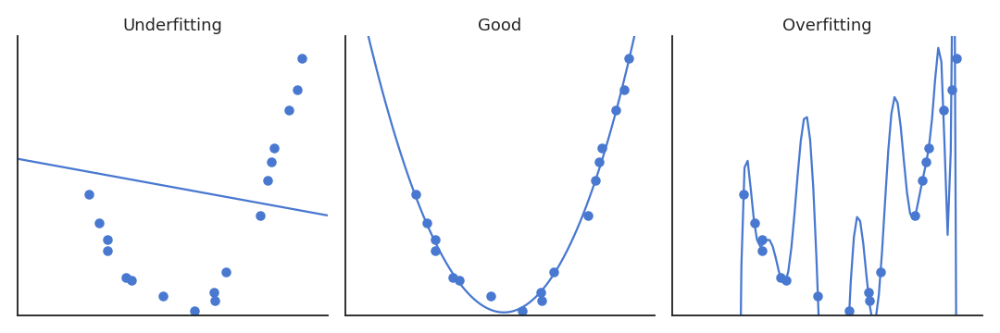
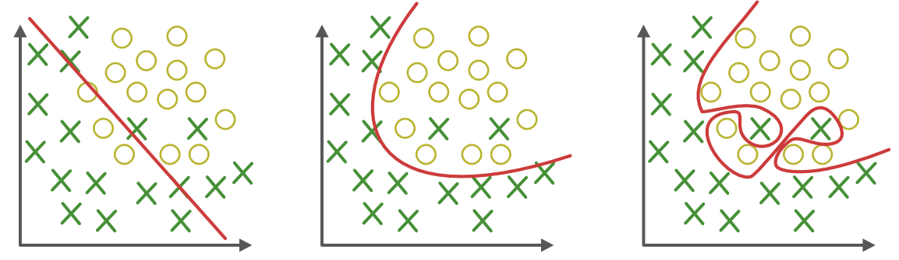
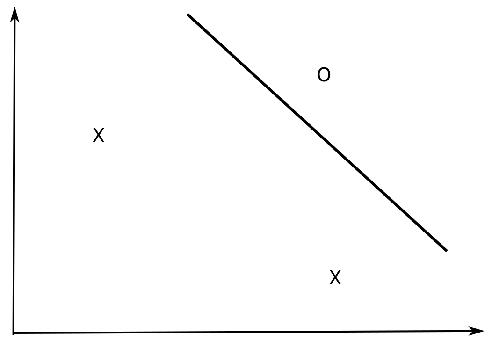
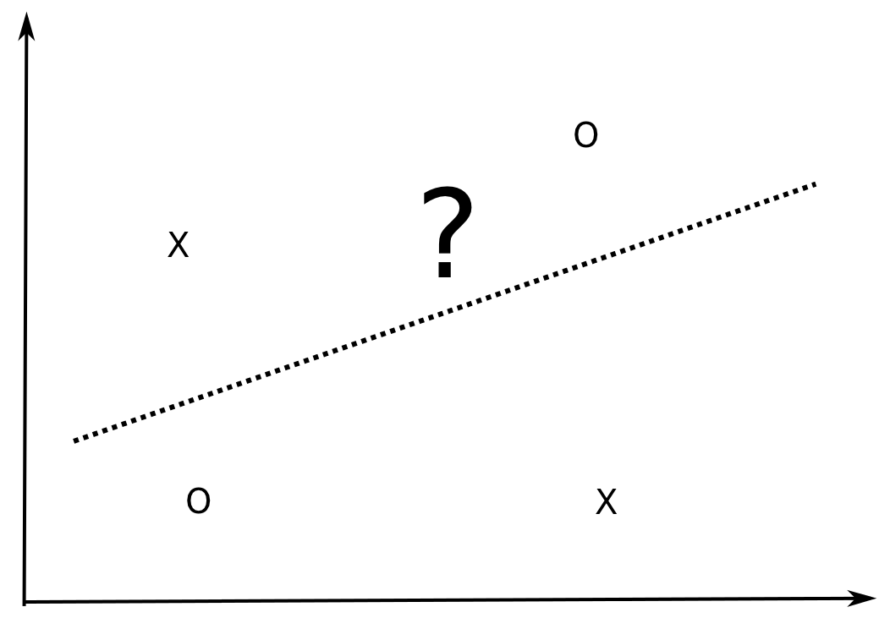
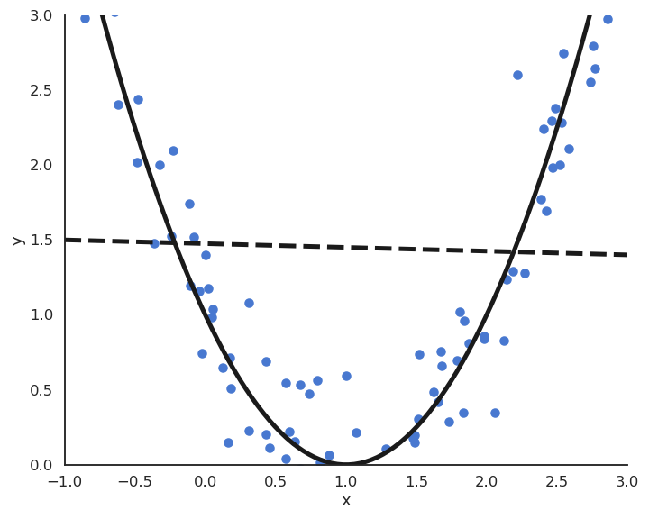
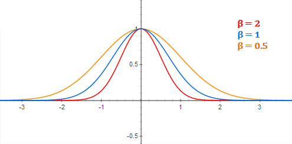
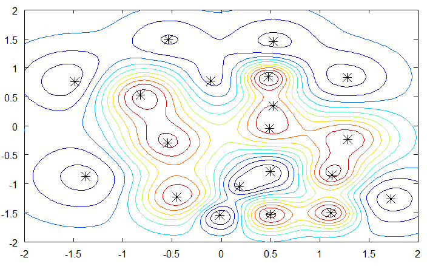
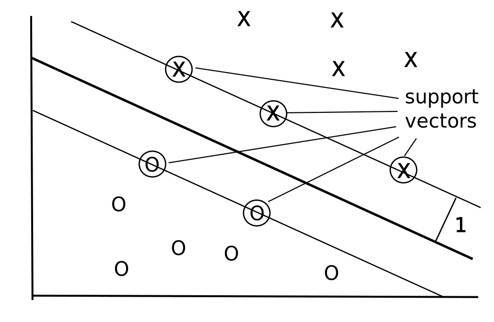

# 1 - Error measurements

# Training vs. Generalization error


::: {.columns}
::: {.column width=30%}


:::
::: {.column width=60%}

* The **training error** is the error made on the training set.

    * Easy to measure for classification: number of misclassified examples divided by the total number.

    $$
        \epsilon_\mathcal{D} = \dfrac{\text{# misclassifications}}{\text{# examples}}
    $$

    * For regression, the mse is generally used.

    * Totally irrelevant on usage: reading the training set has a training error of 0%.

:::
:::


* What matters is the **generalization error**, which is the error that will be made on new examples (not used during learning).

    * Much harder to measure (potentially infinite number of new examples, what is the correct answer?).

    * Often approximated by the **empirical error**: one keeps a number of training examples out of the learning phase and one tests the performance on them.


# Classification errors

::: {.columns}
::: {.column width=50%}


**Confusion matrix**


:::
::: {.column width=50%}


* Classification errors can also depend on the class:

    * **False Positive** errors (FP, false alarm, type I) is when the classifier predicts a positive class for a negative example.

    * **False Negative** errors (FN, miss, type II) is when the classifier predicts a negative class for a positive example.

* **True Positive** (TP) and **True Negative** (TN) are correctly classified examples.

* Is it better to fail to detect a cancer (FN) or to incorrectly predict one (FP)?

:::
:::


::: footer
Source: <https://alliance.seas.upenn.edu/~cis520/dynamic/2017/wiki/index.php?n=Lectures.PrecisionRecall>
:::

# Classification errors

::: {.columns}
::: {.column width=35%}


:::
::: {.column width=65%}


* Error

$$
    \epsilon = \frac{\text{FP} + \text{FN}}{\text{TP} + \text{FP} + \text{TN} + \text{FN}}
$$

* Accuracy (1 - error)

$$
    \text{acc} = \frac{\text{TP} + \text{TN}}{\text{TP} + \text{FP} + \text{TN} + \text{FN}}
$$

* Recall (hit rate, sensitivity) and Precision (specificity)

$$
    R = \frac{\text{TP}}{\text{TP} + \text{FN}} \;\;
    P = \frac{\text{TP}}{\text{TP} + \text{FP}}
$$

* F1 score = harmonic mean of precision and recall

$$
    \text{F1} = \frac{2\, P \, R}{P + R}
$$

:::
:::

::: footer
Source: <https://upload.wikimedia.org/wikipedia/commons/2/26/Precisionrecall.svg>
:::

# Confusion matrix

::: {.columns}
::: {.column width=50%}


* For multiclass classification problems, the **confusion matrix** tells how many examples are correctly classified and where confusion happens.

* One axis is the predicted class, the other is the target class.

* Each element of the matrix tells how many examples are classified or misclassified.

* The matrix should be as diagonal as possible.

:::
::: {.column width=50%}


:::
:::


* Using `scikit-learn`:

```python
from sklearn.metrics import confusion_matrix

m = confusion_matrix(t, y)
```

---

**Overfitting in regression**

{width=80%}

**Overfitting in classification**

{width=80%}

# Cross-validation

* In classification too, **cross-validation** has to be used to prevent overfitting.

* The classifier is trained on the **training set** and tested on the **test set**.

* Optionally, a third **validation set** can be used to track overfitting during training.

{width=70%}


# Training and test data distribution

* Beware: the test data must come from the same distribution as the training data, otherwise it makes no sense.

{width=50%}

# Training and test data distribution

* Beware: the test data must come from the same distribution as the training data, otherwise it makes no sense.

{width=50%}


# 2 - VC dimension

# Vapnik-Chervonenkis dimension of an hypothesis class

How many data examples can be correctly classified by a linear model in $\Re^d$?

{width=60%}

In $\Re^2$, all dichotomies of three non-aligned examples can be correctly classified by a linear model ($y = w_o + w_1 \cdot x_1 + w_2 \cdot x_2$).


# Vapnik-Chervonenkis dimension of an hypothesis class

How many data examples can be correctly classified by a linear model in $\Re^d$?

{width=60%}

In $\Re^2$, all dichotomies of three non-aligned examples can be correctly classified by a linear model ($y = w_o + w_1 \cdot x_1 + w_2 \cdot x_2$).


# Vapnik-Chervonenkis dimension of an hypothesis class

How many data examples can be correctly classified by a linear model in $\Re^d$?

{width=60%}

In $\Re^2$, all dichotomies of three non-aligned examples can be correctly classified by a linear model ($y = w_o + w_1 \cdot x_1 + w_2 \cdot x_2$).


# Vapnik-Chervonenkis dimension of an hypothesis class

How many data examples can be correctly classified by a linear model in $\Re^d$?

{width=60%}

In $\Re^2$, all dichotomies of three non-aligned examples can be correctly classified by a linear model ($y = w_o + w_1 \cdot x_1 + w_2 \cdot x_2$).


# Vapnik-Chervonenkis dimension of an hypothesis class

How many data examples can be correctly classified by a linear model in $\Re^d$?

{width=60%}

However, there exists sets of four examples in $\Re^2$ which can NOT be correctly classified by a linear model, i.e. they are not linearly separable.


# Vapnik-Chervonenkis dimension of an hypothesis class

How many data examples can be correctly classified by a linear model in $\Re^d$?

{width=60%}

However, there exists sets of four examples in $\Re^2$ which can NOT be correctly classified by a linear model, i.e. they are not linearly separable.


# Non-linearly separable data

* The XOR function in $\Re^2$ is for example not linearly separable, i.e. the Perceptron algorithm can not converge.

::: {.columns}
::: {.column width=50%}


:::
::: {.column width=50%}


| $x_1$ |  $x_2$ |  $y$ |
|-------|--------|------|
| $0$   |   $0$  | $0$  |
| $0$   |   $1$  | $1$  |
| $1$   |   $0$  | $1$  |
| $1$   |   $1$  | $0$  |


:::
:::


* The probability that a set of 3 (non-aligned) points in $\Re^2$ is linearly separable is 1, but the probability that a set of four points is linearly separable is smaller than 1 (but not zero).

* When a class of hypotheses $\mathcal{H}$ can correctly classify all points of a training set $\mathcal{D}$, we say that $\mathcal{H}$ **shatters** $\mathcal{D}$.


# Vapnik-Chervonenkis dimension of an hypothesis class

* The **Vapnik-Chervonenkis dimension** $\text{VC}_\text{dim} (\mathcal{H})$ of an hypothesis class $\mathcal{H}$ is defined as the maximal number of training examples that $\mathcal{H}$ can shatter.

* We saw that in $\Re^2$, this dimension is 3:
    
$$\text{VC}_\text{dim} (\text{Linear}(\Re^2) ) = 3$$

* This can be generalized to linear classifiers in $\Re^d$:
  
$$\text{VC}_\text{dim} (\text{Linear}(\Re^d) ) = d+1$$

* This corresponds to the number of **free parameters** of the linear classifier:

  * $d$ parameters for the weight vector, 1 for the bias.

* Given any set of $(d+1)$ examples in $\Re^d$, there exists a linear classifier able to classify them perfectly.

* For other types of (non-linear) hypotheses, the VC dimension is generally proportional to the **number of free parameters**.

* But **regularization** reduces the VC dimension of the classifier.


# Vapnik-Chervonenkis theorem


* The generalization error $\epsilon(h)$ of an hypothesis $h$ taken from a class $\mathcal{H}$ of finite VC dimension and trained on $N$ samples of $\mathcal{S}$ is bounded by the sum of the training error $\hat{\epsilon}_{\mathcal{S}}(h)$ and the VC complexity term:


$$
    \epsilon(h) \leq \hat{\epsilon}_{\mathcal{S}}(h) + \sqrt{\frac{\text{VC}_\text{dim} (\mathcal{H}) \cdot (1 + \log(\frac{2\cdot N}{\text{VC}_\text{dim} (\mathcal{H})})) - \log(\frac{\delta}{4})}{N}}
$$


with probability $1-\delta$, if $\text{VC}_\text{dim} (\mathcal{H}) << N$.

::: footer
Vapnik, Vladimir (2000). The nature of statistical learning theory. Springer.
:::

# Structural risk minimization

$$\epsilon(h) \leq \hat{\epsilon}_{\mathcal{S}(h)} + \sqrt{\frac{\text{VC}_\text{dim} (\mathcal{H}) \cdot (1 + \log(\frac{2\cdot N}{\text{VC}_\text{dim} (\mathcal{H})})) - \log(\frac{\delta}{4})}{N}}$$


# Structural risk minimization

$$\epsilon(h) \leq \hat{\epsilon}_{\mathcal{S}(h)} + \sqrt{\frac{\text{VC}_\text{dim} (\mathcal{H}) \cdot (1 + \log(\frac{2\cdot N}{\text{VC}_\text{dim} (\mathcal{H})})) - \log(\frac{\delta}{4})}{N}}$$

-   The generalization error increases with the VC dimension, while the training error decreases.

-   Structural risk minimization is an alternative method to cross-validation.

-   The VC dimensions of various classes of hypothesis are already known (~ number of free parameters).

-   This bounds tells how many training samples are needed by a given hypothesis class in order to obtain a satisfying generalization error.

    - **The more complex the model, the more training data you will need to get a good generalization error!**

$$
        \epsilon(h) \approx \frac{\text{VC}_\text{dim} (\mathcal{H})}{N}
$$

-   A learning algorithm should only try to minimize the training error, as the VC complexity term only depends on the model.

-   This term is only an upper bound: most of the time, the real bound is usually 100 times smaller.


# Implication for non-linear classifiers

* The VC dimension of linear classifiers in $\Re^d$ is:

$$\text{VC}_\text{dim} (\text{Linear}(\Re^d) ) = d+1$$

* Given any set of $(d+1)$ examples in $\Re^d$, there exists a linear classifier able to classify them perfectly.

* For $N >> d$ the probability of having training errors becomes huge (the data is generally not linearly separable).

    * **If we project the input data onto a space with sufficiently high dimensions, it becomes then possible to find a linear classifier on this projection space that is able to classify the data!**

* However, if the space has too many dimensions, the VC dimension will increase and the generalization error will increase.

* Basic principle of all non-linear methods: multi-layer perceptron, radial-basis-function networks, support-vector machines...


# 3 - Feature space

# Cover's theorem on the separability of patterns (1965)

*A complex pattern-classification problem, cast in a high dimensional space non-linearly, is more likely to be linearly separable than in a low-dimensional space, provided that the space is not densely populated.*


{width=50%}


* The highly dimensional space where the input data is projected is called the **feature space**.

* When the number of dimensions of the feature space increases:

    * the training error decreases (the pattern is more likely linearly separable);

    * the generalization error increases (the VC dimension increases).

# Feature space



# Polynomial features


* For the polynomial regression of order $p$:

$$y = f_{\mathbf{w}, b}(x) = w_1 \, x + w_2 \, x^2 + \ldots + w_p \, x^p + b$$

the vector $\mathbf{x} = \begin{bmatrix} x \\ x^2 \\ \ldots \\ x^p \end{bmatrix}$ defines a feature space for  the input $x$.

::: {.columns}
::: {.column width=40%}



:::
::: {.column width=60%}

* The elements of the feature space are called **polynomial features**.

* We can define polynomial features of more than one variable, e.g. $x^2 \, y$, $x^3 \, y^4$, etc.

* We then apply multiple **linear** regression (MLR) on the polynomial feature space to find the parameters:

$$\Delta \mathbf{w} =  \eta \, (t - y) \, \mathbf{x}$$

:::
:::


# Radial-basis function networks

::: {.columns}
::: {.column width=50%}


* Radial-basis function (**RBF**) networks samples a subset of $K$ training examples and form the feature space using a **gaussian kernel**:

$$\phi(\mathbf{x}) = \begin{bmatrix} \varphi(\mathbf{x} - \mathbf{x}_1) \\ \varphi(\mathbf{x} - \mathbf{x}_2) \\ \ldots \\ \varphi(\mathbf{x} - \mathbf{x}_K) \end{bmatrix}$$

with $\varphi(\mathbf{x}  - \mathbf{x}_i) = \exp - \beta \, ||\mathbf{x}  - \mathbf{x}_i||^2$ decreasing with the distance between the vectors.




:::
::: {.column width=50%}


:::
:::


::: footer
Source: <https://mccormickml.com/2013/08/15/radial-basis-function-network-rbfn-tutorial/>
:::

# Radial-basis function networks

::: {.columns}
::: {.column width=50%}


* By applying a linear classification algorithm on the RBF feature space:

$$\mathbf{y} = f(W \times \phi(\mathbf{x}) + \mathbf{b})$$

we obtain a smooth **non-linear** partition of the input space.

* The width of the gaussian kernel allows distance-based **generalization**.

:::
::: {.column width=50%}


:::
:::


{width=45%}

::: footer
Source: <https://mccormickml.com/2013/08/15/radial-basis-function-network-rbfn-tutorial/>
:::


# Kernel perceptron

::: {.columns}
::: {.column width=50%}


* What happens during online Perceptron learning?

* If an example $\mathbf{x}_i$ is correctly classified ($y_i = t_i$), the weight vector does not change.

$$\mathbf{w} \leftarrow \mathbf{w}$$

* If an example $\mathbf{x}_i$ is miscorrectly classified ($y_i \neq t_i$), the weight vector is increased from $t_i \, \mathbf{x}_i$.

$$\mathbf{w} \leftarrow \mathbf{w} + 2 \, \eta \, t_i \, \mathbf{x}_i$$

:::
::: {.column width=50%}


::: {.callout-tip}
## Primal form of the online Perceptron algorithm

* **for** $M$ epochs:

    * **for** each sample $(\mathbf{x}_i, t_i)$:

        * $y_i =  \text{sign}( \langle \mathbf{w} \cdot \mathbf{x}_i \rangle + b)$

        * $\Delta \mathbf{w} = \eta \, (t_i - y_i) \, \mathbf{x}_i$

        * $\Delta b = \eta \, (t_i - y_i)$
:::

:::
:::


* If you initialize the weight vector to 0, its final value will therefore be a **linear combination** of the input samples:

$$\mathbf{w} = \sum_{i=1}^N \alpha_i \, t_i \, \mathbf{x}_i$$

* The coefficients $\alpha_i$ represent the **embedding strength** of each example, i.e. how often they were misclassified.

# Kernel perceptron

::: {.columns}
::: {.column width=50%}


* With $\mathbf{w} = \sum_{i=1}^N \alpha_i \, t_i \, \mathbf{x}_i$, the prediction for an input $\mathbf{x}$ only depends on the training samples and their $\alpha_i$ value:

$$y =  \text{sign}( \sum_{i=1}^N \alpha_i \, t_i \, \langle \mathbf{x}_i \cdot \mathbf{x} \rangle)$$

* To make a prediction $y$, we need the dot product between the input $\mathbf{x}$ and all training examples $\mathbf{x}_i$.

* We ignore the bias here, but it can be added back.

:::
::: {.column width=50%}


::: {.callout-tip}
## Dual form of the online Perceptron algorithm

* **for** $M$ epochs:

    * **for** each sample $(\mathbf{x}_i, t_i)$:

        * $y_i =  \text{sign}( \sum_{j=1}^N \alpha_j \, t_j \, \langle \mathbf{x}_j \cdot \mathbf{x}_i \rangle)$

        * **if** $y_i \neq t_i$ :

            * $\alpha_i \leftarrow \alpha_i + 1$
:::

:::
:::


* This **dual form** of the Perceptron algorithm is strictly equivalent to its primal form.

* It needs one parameter $\alpha_i$ per training example instead of a weight vector ($N >> d$), but relies on dot products between vectors.

# Kernel perceptron

::: {.columns}
::: {.column width=50%}


* Why is it interesting to have an algorithm relying on dot products?

$$y =  \text{sign}( \sum_{i=1}^N \alpha_i \, t_i \, \langle \mathbf{x}_i \cdot \mathbf{x} \rangle)$$

* You can project the inputs $\mathbf{x}$ to a **feature space** $\phi(\mathbf{x})$ and apply the same algorithm:

$$y =  \text{sign}( \sum_{i=1}^N \alpha_i \, t_i \, \langle \phi(\mathbf{x}_i) \cdot \phi(\mathbf{x}) \rangle)$$

:::
::: {.column width=50%}


:::
:::


* But you do not need to compute the dot product in the feature space, all you need to know is its result.

$$K(\mathbf{x}_i, \mathbf{x}) = \langle \phi(\mathbf{x}_i) \cdot \phi(\mathbf{x}) \rangle$$

* **Kernel trick:** A kernel $K(\mathbf{x}, \mathbf{z})$ allows to compute the dot product between the feature space representation of two vectors without ever computing these representations! 


# Example of the polynomial kernel


::: {.columns}
::: {.column width=50%}


* Let's consider the quadratic kernel in $\Re^3$:

\begin{eqnarray*}
\forall (\mathbf{x}, \mathbf{z}) \in \Re^3 \times \Re^3 && \\
&& \\
  K(\mathbf{x}, \mathbf{z}) &=& ( \langle \mathbf{x} \cdot  \mathbf{z} \rangle)^2 \\
                                            &=&  (\sum_{i=1}^3 x_i \cdot z_i) \cdot (\sum_{j=1}^3 x_j \cdot z_j) \\
                                            &=&  \sum_{i=1}^3 \sum_{j=1}^3 (x_i \cdot x_j) \cdot ( z_i \cdot z_j) \\
                                            &=&  \langle \phi(\mathbf{x}) \cdot \phi(\mathbf{z}) \rangle
\end{eqnarray*}

:::
::: {.column width=50%}


$$
  \text{with:} \qquad  \phi(\mathbf{x}) = \begin{bmatrix}
                            x_1 \cdot x_1 \\
                            x_1 \cdot x_2 \\
                            x_1 \cdot x_3 \\
                            x_2 \cdot x_1 \\
                            x_2 \cdot x_2 \\
                            x_2 \cdot x_3 \\
                            x_3 \cdot x_1 \\
                            x_3 \cdot x_2 \\
                            x_3 \cdot x_3 \end{bmatrix}
$$

:::
:::


* The quadratic kernel implicitely transforms an input space with three dimensions into a feature space of 9 dimensions.

# Example of the polynomial kernel

* More generally, the polynomial kernel in $\Re^d$ of degree $p$:

$$
\begin{align*}
\forall (\mathbf{x}, \mathbf{z}) \in \Re^d \times \Re^d \qquad  K(\mathbf{x}, \mathbf{z}) &= ( \langle \mathbf{x} \cdot  \mathbf{z} \rangle)^p \\
                                            &=  \langle \phi(\mathbf{x}) \cdot \phi(\mathbf{z}) \rangle
\end{align*}
$$

transforms the input from a space with $d$ dimensions into a feature space of $d^p$ dimensions.

* While the inner product in the feature space would require $O(d^p)$ operations, the calculation of the kernel directly in the input space only requires $O(d)$ operations.

* This is called the **kernel trick**: when a linear algorithm only relies on the dot product between input vectors, it can be safely projected into a higher dimensional feature space through a kernel function, without increasing too much its computational complexity, and without ever computing the values in the feature space.

# Kernel perceptron


::: {.columns}
::: {.column width=50%}


* The **kernel perceptron** is the dual form of the Perceptron algorithm using a kernel.


::: {.callout-tip}
## Kernel Perceptron

* **for** $M$ epochs:

    * **for** each sample $(\mathbf{x}_i, t_i)$:

        * $y_i =  \text{sign}( \sum_{j=1}^N \alpha_j \, t_j \, K(\mathbf{x}_j, \mathbf{x}_i))$

        * **if** $y_i \neq t_i$ :

            * $\alpha_i \leftarrow \alpha_i + 1$
:::

* Depending on the kernel, the implicit dimensionality of the feature space can even be infinite!

:::
::: {.column width=45%}

* **Linear kernel**: dimension of the feature space = $d$.

$$
K(\mathbf{x},\mathbf{z}) = \langle \mathbf{x} \cdot \mathbf{z} \rangle
$$

* **Polynomial kernel**: dimension of the feature space = $d^p$.

$$
K(\mathbf{x},\mathbf{z}) = (\langle \mathbf{x} \cdot \mathbf{z} \rangle)^p
$$

* **Gaussian kernel** (or RBF kernel): dimension of the feature space= $\infty$.

$$
K(\mathbf{x},\mathbf{z}) = \exp(-\frac{\| \mathbf{x} - \mathbf{z} \|^2}{2\sigma^2})
$$

* **Hyperbolic tangent kernel**: dimension of the feature space = $\infty$

$$
k(\mathbf{x},\mathbf{z})=\tanh(\langle \kappa \mathbf{x} \cdot \mathbf{z} \rangle +c)
$$

:::
:::


# Examples of kernels


* In practice, the choice of the kernel family depends more on the nature of data (text, image...) and its distribution than on the complexity of the learning problem.

* RBF kernels tend to "group" positive examples together.

* Polynomial kernels are more like "distorted" hyperplanes.

* Kernels have parameters ($p$, $\sigma$...) which have to found using cross-validation.

::: footer
Source: <http://beta.cambridgespark.com/courses/jpm/05-module.html>
:::

# Support vector machines

::: {.columns}
::: {.column width=50%}


* **Support vector machines** (SVM) extend the idea of a kernel perceptron using a different linear learning algorithm, the maximum margin classifier.

* Using Lagrange optimization and regularization, the maximal margin classifer tries to maximize the "safety zone" (geometric margin) between the classifier and the training examples.

* It also tries to reduce the number of non-zero $\alpha_i$ coefficients to keep the complexity of the classifier bounded, thereby improving the generalization:

$$
\mathbf{y} = \text{sign}(\sum_{i=1}^{N_{SV}} \alpha_i \, t_i \, K(\mathbf{x}_i, \mathbf{x}) + b)
$$

:::
::: {.column width=50%}



:::
:::


* Coupled with a good kernel, a SVM can efficiently solve non-linear classification problems without overfitting.

* SVMs were the weapon of choice before the deep learning era, which deals better with huge datasets.
