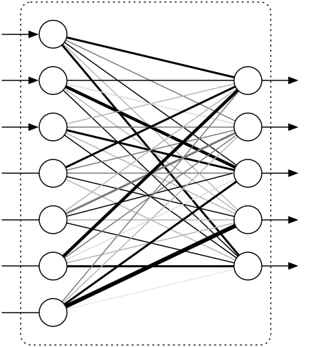
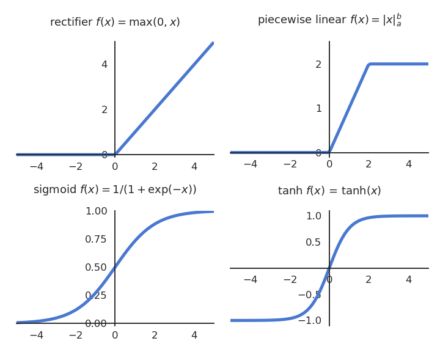
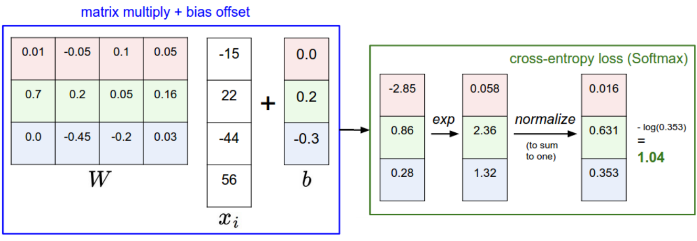
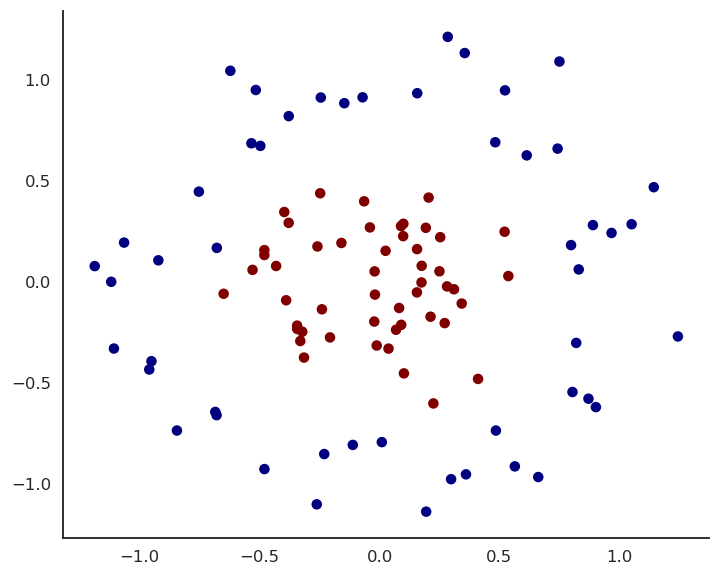

# 1 - Multi-layer perceptron


# Multi-layer perceptron

::: {.columns}
::: {.column width=50%}


:::
::: {.column width=50%}


* A **Multi-Layer Perceptron** (MLP) or **feedforward neural network** is composed of:

    * an input layer for the input vector $\mathbf{x}$

    * one or several hidden layers allowing to project non-linearly the input into a space of higher dimensions $\mathbf{h}_1, \mathbf{h}_2, \mathbf{h}_3, \ldots$.

    * an output layer for the output $\mathbf{y}$.

* If there is a single hidden layer $\mathbf{h}$, it corresponds to the feature space.

* Each layer takes inputs from the previous layer.

* If the hidden layer is adequately chosen, the output neurons can learn to replicate the desired output $\mathbf{t}$.

:::
:::


# Fully-connected layer

{width=60%}

::: {.columns}
::: {.column width=30%}

<!--  -->


:::
::: {.column width=70%}

* The operation performed by each layer can be written in the form of a **matrix-vector** multiplication:

$$
    \mathbf{h} = f(\textbf{net}_\mathbf{h}) = f(W^1 \, \mathbf{x} + \mathbf{b}^1)
$$
$$
    \mathbf{y} = f(\textbf{net}_\mathbf{y}) = f(W^2 \, \mathbf{h} + \mathbf{b}^2)
$$

* **Fully-connected layers** (FC) transform an input vector $\mathbf{x}$ into a new vector $\mathbf{h}$ by multiplying it by a **weight matrix** $W$ and adding a **bias vector** $\mathbf{b}$.

* A non-linear **activation function** transforms each element of the net activation.

:::
:::


# Activation functions

{width=75%}


# Modern activation functions

{width=50%}

* Rectified linear function - ReLU (output is continuous and positive).

$$
    f(x) = \max(0, x) = \begin{cases} x \quad \text{if} \quad x \geq 0 \\ 0 \quad \text{otherwise.} \end{cases}
$$

* Parametric Rectifier Linear Unit - PReLU (output is continuous).

$$
    f(x) = \begin{cases} x \quad \text{if} \quad x \geq 0 \\ \alpha \, x  \quad \text{otherwise.}\end{cases}
$$


# Softmax activation function

{width=60%}

* For classification problems, the **softmax** activation function can be used in the output layer to make sure that the sum of the outputs $\mathbf{y} = \{y_j\}$ over all output neurons is one.

$$
    y_j = P(\text{class = j}) = \frac{\exp(\text{net}_j)}{\sum_k \exp(\text{net}_k)}
$$

* The higher the net activation $\text{net}_j$, the higher the probability that the example belongs to class $j$.

* Softmax is not *per se* a transfer function (not local to each neuron), but the idea is similar.


::: footer
Source <http://cs231n.github.io/linear-classify>
:::

# Why non-linear activation functions?

* Why not use the linear function $f(x) = x$ in the hidden layer?

$$
    \mathbf{h} = W^1 \, \mathbf{x} + \mathbf{b}^1
$$
$$
    \mathbf{y} = W^2 \, \mathbf{h} + \mathbf{b}^2
$$

* We would have:

$$
\begin{align*}
    \mathbf{y} &= W^2 \, (W^1 \, \mathbf{x} + \mathbf{b}^1) + \mathbf{b}^2 \\
               &= (W^2 \, W^1) \, \mathbf{x} + (W^2 \, \mathbf{b}^1 + \mathbf{b}^2) \\
               &= W \, \mathbf{x} + \mathbf{b} \\
\end{align*}
$$

so the equivalent function would be linear...

* Remember Cover's theorem:

    * A complex pattern-classification problem, cast in a high dimensional space **non-linearly**, is more likely to be linearly separable than in a low-dimensional space, provided that the space is not densely populated.

* In practice it does not matter how non-linear the function is (e.g PReLU is almost linear), but there must be at least one non-linearity.

# Training a MLP : loss functions

* We have a training set \mathcal{D} composed of N input/output pairs $(\mathbf{x}_i, \mathbf{t}_i)_{i=1..N}$.

* **Optimization problem:** 
  
  * What are the free parameters $\theta$ (weights $W^1, W^2$ and biases $\textbf{b}^1, \textbf{b}^2$) making the prediction $\mathbf{y}$ as close as possible from the desired output $\mathbf{t}$?

* We define a **loss function** $\mathcal{L}(\theta)$ of the free parameters which should be minimized:

    - For **regression** problems, we take the **mean square error** (mse):

    $$
    \mathcal{L}_\text{reg}(\theta) = \mathbb{E}_{\mathbf{x}, \mathbf{t} \in \mathcal{D}} [ ||\mathbf{t} - \mathbf{y}||^2 ]
    $$

    - For **classification** problems, we take the **cross-entropy** or **negative log-likelihood** on a softmax output layer:

    $$\mathcal{L}_\text{class}(\theta) = \mathbb{E}_{\mathbf{x}, \mathbf{t} \sim \mathcal{D}} [ - \langle \mathbf{t} \cdot \log \mathbf{y} \rangle]$$


# Training a MLP : optimizer

* To minimize the chosen loss function, we are going to use **stochastic gradient descent** iteratively until the network converges:

$$\begin{cases}
    \Delta W^1 = - \eta \, \nabla_{W^1} \, \mathcal{L}(\theta) \\
    \\
    \Delta \mathbf{b}^1 = - \eta \, \nabla_{\mathbf{b}^1} \, \mathcal{L}(\theta) \\
    \\
    \Delta W^2 = - \eta \, \nabla_{W^2} \, \mathcal{L}(\theta) \\
    \\
    \Delta \mathbf{b}^2 = - \eta \, \nabla_{\mathbf{b}^2} \, \mathcal{L}(\theta)\\
\end{cases}
$$

* We will see later that other optimizers than SGD can be used.

* The question is now how to compute efficiently these **gradients** w.r.t all the weights and biases.

* The algorithm to achieve this is called **backpropagation**, which is simply a smart implementation of the chain rule.
  
  
::: footer
Rumelhart, Hinton, Williams (1986). "Learning representations by back-propagating errors". Nature.
:::

# 2 - Backpropagation

# Backpropagation on a shallow network

::: {.columns}
::: {.column width=35%}


:::
::: {.column width=65%}

$$
    \mathbf{h} = f(\textbf{net}_\mathbf{h}) = f(W^1 \, \mathbf{x} + \mathbf{b}^1)
$$
$$
    \mathbf{y} = f(\textbf{net}_\mathbf{y}) = f(W^2 \, \mathbf{h} + \mathbf{b}^2)
$$

* The chain rule gives us for the parameters of the output layer:

$$
    \frac{\partial \mathcal{L}(\theta)}{\partial W^2} = \frac{\partial \mathcal{L}(\theta)}{\partial \mathbf{y}} \times \frac{\partial \mathbf{y}}{\partial \textbf{net}_\mathbf{y}} \times \frac{\partial \textbf{net}_\mathbf{y}}{\partial W^2}
$$

$$
    \frac{\partial \mathcal{L}(\theta)}{\partial \mathbf{b}^2} = \frac{\partial \mathcal{L}(\theta)}{\partial \mathbf{y}} \times \frac{\partial \mathbf{y}}{\partial \textbf{net}_\mathbf{y}} \times \frac{\partial \textbf{net}_\mathbf{y}}{\partial \mathbf{b}^2}
$$

:::
:::


* and for the hidden layer:

$$
    \frac{\partial \mathcal{L}(\theta)}{\partial W^1} = \frac{\partial \mathcal{L}(\theta)}{\partial \mathbf{y}} \times \frac{\partial \mathbf{y}}{\partial \textbf{net}_\mathbf{y}} \times \frac{\partial \textbf{net}_\mathbf{y}}{\partial \mathbf{h}} \times \frac{\partial \mathbf{h}}{\partial \textbf{net}_\mathbf{h}} \times \frac{\partial \textbf{net}_\mathbf{h}}{\partial W^1}
$$

$$
    \frac{\partial \mathcal{L}(\theta)}{\partial \mathbf{b}^1} = \frac{\partial \mathcal{L}(\theta)}{\partial \mathbf{y}} \times \frac{\partial \mathbf{y}}{\partial \textbf{net}_\mathbf{y}} \times \frac{\partial \textbf{net}_\mathbf{y}}{\partial \mathbf{h}} \times \frac{\partial \mathbf{h}}{\partial \textbf{net}_\mathbf{h}} \times \frac{\partial \textbf{net}_\mathbf{h}}{\partial \mathbf{b}^1}
$$

* If we can compute all these partial derivatives / gradients individually, the problem is solved.

# Gradient of the loss function

* We have already seen for the linear algorithms that the derivative of the loss function w.r.t the net activation of the output $\textbf{net}_\mathbf{y}$ is proportional to the **prediction error** $\mathbf{t} - \mathbf{y}$:

    * mse for regression:

    $$
        \mathbf{\delta_y} = - \frac{\partial \mathcal{l}_\text{reg}(\theta)}{\partial \textbf{net}_\mathbf{y}} = - \frac{\partial \mathcal{l}_\text{reg}(\theta)}{\partial \mathbf{y}} \times \frac{\partial \mathbf{y}}{\partial \textbf{net}_\mathbf{y}} = 2 \, (\mathbf{t} - \mathbf{y}) \, f'(\textbf{net}_\mathbf{y})
    $$

    * cross-entropy using a softmax output layer:

    $$
        \mathbf{\delta_y} = - \frac{\partial \mathcal{l}_\text{class}(\theta)}{\partial \textbf{net}_\mathbf{y}} = (\mathbf{t} - \mathbf{y})
    $$

* $\mathbf{\delta_y} = - \dfrac{\partial \mathcal{l}(\theta)}{\partial \textbf{net}_\mathbf{y}}$ is called the output error.

* The output error is going to appear in all partial derivatives, i.e. in all learning rules.

* The backpropagation algorithm is sometimes called **backpropagation of the error**.

# Gradient in the output layer

* We now have everything we need to train the output layer:

$$
    \frac{\partial \mathcal{l}(\theta)}{\partial W^2} = \frac{\partial \mathcal{l}(\theta)}{\partial \textbf{net}_\mathbf{y}}  \times \frac{\partial \textbf{net}_\mathbf{y}}{\partial W^2} = - \mathbf{\delta_y}  \times \frac{\partial \textbf{net}_\mathbf{y}}{\partial W^2}
$$

$$
    \frac{\partial \mathcal{l}(\theta)}{\partial \mathbf{b}^2} = \frac{\partial \mathcal{l}(\theta)}{\partial \textbf{net}_\mathbf{y}}  \times \frac{\partial \textbf{net}_\mathbf{y}}{\partial \mathbf{b}^2} = - \mathbf{\delta_y} \times \frac{\partial \textbf{net}_\mathbf{y}}{\partial \mathbf{b}^2}
$$

* As $\textbf{net}_\mathbf{y} = W^2 \, \mathbf{h} + \mathbf{b}^2$, we get for the cross-entropy loss:

$$
    \frac{\partial \mathcal{l}(\theta)}{\partial W^2} = - \mathbf{\delta_y} \times \mathbf{h}^T
$$

$$
    \frac{\partial \mathcal{l}(\theta)}{\partial \mathbf{b}^2} = - \mathbf{\delta_y}
$$

i.e. exactly the same delta learning rule as a softmax linear classifier or multiple linear regression using the vector $\mathbf{h}$ as an input.

$$
\begin{cases}
    \Delta W^2 = \eta \, \mathbf{\delta_y} \times \mathbf{h}^T = \eta \,  (\mathbf{t} - \mathbf{y} ) \times \mathbf{h}^T \\
    \\
    \Delta \mathbf{b}^2 = \eta \,  \mathbf{\delta_y} = \eta \,  (\mathbf{t} - \mathbf{y} ) \\
\end{cases}
$$

# Gradient in the hidden layer

* Let's note $\mathbf{\delta_h}$ the **hidden error**, i.e. minus the gradient of the loss function w.r.t the net activation of the hidden layer:

$$
    \mathbf{\delta_h} = - \frac{\partial \mathcal{l}(\theta)}{\partial \textbf{net}_\mathbf{h}} = - \frac{\partial \mathcal{l}(\theta)}{\partial \textbf{net}_\mathbf{y}} \times \frac{\partial \textbf{net}_\mathbf{y}}{\partial \mathbf{h}} \times \frac{\partial \mathbf{h}}{\partial \textbf{net}_\mathbf{h}}  = \mathbf{\delta_y} \times \frac{\partial \textbf{net}_\mathbf{y}}{\partial \mathbf{h}} \times \frac{\partial \mathbf{h}}{\partial \textbf{net}_\mathbf{h}}
$$

* Using this hidden error, we can compute the gradients w.r.t $W^1$ and $\mathbf{b}^1$:

$$
    \frac{\partial \mathcal{l}(\theta)}{\partial W^1} = \frac{\partial \mathcal{l}(\theta)}{\partial \textbf{net}_\mathbf{h}} \times \frac{\partial \textbf{net}_\mathbf{h}}{\partial W^1} = - \mathbf{\delta_h} \times \frac{\partial \textbf{net}_\mathbf{h}}{\partial W^1}
$$

$$
    \frac{\partial \mathcal{l}(\theta)}{\partial \mathbf{b}^1} = \frac{\partial \mathcal{l}(\theta)}{\partial \textbf{net}_\mathbf{h}} \times \frac{\partial \textbf{net}_\mathbf{h}}{\partial \mathbf{b}^1} = - \mathbf{\delta_h} \times \frac{\partial \textbf{net}_\mathbf{h}}{\partial \mathbf{b}^1}
$$

* As $\textbf{net}_\mathbf{h} = W^1 \, \mathbf{x} + \mathbf{b}^1$, we get:

$$
    \frac{\partial \mathcal{l}(\theta)}{\partial W^1} =  - \mathbf{\delta_h} \times \mathbf{x}^T
$$

$$
    \frac{\partial \mathcal{l}(\theta)}{\partial \mathbf{b}^1} =  - \mathbf{\delta_h}
$$

# Gradient in the hidden layer

$$
    \frac{\partial \mathcal{l}(\theta)}{\partial W^1} =  - \mathbf{\delta_h} \times \mathbf{x}^T
$$

$$
    \frac{\partial \mathcal{l}(\theta)}{\partial \mathbf{b}^1} =  - \mathbf{\delta_h}
$$

* If we know the **hidden error** $\mathbf{\delta_h}$, the update rules for the input weights $W^1$ and $\mathbf{b}^1$ also take the form of the delta learning rule:

$$
\begin{cases}
    \Delta W^1 = \eta \,   \mathbf{\delta_h} \times \mathbf{x}^T \\
    \\
    \Delta \mathbf{b}^1 = \eta \,  \mathbf{\delta_h} \\
\end{cases}
$$

* This is the classical form eta * error * input.

* All we need to know is the **backpropagated error** $\mathbf{\delta_h}$ and we can apply the delta learning rule!

# Backpropagated error


::: {.columns}
::: {.column width=35%}


:::
::: {.column width=65%}

* The backpropagated error $\mathbf{\delta_h}$ is a vector assigning an error to each of the hidden neurons:

$$
    \mathbf{\delta_h} = - \frac{\partial \mathcal{l}(\theta)}{\partial \textbf{net}_\mathbf{h}}  = \mathbf{\delta_y} \times \frac{\partial \textbf{net}_\mathbf{y}}{\partial \mathbf{h}} \times \frac{\partial \mathbf{h}}{\partial \textbf{net}_\mathbf{h}}
$$

* As :

$$\textbf{net}_\mathbf{y} = W^2 \, \mathbf{h} + \mathbf{b}^2$$

$$\mathbf{h} = f(\textbf{net}_\mathbf{h})$$

we obtain:

$$
    \mathbf{\delta_h} = f'(\textbf{net}_\mathbf{h}) \, (W^2)^T \times \mathbf{\delta_y}
$$

:::
:::


* If $\mathbf{h}$ and $\mathbf{\delta_h}$ have $K$ elements and $\mathbf{y}$ and $\mathbf{\delta_y}$ have $C$ elements, the matrix $W^2$ is $C \times K$ as $W^2 \times \mathbf{h}$ must be a vector with $C$ elements.

* $(W^2)^T \times \mathbf{\delta_y}$ is therefore a vector with $K$ elements, which is then multiplied element-wise with the derivative of the transfer function to obtain $\mathbf{\delta_h}$.


# Backpropagation for a shallow MLP

::: {.columns}
::: {.column width=50%}


{width=70%}

:::
::: {.column width=50%}


* For a shallow MLP with one hidden layer:

$$
    \mathbf{h} = f(\textbf{net}_\mathbf{h}) = f(W^1 \, \mathbf{x} + \mathbf{b}^1)
$$
$$
    \mathbf{y} = f(\textbf{net}_\mathbf{y}) = f(W^2 \, \mathbf{h} + \mathbf{b}^2)
$$

the output error:

$$
        \mathbf{\delta_y} = - \frac{\partial \mathcal{l}(\theta)}{\partial \textbf{net}_\mathbf{y}} = (\mathbf{t} - \mathbf{y})
    $$


is **backpropagated** to the hidden layer:

$$
    \mathbf{\delta_h} = f'(\textbf{net}_\mathbf{h}) \, (W^2)^T \times \mathbf{\delta_y}
$$

:::
:::


what allows to apply the delta learning rule to all parameters:

$$
\begin{cases}
    \Delta W^2 = \eta \, \mathbf{\delta_y} \times \mathbf{h}^T \\
    \Delta \mathbf{b}^2 = \eta \,  \mathbf{\delta_y} \\
    \Delta W^1 = \eta \, \mathbf{\delta_h}  \times  \mathbf{x}^T \\
    \Delta \mathbf{b}^1 = \eta \, \mathbf{\delta_h}  \\
\end{cases}
$$


# Derivative of the activation functions

The usual transfer functions are easy to derive (that is why they are chosen...).

* Threshold and sign functions are not differentiable, we simply consider the derivative is 1.

$$
f(x) = \begin{cases} 1 \quad \text{if} \quad x \geq 0 \\ 0 \text{ or } 1 \quad \text{otherwise.} \end{cases} \qquad \rightarrow \qquad f'(x) = 1
$$

* The logistic or sigmoid function has the nice property that its derivative can be expressed as a function of itself:

$$
f(x) = \frac{1}{1+\exp(-x)} \qquad \rightarrow \qquad f'(x) = f(x) \, (1 - f(x))
$$

* The hyperbolic tangent function too:

$$
f(x) = \tanh(x) \qquad \rightarrow \qquad f'(x) = 1 - f(x)^2
$$

* ReLU is even simpler:

$$
f(x) = \max(0, x) = \begin{cases} x \quad \text{if} \quad x \geq 0 \\ 0 \quad \text{otherwise.} \end{cases} \qquad \rightarrow \qquad f'(x) = \begin{cases} 1 \quad \text{if} \quad x \geq 0 \\ 0 \quad \text{otherwise.}\end{cases}
$$


# What is backpropagated?


::: {.columns}
::: {.column width=50%}


{width=70%}

:::
::: {.column width=50%}


* Let's have a closer look at what is backpropagated using single neurons and weights. 

* The output neuron $y_k$ computes: 

$$y_k = f(\sum_{j=1}^K W^2_{jk} \, h_j + b^2_k)$$

* All output weights $W^2_{jk}$ are updated proportionally to the output error of the neuron $y_k$:

$$\Delta W^2_{jk} = \eta \, \delta_{{y}_k} \, h_j = \eta \, (t_k - y_k) \, h_j$$

:::
:::


* This is possible because we know the output error directly from the data $t_k$.

# What is backpropagated?


::: {.columns}
::: {.column width=50%}


{width=70%}

:::
::: {.column width=50%}


* The hidden neuron $h_j$ computes: 

$$h_j = f(\sum_{i=1}^d W^1_{ij} \, x_i + b^1_j)$$

* We want to learn the hidden weights $W^1_{ij}$ using the delta learning rule:

$$\Delta W^1_{ij} = \eta \, \delta_{{h}_j} \, x_i$$

but we do not know the ground truth of the hidden neuron in the data:

$$\delta_{{h}_j} = (? - h_j)$$

:::
:::


* We need to **estimate** the backpropagated error using the output error.


# What is backpropagated?


::: {.columns}
::: {.column width=50%}


{width=70%}

:::
::: {.column width=50%}


$$
    \mathbf{\delta_h} = f'(\textbf{net}_\mathbf{h}) \, (W^2)^T \times \mathbf{\delta_y}
$$

* If we omit the derivative of the transfer function, the backpropagated error for the hidden neuron $h_j$ is:

$$\delta_{{h}_j} = - \sum_{k=1}^C W^2_{jk} \, \delta_{{y}_k}$$

* The backpropagated error is an **average** of the output errors $\delta_{{y}_k}$, weighted by the output weights between the hidden neuron $h_j$ and the output neurons $y_k$.

:::
:::


* The backpropagated error is the **contribution** of each hidden neuron $h_j$ to the output error:

    * If there is no output error, there is no hidden error.

    * If a hidden neuron sends **strong weights** $|W^2_{jk}|$ to an output neuron $y_k$ with a strong prediction error $\delta_{{y}_k}$, this means that it participates strongly to the output error and should learn from it.

    * If the weight $|W^2_{jk}|$ is small, it means that the hidden neuron does not take part in the output error.

# MLP: the universal approximation theorem


**Cybenko, 1989**

*Let $\varphi()$ be a nonconstant, bounded, and monotonically-increasing continuous function. Let $I_{m_0}$ denote the $m_0$-dimensional unit hypercube $[0,1]^{m_0}$. The space of continuous functions on $I_{m_0}$ is denoted by $C(I_{m_0})$. Then, given any function $f \in C(I_{m_0})$ and $\epsilon > 0$, there exists an integer $m_1$ and sets of real constants $\alpha_i, b_i$ and $w_{ij} \in \Re$, where $i = 1, ..., m_1$ and $j = 1, ..., m_0$ such that we may define:*

$$
    F(\mathbf{x}) = \sum_{i=1}^{m_1} \alpha_i \cdot \varphi \left( \sum_{j=1}^{m_0} w_{ij} \cdot x_j + b_i \right)
$$

*as an approximate realization of the function f; that is,*

$$ | F(\mathbf{x}) - f(\mathbf{x})| < \epsilon$$

*for all $x \in I_m$.*


* This theorem shows that for **any** input/output mapping function $f$ in supervised learning, there exists a MLP with $m_1$ neurons in the hidden layer which is able to approximate it with a desired precision!

# Properties of MLP

* The universal approximation theorem only proves the existence of a shallow MLP with $m_1$ neurons in the hidden layer that can approximate any function, but it does not tell how to find this number.

* A rule of thumb to find this number is that the generalization error is empirically close to:

$$ \epsilon = \frac{\text{VC}_{\text{dim}}(\text{MLP})}{N}
$$

where $\text{VC}_{\text{dim}}(\text{MLP})$ is the total number of weights and biases in the model, and $N$ the number of training samples.

* The more neurons in the hidden layer, the better the training error, but the worse the generalization error (overfitting).

* The optimal number should be found with cross-validation methods.

* For most functions, the optimal number $m_1$ is high and becomes quickly computationally untractable. We need to go deep!

# 3 - Deep neural networks

# Deep Neural Network

* A MLP with more than one hidden layer is a **deep neural network**.


# Backpropagation for deep neural networks

* Backpropagation still works if we have many hidden layers $\mathbf{h}_1, \ldots, \mathbf{h}_n$:

{width=50%}

* If each layer is differentiable, i.e. one can compute its gradient $\frac{\partial \mathbf{h}_{k}}{\partial \mathbf{h}_{k-1}}$, we can chain **backwards** each partial derivatives to know how to update each layer:

{width=70%}

* **Backpropagation** is simply an efficient implementation of the chain rule: the partial derivatives are iteratively reused in the backwards phase.

>

::: footer
Source: David Silver, Tutorial: Deep Reinforcement Learning
:::


# Gradient of a fully connected layer


* A fully connected layer transforms an input vector $\mathbf{h}_{k-1}$ into an output vector $\mathbf{h}_{k}$ using a weight matrix $W^k$, a bias vector $\mathbf{b}^k$ and a non-linear activation function $f$:

$$
    \mathbf{h}_{k} = f(\textbf{net}_{\mathbf{h}^k}) = f(W^k \, \mathbf{h}_{k-1} + \mathbf{b}^k)
$$

{width=40%}

* The gradient of its output w.r.t the input $\mathbf{h}_{k-1}$ is (using the chain rule):

$$
\frac{\partial \mathbf{h}_{k}}{\partial \mathbf{h}_{k-1}} = f'(\textbf{net}_{\mathbf{h}^k}) \, W^k
$$

* The gradients of its output w.r.t the free parameters $W^k$ and $\mathbf{b}_{k}$ are:

$$
\frac{\partial \mathbf{h}_{k}}{\partial W^{k}} =  f'(\textbf{net}_{\mathbf{h}^k}) \, \mathbf{h}_{k-1}
$$

$$
\frac{\partial \mathbf{h}_{k}}{\partial \mathbf{b}_{k}} =  f'(\textbf{net}_{\mathbf{h}^k})
$$


# Gradient of a fully connected layer

::: {.columns}
::: {.column width=50%}


:::
::: {.column width=50%}


* A fully connected layer $\mathbf{h}_{k} =  f(W^k \, \mathbf{h}_{k-1} + \mathbf{b}^k)$ receives the gradient of the loss function w.r.t. its output $\mathbf{h}_{k}$ from the layer above:

$$
    \frac{\partial \mathcal{L}(\theta)}{\partial \mathbf{h}_{k}} 
$$

:::
:::


* It adds to this gradient its own contribution and transmits it to the previous layer:

$$
    \frac{\partial \mathcal{L}(\theta)}{\partial \mathbf{h}_{k-1}} = \frac{\partial \mathcal{L}(\theta)}{\partial \mathbf{h}_{k}} \times \frac{\partial \mathbf{h}_{k}}{\partial \mathbf{h}_{k-1}} = f'(\textbf{net}_{\mathbf{h}^k}) \, (W^k)^T \times \frac{\partial \mathcal{L}(\theta)}{\partial \mathbf{h}_{k}}
$$


* It then updates its parameters $W^k$ and $\mathbf{b}_{k}$ with:

$$\begin{cases}
\dfrac{\partial \mathcal{L}(\theta)}{\partial W^{k}} = \dfrac{\partial \mathcal{L}(\theta)}{\partial \mathbf{h}_{k}}  \times \dfrac{\partial \mathbf{h}_{k}}{\partial W^{k}} =  f'(\textbf{net}_{\mathbf{h}^k}) \, \dfrac{\partial \mathcal{L}(\theta)}{\partial \mathbf{h}_{k}}  \times \mathbf{h}_{k-1}^T \\
\\
\dfrac{\partial \mathcal{L}(\theta)}{\partial \mathbf{b}_{k}}  = \dfrac{\partial \mathcal{L}(\theta)}{\partial \mathbf{h}_{k}}  \times \dfrac{\partial \mathbf{h}_{k}}{\partial \mathbf{b}_{k}} =  f'(\textbf{net}_{\mathbf{h}^k}) \, \dfrac{\partial \mathcal{L}(\theta)}{\partial \mathbf{h}_{k}} \\
\end{cases} 
$$

# Training a deep neural network with backpropagation

* A **feedforward** neural network is an acyclic graph of differentiable and parameterized layers.

$$
    \mathbf{x} \rightarrow \mathbf{h}_1 \rightarrow \mathbf{h}_2 \rightarrow \ldots \rightarrow  \mathbf{h}_n \rightarrow \mathbf{y}
$$

* The **backpropagation** algorithm is used to assign the gradient of the loss function $\mathcal{L}(\theta)$ to each layer using backward chaining:

$$
    \frac{\partial \mathcal{L}(\theta)}{\partial \mathbf{h}_{k-1}} = \frac{\partial \mathcal{L}(\theta)}{\partial \mathbf{h}_{k}} \times \frac{\partial \mathbf{h}_{k}}{\partial \mathbf{h}_{k-1}}
$$

{width=70%}

* **Stochastic gradient descent** is then used to update the parameters of each layer:

$$
    \Delta W^k = - \eta \, \frac{\partial \mathcal{L}(\theta)}{\partial W^{k}} = - \eta \, \frac{\partial \mathcal{L}(\theta)}{\partial \mathbf{h}_{k}} \times \frac{\partial \mathbf{h}_{k}}{\partial W^{k}}
$$

::: footer
Rumelhart, Hinton, Williams (1986). "Learning representations by back-propagating errors". Nature.
:::


# 4 - Example


# MLP example

* Let's try to solve this **non-linear** binary classification problem:

{width=60%}


# MLP example

::: {.columns}
::: {.column width=50%}


:::
::: {.column width=50%}


* We can create a shallow MLP with:

    * Two input neurons $x_1, x_2$ for the two input variables.

    * Enough hidden neurons (e.g. 20), with a sigmoid or ReLU activation function.

    * One output neuron with the logistic activation function.

    * The cross-entropy (negative log-likelihood) loss function.

* We train it on the input data using the backpropagation algorithm and the SGD optimizer.

:::
:::


# MLP example

{width=60%}

* Experiment live on <https://playground.tensorflow.org/>!


# Automatic differentiation Deep Learning frameworks

**Current:**

* **Tensorflow** <https://www.tensorflow.org/> released by Google in 2015 is one of the two standard DL frameworks.

* **Keras** <https://keras.io/> is a high-level Python API over tensorflow (but also theano, CNTK and MxNet) written by Francois Chollet.

* **PyTorch** <http://pytorch.org> by Facebook is the other standard framework.

**Historical:**

* **Theano** <http://deeplearning.net/software/theano/> released by U Toronto in 2010 is the predecessor of tensorflow. Now abandoned.

* **Caffe** <http://caffe.berkeleyvision.org/> by U Berkeley was long the standard library for convolutional networks.

* **CNTK** <https://github.com/Microsoft/CNTK> (Microsoft Cognitive Toolkit) is a **free** library by Microsoft!

* **MxNet** <https://github.com/apache/incubator-mxnet> from Apache became the DL framework at Amazon.

<!-- * **Gluon** <https://github.com/gluon-api/gluon-api> is a high-level API over MxNet. -->

# Example of a shallow neural network with keras

* Let's implement the previous MLP using keras.

* We first need to generate the data using `scikit-learn`:

```python
import sklearn.datasets
X, t = sklearn.datasets.make_circles(n_samples=100, shuffle=True, noise=0.15, factor=0.3)
```

* We then import `tensorflow`:

```python
import tensorflow as tf
```

* The neural network is called a `Sequential` model in keras:

```python
model = tf.keras.Sequential()
```

# Example of a shallow neural network with keras

* Creating a NN is simply **stacking** layers in the model. The input layer is just a placeholder for the data:

```python
model.add( tf.keras.layers.Input(shape=(2, )) )
```


* The hidden layer has 20 neurons, the ReLU activation and takes input from the previous layer:

```python
model.add(
    tf.keras.layers.Dense(
        20, # Number of hidden neurons
        activation='relu' # Activation function
    )
)
```

* The output layer has 1 neuron with the logistic/sigmoid activation function:

```python
model.add(
    tf.keras.layers.Dense(
        1, # Number of output neurons
        activation='sigmoid' # Soft classification
    )
)
```


# Example of a shallow neural network with keras

* We now choose an optimizer (SGD) with a learning rate $\eta = 0.001$:

```python
optimizer = tf.keras.optimizers.SGD(lr=0.001)
```

* We choose a loss function (binary cross-entropy, aka negative log-likelihood):
  
```python
loss = tf.keras.losses.binary_crossentropy
```

* We compile the model (important!) and tell it to track the accuracy of the model:

```python
model.compile(
    loss=loss,
    optimizer=optimizer, 
    metrics=tf.keras.metrics.categorical_accuracy
)
```

# Example of a shallow neural network with keras

* Et voilà! The network has been created.

```python
print(model.summary())
```

```
Model: "sequential_1"
_________________________________________________________________
Layer (type)                 Output Shape              Param #   
=================================================================
dense (Dense)                (None, 20)                60        
_________________________________________________________________
dense_1 (Dense)              (None, 1)                 21        
=================================================================
Total params: 81
Trainable params: 81
Non-trainable params: 0
_________________________________________________________________
None
```

# Example of a shallow neural network with keras

* We now train the model on the data for 100 epochs using a batch size of 10 and wait for it to finish:

```python
model.fit(X, t, batch_size=10, nb_epoch=100)
```

* With keras (and the other automatic differentiation frameworks), you only need to define the structure of the network.

* The rest (backpropagation, SGD) is done automatically.

* To make predictions on new data, just do:

```python
model.predict(X_test)
```


