# 1 - Denoising Diffusion Probabilistic Model (DDPM)

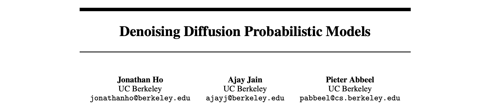

:::footer
@Ho2020 Denoising Diffusion Probabilistic Models arXiv:2006.11239
:::

# Generative modeling

* Generative modeling consists in transforming a simple probability distribution (e.g. Gaussian) into a more complex one (e.g. images).

* Learning this model allows to easily sample complex images.

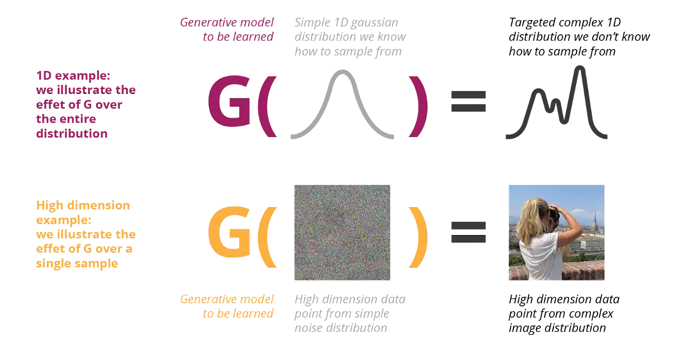{width=70%}

# VAE and GAN  transform simple noise into complex distributions

::: {.columns}
::: {.column}

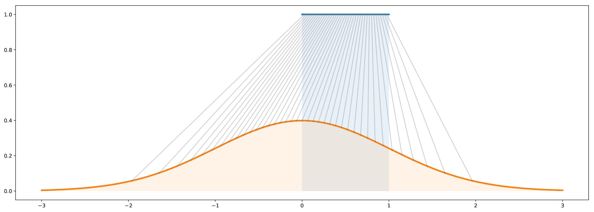{width=80%}

:::
::: {.column}

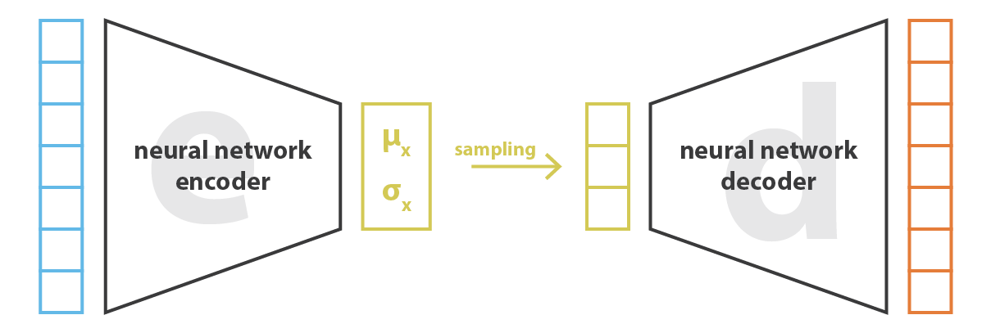

:::
:::

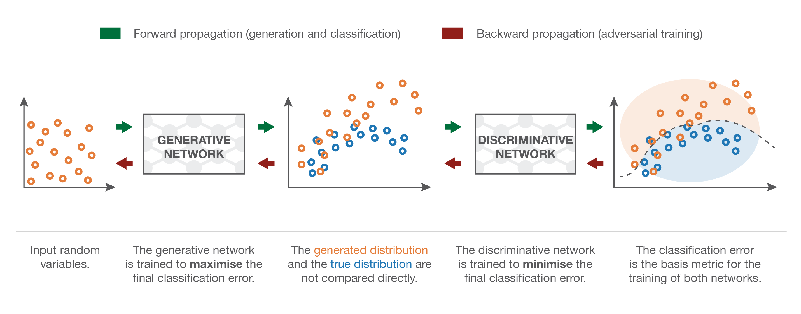{width=70%}

# Destroying information is easier than creating it

* The task of the generators in GAN or VAE is very hard: going from noise to images in a few layers.

* The other direction is extremely easy.

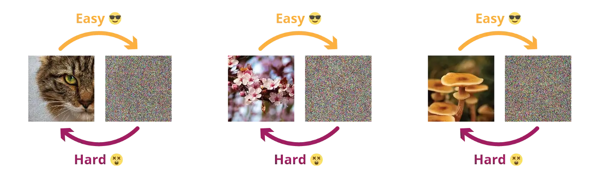

# Diffusion process

* The forward **diffusion process** iteratively destructs all information in the image through a Markov chain that adds white noise.

* A Markov chain implies that each step is independent and governed by a probability distribution $q(x_t | x_{t-1})$.

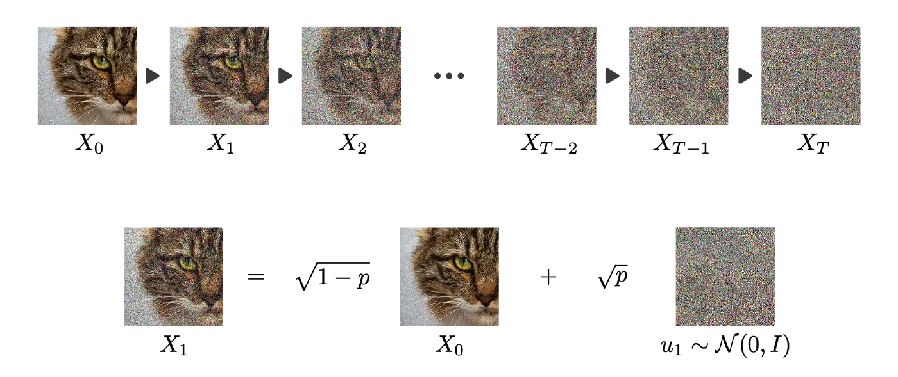

# Stochastic processes can destroy information

:::columns
:::column

* Iteratively adding normal noise to a signal creates a **stochastic differential equation** (SDE), such as the **Ornstein–Uhlenbeck** (OU) stochastic process.

$$
\begin{aligned}
   \text{discrete:} \qquad& x_t = \sqrt{1 - \beta_t} \, x_{t-1} + \sqrt{\beta_t}   \, \epsilon \\
   & \qquad\qquad\text{where} \qquad  \epsilon \sim \mathcal{N}(0, 1) \\
&\\
   \text{continuous:} \qquad & dx = - \dfrac{1}{2} \, \beta(t) \, x \, dt  + \sqrt{\beta(t)} \, dW \\
\end{aligned}
$$

* Any probability distribution converges to a normal distribution when following the OU process.

:::
:::column

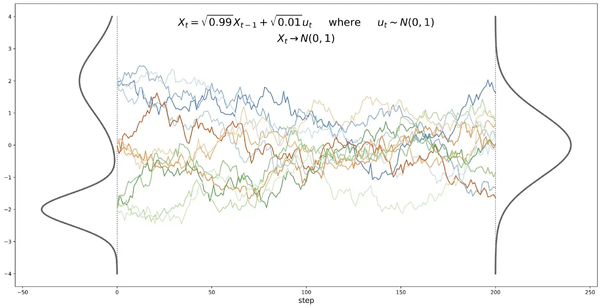

:::
:::

* The **Focker-Planck equation** is a general form of the OU process (drift + diffusion), hence the name:

$$
     dx = \underbrace{\mu(x, t) \, dt}_{\text{drift}}  + \underbrace{\sigma(x, t) \, dW}_{\text{diffusion}}
$$

# Probabilistic diffusion models

* It should be possible to **reverse** each diffusion step by removing the noise using a sort of denoising autoencoder.

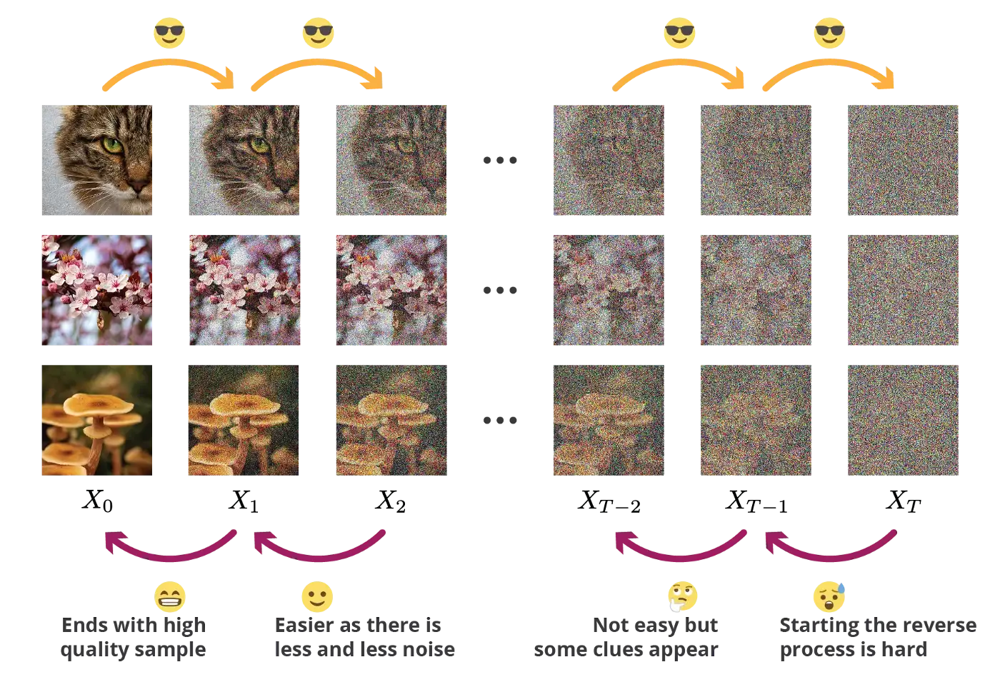{width=60%}

# Reminder: Denoising autoencoder

* A **denoising autoencoder** (DAE) is trained with noisy inputs but perfect desired outputs. It learns to suppress that noise.

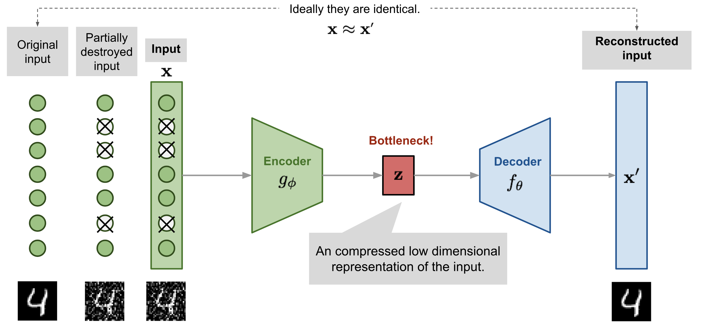{width=60%}

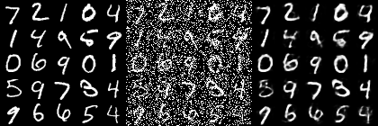

::: footer
@Vincent2010 "Stacked Denoising Autoencoders: Learning Useful Representations in a Deep Network with a Local Denoising Criterion". JMLR.
:::

# Forward Diffusion process

* The forward process iteratively corrupts the image using $q(x_t | x_{t-1})$ for $T$ steps (e.g. $T=1000$). 

* The goal is to learn a reverse process $p_\theta(x_{t-1} | x_t)$ that approximates the true posterior $q(x_{t-1} | x_t)$.

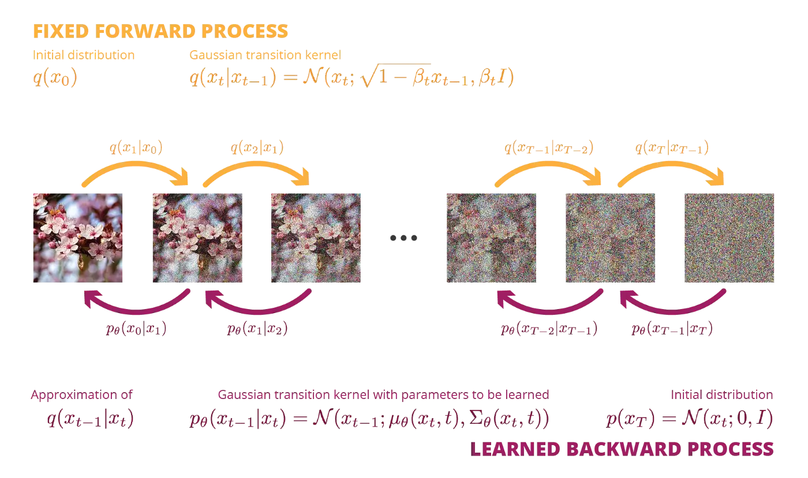{width=70%}

# Forward Diffusion process

:::columns
:::{.column width=70%}

* The forward diffusion process iteratively adds Gaussian noise with a fixed variance schedule $\beta_t$:

$$
    x_t = \sqrt{1 - \beta_t} \, x_{t-1} +  \sqrt{\beta_t} \,  \epsilon \;\; \text{where} \; \epsilon \sim \mathcal{N}(0, I)
$$

* It is equivalent to say that we sample $x_t$ from a conditional normal distribution.

$$
    q(x_t | x_{t-1}) = \mathcal{N}(\mu_t = \sqrt{1 - \beta_t} \, x_{t-1}, \Sigma_t^2 = \beta_t \, I)
$$

* $\mu_t = \sqrt{1 - \beta_t} \, x_{t-1}$ is the mean of the distribution, $\Sigma_t^2 = \beta_t \, I$ its variance.

* The parameter $\beta_t$ is annealed with a decreasing schedule, as adding more noise at the end does not destroy much more information.

:::
:::{.column width=30%}

:::
:::

# Forward Diffusion process

* **Nice property:** each image $x_t$ is also a noisy version of the original image $x_0$:

$$
    q(x_t | x_{0}) = \mathcal{N}(\sqrt{\bar{\alpha}_t} \, x_0 ,  (1 - \bar{\alpha}_t) \, I)
$$
$$
    x_t = \sqrt{\bar{\alpha}_t} \, x_0 +  \sqrt{1 - \bar{\alpha}_t} \, \epsilon_t \;\; \text{where} \; \epsilon_t \sim \mathcal{N}(0, I)
$$

with $\alpha_t = 1 - \beta_t$ and $\bar{\alpha}_t = \prod_{s=1}^t \alpha_s$ only depending on the history of $\beta_t$.

* Adding Gaussian noise to Gaussian noise is still Gaussian noise.

* We do not need to perform $t$ noising steps on $x_0$ to obtain $x_t$!

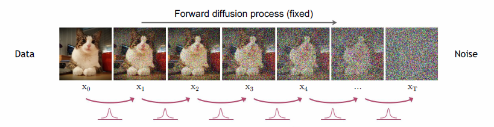

# Reverse diffusion model

* The goal of the reverse diffusion process is to find a parameterized model $p_\theta$ explaining the sequence of images backwards in time:

$$
    p_\theta(x_{0:T}) = p(x_T) \, \prod_{t=1}^T p_\theta(x_{t-1} | x_t)
$$

where:

$$
p_\theta(x_{t-1} | x_t) = \mathcal{N}(\mu_\theta(x_t, t), \Sigma_\theta(x_t, t))
$$

* The reverse process is also normally distributed, given that the noise $\beta_t$ is not too big.

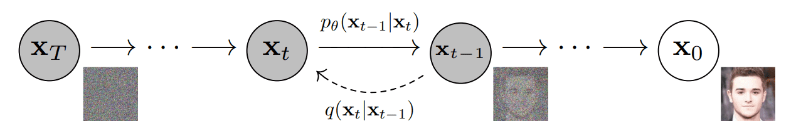{width=70%}

:::footer
See <https://lilianweng.github.io/posts/2021-07-11-diffusion-models/>
:::

# Denoising Probabilistic Diffusion Model

* By doing some Bayesian inference on the true posterior $q(x_{t-1} | x_t) = \mathcal{N}(\mu_t, \Sigma_t)$, @Ho2020 could show that:

$$
\begin{cases}
\mu_t = \dfrac{1}{\sqrt{\alpha_t}} \, (x_t - \dfrac{1-\alpha_t}{\sqrt{1 - \bar{\alpha}_t}} \, \epsilon_t)\\
\\
\Sigma_t = \dfrac{1 - \bar{\alpha}_{t-1}}{1 - \bar{\alpha}_{t}} \beta_t \, I = \bar{\beta}_t \, I \\
\end{cases}
$$

* The reverse variance only depends on the schedule of $\beta_t$, it can be pre-computed.

{width=70%}

:::footer
See <https://lilianweng.github.io/posts/2021-07-11-diffusion-models/>
:::

# Denoising Probabilistic Diffusion Model

* The reverse model $p_\theta(x_{t-1} | x_t)$ only need to approximate the mean:

$$
\mu_\theta(x_t, t) = \dfrac{1}{\sqrt{\alpha_t}} \, (x_t - \dfrac{1-\alpha_t}{\sqrt{1 - \bar{\alpha}_t}} \, \epsilon_\theta(x_t, t))
$$

* $x_t$ is an input to the model, it does not have to predicted.

* All we need to learn is the noise $\epsilon_\theta(x_t, t) \approx \epsilon_t$ that was added to the original image $x_0$ to obtain $x_t$:

$$
    x_t = \sqrt{\bar{\alpha}_t} \, x_0 +  \sqrt{1 - \bar{\alpha}_t} \, \epsilon_t 
$$

{width=70%}

:::footer
See <https://lilianweng.github.io/posts/2021-07-11-diffusion-models/>
:::

# Denoising Probabilistic Diffusion Model

:::::: {.columns}
::: {.column width=60%}

* We want to predict the added noise in the image space:

$$
    \epsilon_\theta(x_t, t) = \epsilon_\theta(\sqrt{\bar{\alpha}_t} \, x_0 +  \sqrt{1 - \bar{\alpha}_t} \, \epsilon_t, t) \approx \epsilon_t
$$

* We can simply minimize the mse with the true noise:

$$
\begin{aligned}
    \mathcal{L}(\theta) &= \mathbb{E}_{t \sim [1, T], x_0, \epsilon_t} [(\epsilon_t - \epsilon_\theta(x_t, t))^2] \\
 &= \mathbb{E}_{t \sim [1, T], x_0, \epsilon_t} [(\epsilon_t - \epsilon_\theta(\sqrt{\bar{\alpha}_t} \, x_0 +  \sqrt{1 - \bar{\alpha}_t} \, \epsilon_t, t) )^2] \\
\end{aligned}
$$

* We only need to sample an image $x_0$, a time step $t$, a noise $\epsilon_t \sim \mathcal{N}(0, I)$, predict the noise $\epsilon_\theta(x_t, t)$ and minimize the mse!

:::
::: {.column width=40%}

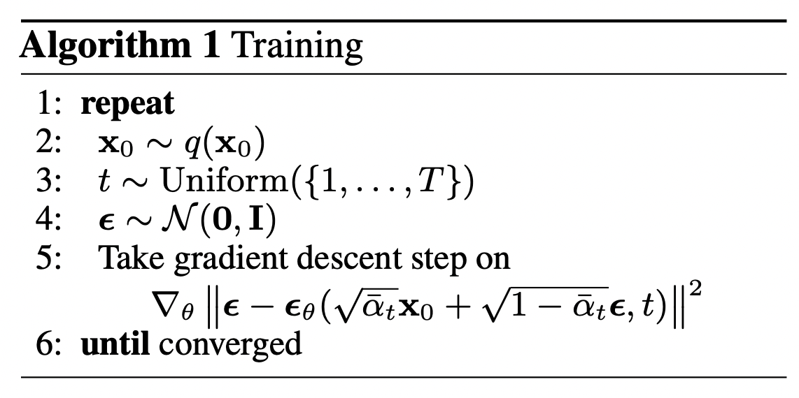

:::
:::

:::footer
@Ho2020 Denoising Diffusion Probabilistic Models. arXiv:2006.11239
:::

# Denoising Probabilistic Diffusion Model

* Training can be done on individual samples, no need for the whole Markov chain to create the minibatches.

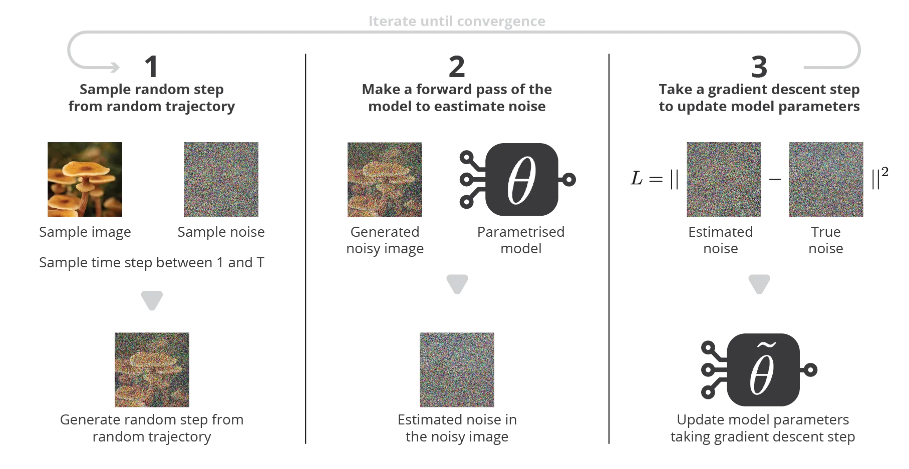{width=80%}

# DDPM backbone

* The neural network used for the reverse diffusion is usually some kind of U-net, with attentional layers, or even a vision Transformer.

:::columns
:::column

:::
:::column
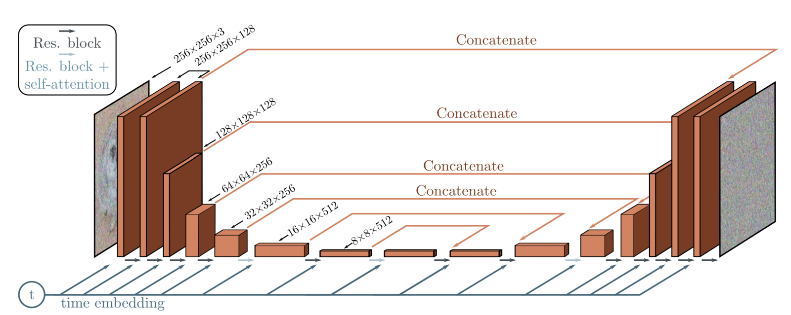

* A **time embedding** for the time index $t$ is necessary. It is usually added to each layer of the U-Net.
:::
:::

# DDPM sampler

:::columns
:::column

* The reverse diffusion occurs iteratively backwards in time (1000 steps) by sampling the posterior:

$$
    p_\theta(x_{t-1} | x_t) = \mathcal{N}(\mu_\theta(x_t, t), \bar{\beta}_t \, I)
$$

$$
x_{t-1} = \dfrac{1}{\sqrt{\alpha_t}} \, (x_t - \dfrac{1-\alpha_t}{\sqrt{1 - \bar{\alpha}_t}} \, \epsilon_\theta(x_t, t)) + \bar{\beta}_t \, \epsilon
$$

* The last step $x_1 \rightarrow x_0$ can be done deterministically.

* It is possible to use less iterations (200) by taking bigger steps, but this stays expensive and generates lower quality images.

:::
:::column

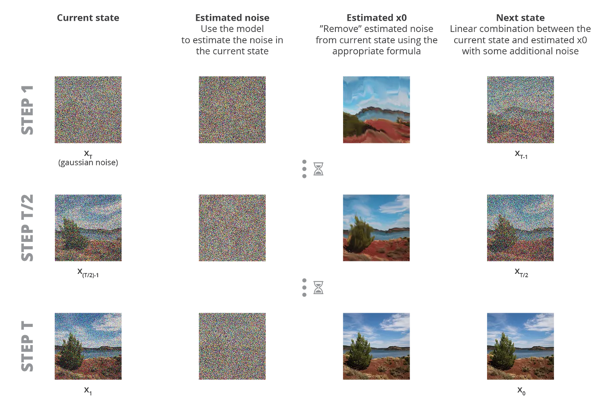

:::
:::

{width=70%}

# Denoising Probabilistic Diffusion Model

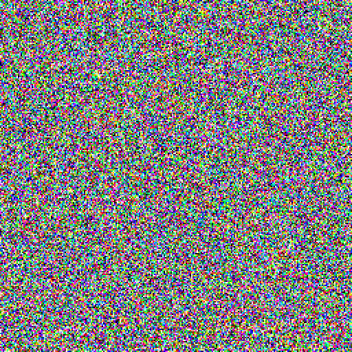

# Modern samplers

:::columns
:::{.column width=60%}

* The equivalent SDE is:

$$
    dx = \left[-\frac{1}{2}\beta(t) x + \frac{\beta(t)}{\sqrt{1-\bar{\alpha}_t}} \epsilon_\theta(x, t)\right] dt + \sqrt{\beta(t)} \, d\bar{W}
$$

* The DDPM sampler is actually a simple first-order Euler-Maruyama SDE solver:

$$
x_{t-1} = \dfrac{1}{\sqrt{\alpha_t}} \, (x_t - \dfrac{\beta_t}{\sqrt{1 - \bar{\alpha}_t}} \, \epsilon_\theta(x_t, t)) + \bar{\beta}_t \, \epsilon
$$

* Higher-order and/or deterministic solvers allow to more precisely evaluate the SDE while taking much less steps (50), such as the DDIM sampler, or fancier ones like DPM++, Heun, etc.

$$
x_{t-1} = \sqrt{\bar{\alpha}_{t-1}} \, (\dfrac{x_t - \sqrt{1- \bar{\alpha}_t} \, \epsilon_\theta(x_t, t)}{ \sqrt{\bar{\alpha}_t}}) + \sqrt{1 - \bar{\alpha}_{t-1}} \, \epsilon_\theta(x_t, t)
$$

:::
:::{.column width=40%}

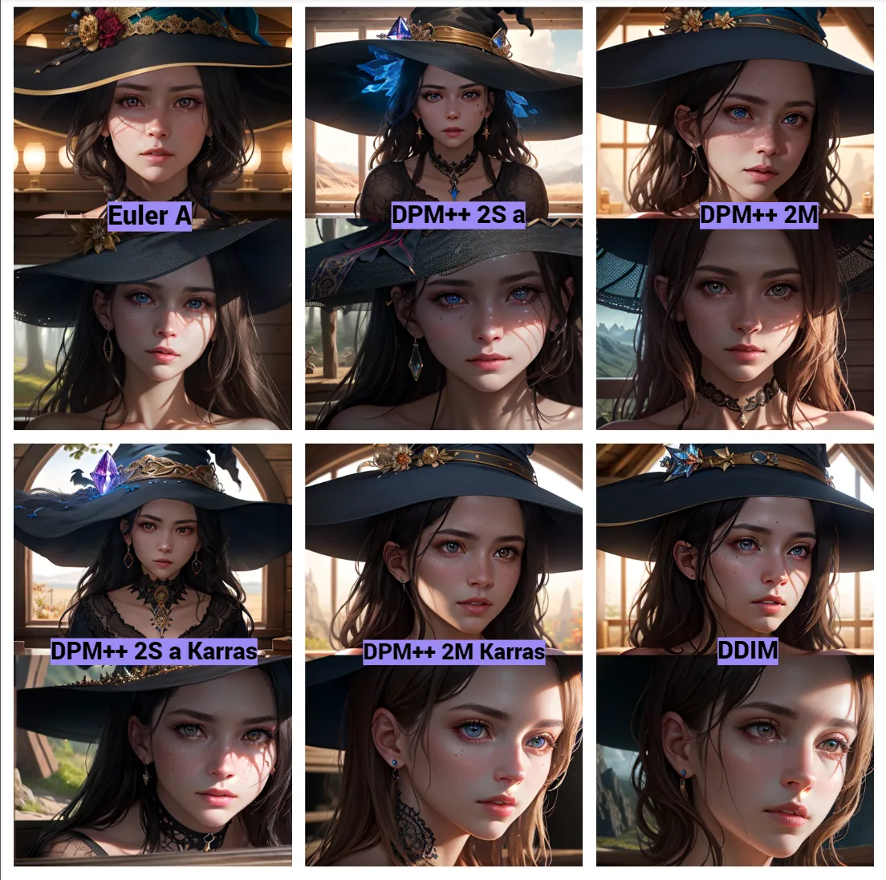{width=70%}

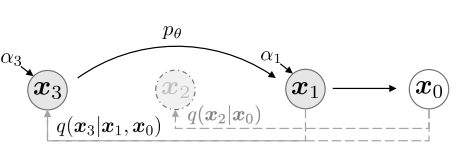

:::
:::

# 2 - Loss derivation

#  Loss derivation

* Let's now see how to arrive to the same loss function from a variational point of view. 

* The blog post by Lilian Weng is very helpful: <https://lilianweng.github.io/posts/2021-07-11-diffusion-models/>, as well as this one by Jonathan Kernes <https://towardsdatascience.com/diffusion-models-91b75430ec2>.

* As we have a generative model (learning the distribution of images $x_0$), all we want to maximize is the log-likelihood of the model $p_\theta(x_0)$ on the data, which gives us the following NLL loss:

$$
	\mathcal{L}(\theta) = \mathbb{E}_{x_0 \sim q(x_0)} [- \log p_\theta(x_0)]  = \int - q(x_0) \log p_\theta(x_0) dx_0
$$

#  Loss derivation

* The first trick is to rewrite the log-evidence $\log p_\theta(x_0)$ as a function of normalized transition probabilities using the **Markov assumption**. 

* Let's first marginalize $p_\theta(x_0)$ using the rest of the sequence $(x_1, \ldots x_T)$, involving the joint probability of the sequence:

$$
\log p_\theta(x_0) = \log \int p_\theta(x_0, x_1, \ldots, x_T)\, dx_1 \, dx_2 \ldots \, dx_T
$$

* The Markov assumption states that the different denoising steps of the sequence are independent from each other, i.e. $x_t$ contains enough information to predict the distribution of $x_{t-1}$, there is no need to know the "history", i.e. the other steps:

$$
 p_\theta(x_0, x_1, \ldots, x_T) = p_\theta(x_T) \prod_{t=1}^T p_\theta(x_{t-1} | x_t)
$$

#  Loss derivation

* Let's do the same with the **forward process** on the whole sequence $q(x_0, x_1, \ldots x_t)$, but in the other direction:

$$
q(x_0, x_1, \ldots, x_T) = q(x_0) \prod_{t=1}^T q(x_{t} | x_{t-1})
$$

* Dividing both sides with $q(x_0)$, we obtain the conditional:

$$
q(x_1, \ldots, x_T | x_0) = \prod_{t=1}^T q(x_{t} | x_{t-1})
$$

* Noting $dx_{1..T} = dx_1 \, dx_2 \ldots \, dx_T$, we have

$$
\log p_\theta(x_0) = \log \int p_\theta(x_T) \prod_{t=1}^T p_\theta(x_{t-1} | x_t) \, dx_{1..T}
$$

#  Loss derivation

* We now use the **importance sampling** trick, by adding the term $\dfrac{q(x_1, \ldots, x_T | x_0)}{q(x_1, \ldots, x_T | x_0)} = 1$ inside the equation and expanding the denominator:

$$
\begin{aligned}
\log p_\theta(x_0) & = \log \int \dfrac{q(x_1, \ldots, x_T | x_0)}{q(x_1, \ldots, x_T | x_0)} p_\theta(x_T) \prod_{t=1}^T p_\theta(x_{t-1} | x_t) \, dx_{1..T} \\
&\\
&= \log \int q(x_1, \ldots, x_T | x_0) \, p_\theta(x_T) \prod_{t=1}^T \frac{p_\theta(x_{t-1} | x_t)}{q(x_t | x_{t-1})} \, dx_{1..T} \\
&\\
&= \log \mathbb{E}_{x_1, \dots, x_T \sim q(x_1, \ldots, x_T | x_0)} [ p_\theta(x_T) \prod_{t=1}^T \frac{p_\theta(x_{t-1} | x_t)}{q(x_t | x_{t-1})} ] \\
\end{aligned}
$$

* The importance sampling trick is a brilliant way to replace pesky integrals with expectations, which can later be sampled. This is exactly the same trick as in RL and policy gradients.

* What this expectation means is that we only need to sample the sequence $x_1, \ldots, x_t$ conditioned on $x_0$ (the input image) following the **forward process**. 

#  Loss derivation

* We now use **Jensen's inequality** ($\mathbb{E}[f(X)] \geq f(\mathbb{E}[X])$ if $f$ is convex) to put the log inside the expectation and obtain a **lower bound on the log-evidence**:

$$
\begin{aligned}
\log p_\theta(x_0) &\geq \mathbb{E}_{x_1, \dots, x_T \sim q(x_1, \ldots, x_T | x_0)} [ \log ( p_\theta(x_T) \prod_{t=1}^T \frac{p_\theta(x_{t-1} | x_t)}{q(x_t | x_{t-1})} )] \\
&\\
&= \mathbb{E}_{x_1, \dots, x_T \sim q(x_1, \ldots, x_T | x_0)} [ \log p_\theta(x_T) + \sum_{t=1}^T \log \frac{p_\theta(x_{t-1} | x_t)}{q(x_t | x_{t-1})} ] \\
&\\
&= \text{ELBO}(p_\theta, q, x_0)
\end{aligned}
$$

* The **evidence lower bound** (ELBO) or **variational lower bound** (VLB) is a classical trick in variational inference (including VAE): the goal is to maximize the evidence $\log p_\theta(x_0)$, but it is generally intractable. 

* We instead maximize its lower bound, as the parameters $\theta$ maximizing the ELBO will also maximize the evidence (see <https://yunfanj.com/blog/2021/01/11/ELBO.html> for more details).

#  Loss derivation

* The ratio of probabilities $\log \dfrac{p_\theta(x_{t-1} | x_t)}{q(x_t | x_{t-1})}$ looks interesting, as it might lead us to a KL divergence, but the conditionals are reversed. 

* Let's use the Bayes rule to invert $q(x_t | x_{t-1})$, remembering from earlier that it is only tractable when conditioned on $x_0$:

$$
q(x_{t}| x_{t-1}) = q(x_{t}| x_{t-1}, x_0) = q(x_{t-1}| x_{t}, x_0) \, \dfrac{q(x_{t} | x_0)}{q(x_{t-1} | x_0)}
$$

* The first equality $q(x_{t}| x_{t-1}) = q(x_{t}| x_{t-1}, x_0)$ is due to the **Markov property**, we do not need $x_0$ to predict $x_{t}$ from $x_{t-1}$ in the forward process!

#  Loss derivation

* Let's plug this in our ELBO, taking out $t=1$ from the sum:

$$
\begin{aligned}
\log p_\theta(x_0) &\geq \mathbb{E}_{x_1, \dots, x_T \sim q(x_1, \ldots, x_T | x_0)} [ \log p_\theta(x_T) + \sum_{t=2}^T \log \frac{p_\theta(x_{t-1} | x_t)}{q(x_t | x_{t-1})} + \log \dfrac{p_\theta(x_0 | x_1)}{q(x_1 | x_0)}] \\
&\\
&= \mathbb{E}_{x_1, \dots, x_T \sim q(x_1, \ldots, x_T | x_0)} [ \log p_\theta(x_T) + \sum_{t=2}^T \log \frac{p_\theta(x_{t-1} | x_t)}{q(x_{t-1} | x_{t}, x_0)}  \, \dfrac{q(x_{t-1} | x_0)}{q(x_t | x_0)}+ \log \dfrac{p_\theta(x_0 | x_1)}{q(x_1 | x_0)}] \\
&\\
&= \mathbb{E}_{x_1, \dots, x_T \sim q(x_1, \ldots, x_T | x_0)} [ \log p_\theta(x_T) + \sum_{t=2}^T \log \frac{p_\theta(x_{t-1} | x_t)}{q(x_{t-1} | x_{t}, x_0)}  + \sum_{t=2}^T \log  \dfrac{q(x_{t-1} | x_0)}{q(x_t | x_0)} + \log \dfrac{p_\theta(x_0 | x_1)}{q(x_1 | x_0)}] \\
\end{aligned}
$$

* The term $\sum_{t=2}^T \log  \dfrac{q(x_{t-1} | x_0)}{q(x_t | x_0)}$ cancels nicely and becomes equal to $\log q(x_1 | x_0) - \log q(x_{T} | x_0)$.  

#  Loss derivation

* The first term $\log q(x_1 | x_0)$  even cancels the denominator of $\log \dfrac{p_\theta(x_0 | x_1)}{q(x_1 | x_0)}$, so we obtain:

$$
\begin{aligned}
\log p_\theta(x_0) &\geq  \mathbb{E}_{x_1, \dots, x_T \sim q(x_1, \ldots, x_T | x_0)} [ \log p_\theta(x_T) + \sum_{t=2}^T \log \frac{p_\theta(x_{t-1} | x_t)}{q(x_{t-1} | x_{t}, x_0)} -\log q(x_T | x_0)  + \log p_\theta(x_0 | x_1) ] \\
&\\
& = \mathbb{E}_{x_1, \dots, x_T \sim q(x_1, \ldots, x_T | x_0)} [ \log \dfrac{p_\theta(x_T)}{q(x_T | x_0)} + \sum_{t=2}^T \log \frac{p_\theta(x_{t-1} | x_t)}{q(x_{t-1} | x_{t}, x_0)}  + \log p_\theta(x_0 | x_1) ]\\
&\\
& = \mathbb{E}_{x_1, \dots, x_T \sim q(x_1, \ldots, x_T | x_0)} [ L_T + \sum_{t=2}^T L_{t}  + L_0 ]\\
\end{aligned}
$$

#  Loss derivation

$$
\begin{aligned}
\log p_\theta(x_0) 
& = \mathbb{E}_{x_1, \dots, x_T \sim q(x_1, \ldots, x_T | x_0)} [ L_T + \sum_{t=2}^T L_{t}  + L_0 ]\\
\end{aligned}
$$

* The final term $L_T$ depends on the final image $x_T$, which is just pure noise if the forward process was parameterized correctly. The reverse process does not play a role in obtaining $x_T$, so it is a constant with respect to $\theta$, and we can ignore it for the optimization process.
* The initial loss $L_0 = \log p_\theta(x_0 | x_1)$ concerns the reconstruction of the original image from the first noisy version. It ensures that the model can accurately recover the original data after the noise has been gradually removed through the reverse process. It is in particular involved in scaling the pixels to $[-1,1]$, ensuring that a real image comes out of the denoising process.
* The loss at time $t$ $L_t = \log \dfrac{p_\theta(x_{t-1} | x_t)}{q(x_{t-1} | x_{t}, x_0)} = - \text{KL} (p_\theta(x_{t-1} | x_t), q(x_{t-1} | x_{t}, x_0))$ is the KL divergence between the learned posterior $p_\theta(x_{t-1} | x_t)$ and the "true" posterior $q(x_{t-1} | x_{t}, x_0)$.

#  Loss derivation

* Now we can simplify this loss using all our assumptions. In particular, the **Markov property** states that the different step of the noising/denoising process are independent, so we do no need to explicitly optimize the sum of all $L_t$ terms: optimizing each of them individually by sampling $t$ uniformly in $[1, T]$ would lead to the same result. 

$$
\mathcal{L}_\text{VLB}(\theta) = \mathbb{E}_{x_0 \sim q(x_0), t \sim \mathcal{U}(1, T)} [\text{KL} (p_\theta(x_{t-1} | x_t), q(x_{t-1} | x_{t}, x_0) ) ]
$$

* Remember that $L_T$ does not matter, and that $L_0$ will be a special case. We call this loss the **variational lower bound** VLB.

* Moreover, we know that both distributions inside the KL are **normal distributions**. As shown earlier, the true posterior is known to be:

$$
	q(x_{t-1}| x_t, x_0) = \mathcal{N}(x_{t-1}; \hat{\mu}(x_t, t) = \dfrac{1}{\sqrt{\bar{\alpha}_t}} \, (x_t - \dfrac{\beta_t}{\sqrt{1 - \bar{\alpha}_t}} \, \epsilon_t), (\dfrac{1 - \bar{\alpha}_{t-1}}{1 - \bar{\alpha}_t} \, \beta_t)^2 \, I)
$$

* The learned posterior should therefore also be a normal distribution, whose parameters should be learned.

$$
	p_\theta(x_{t-1}| x_t) = \mathcal{N}(x_{t-1}; \mu_\theta(x_t, t), \Sigma^2_\theta(x_t, t))
$$

#  Loss derivation

* The interest of having normal distributions is that their KL divergence takes a closed form:

> **Closed form of the KL divergence between two Gaussians**
>
> The closed form of the KL divergence between $X = \mathcal{N}(\mu_x, \sigma^2_x)$ and $Y=\mathcal{N}(\mu_y, \sigma^2_y)$ is simply a function of their parameters:

$$
\text{KL}(X ||Y) = \log \dfrac{\sigma_y}{\sigma_x} + \dfrac{\sigma_x^2 + (\mu_x - \mu_y)^2}{2 \sigma_y^2} - \dfrac{1}{2}
$$

#  Loss derivation

* Furthermore, an assumption of DDPM is that **the variance schedule $\beta_t$** is fixed and does not depend on $\theta$. 

* All terms of the KL depending on the variances disappear when calculating the gradient of the KL.

* All that remains in the loss function is the squared difference between the means, i.e. the **mse**!

$$
\mathcal{L}_\text{VLB}(\theta) = \mathbb{E}_{x_0 \sim q(x_0), t \sim \mathcal{U}(1, T)} [ (\hat{\mu}(x_t, t) - \mu_\theta(x_t, t))^2 ]
$$

#  Loss derivation

* In addition, noting that $\hat{\mu}(x_t, t) = \dfrac{1}{\sqrt{\bar{\alpha}_t}} \, (x_t - \dfrac{\beta_t}{\sqrt{1 - \bar{\alpha}_t}} \, \epsilon_t)$, we can parameterize $\mu_\theta(x_t, t)$ in the following way:

$$
\mu_\theta(x_t, t) = \dfrac{1}{\sqrt{\bar{\alpha}_t}} \, (x_t - \dfrac{\beta_t}{\sqrt{1 - \bar{\alpha}_t}} \, \epsilon_\theta(x_t, t))
$$

and have only to compute the mse between the **residuals** $\epsilon_t$ and $\epsilon_\theta(x_t, t)$. This is the simple objective we used previously:

$$
\mathcal{L}(\theta) = \mathbb{E}_{x_0 \sim q, \epsilon_t \sim \mathcal{N}(0, I), t \sim \mathcal{U}(1, T)} [(\epsilon_t - \epsilon_\theta(x_t, t))^2]
$$

* Using the Markov property, normal distributions, a fixed variance schedule and a clever reparameterization, we moved from the very complex ELBO loss to a simple regression on the residuals.

# 3 - Dall-e 2

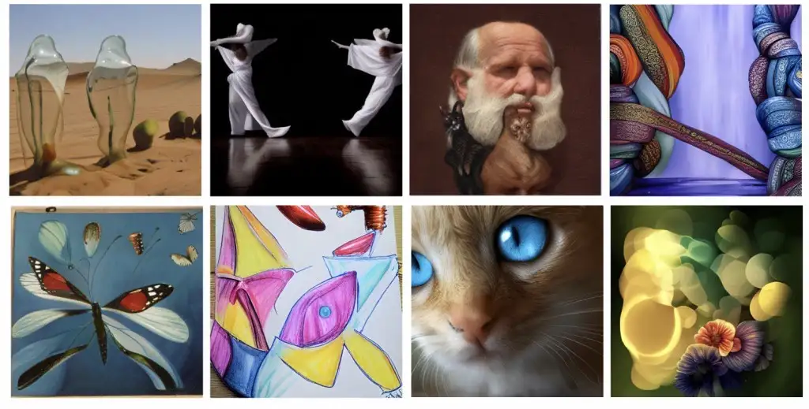

:::footer
@Ramesh2022 Hierarchical Text-Conditional Image Generation with CLIP Latents. arXiv:2204.06125
:::

# Dall-e 2

* Text-to-image generators such as Dall-e, Midjourney, or Stable Diffusion combine LLM for text embedding with diffusion models for image generation.

* CLIP embeddings of texts and images are first learned using contrastive learning.

* A conditional diffusion process (GLIDE) then uses the image embeddings to produce images.

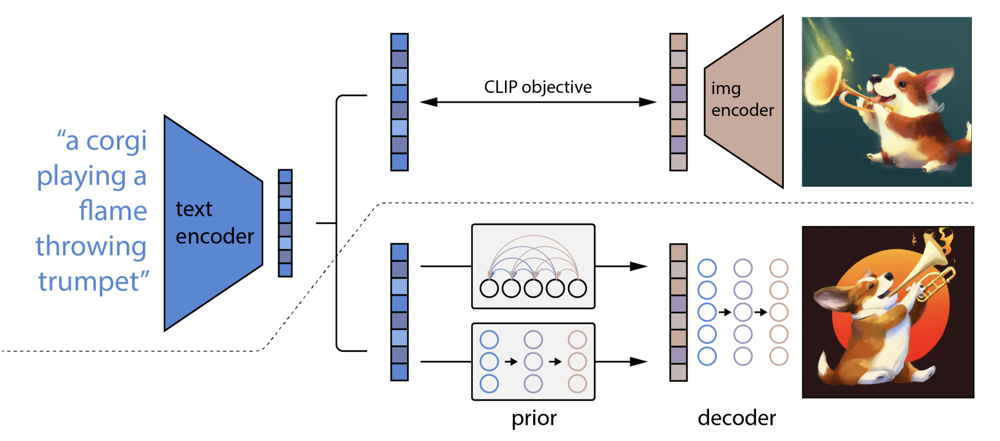{width=80%}

::: footer
<https://openai.com/dall-e-2/>
:::

# CLIP: Contrastive Language-Image Pre-training

* Embeddings for text and images are learned using **Transformer encoders** and **contrastive learning**. 

* For each pair (text, image) in the training set, their representation should be made similar, while being different from the others. 

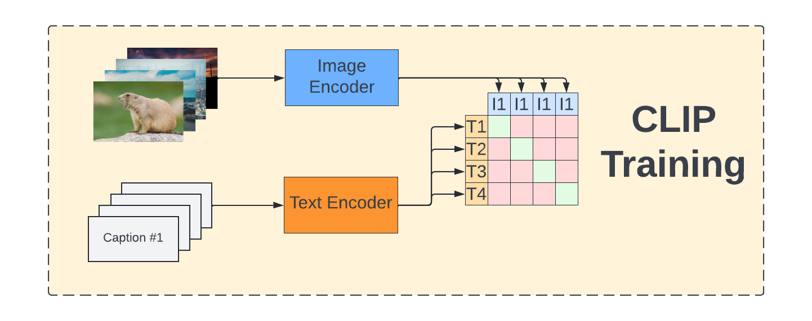

# GLIDE

* DDPMs generate images from raw noise, but there is no control over which image will emerge.

* **GLIDE** (Guided Language to Image Diffusion for Generation and Editing) is a DDPM conditioned on a latent representation of a caption $c$.

* As for cGAN and cVAE, the caption $c$ is provided to the learned model:

$$
    \epsilon_\theta(x_t, t, c) \approx \epsilon_t
$$

* Text embeddings can be obtained from any NLP model, for example a Transformer.

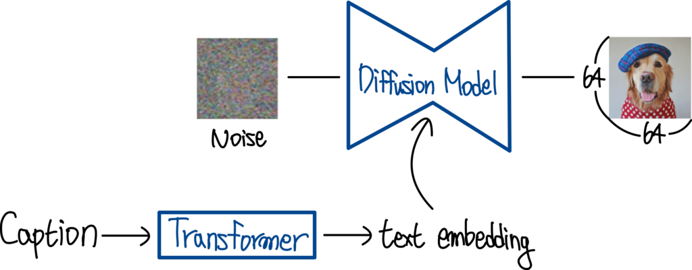{width=60%}

:::footer
@Nichol2022 GLIDE: Towards Photorealistic Image Generation and Editing with Text-Guided Diffusion Models. arXiv:2112.10741
:::

# Dall-e 2

* In Dall-e 2, the prior network learns to map text embeddings to a sequence of image embeddings:

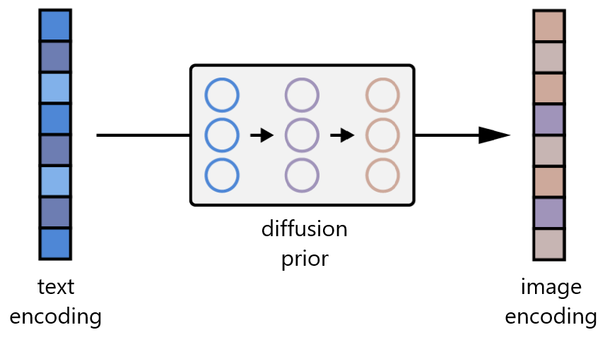{width=40%}

* After CLIP training, the two embeddings are already close from each other, but the authors find that the diffusion process works better when the image embeddings change during the diffusion.

* The image embedding is then used as the condition for GLIDE.

:::footer
@Ramesh2022 Hierarchical Text-Conditional Image Generation with CLIP Latents. arXiv:2204.06125
:::

# References