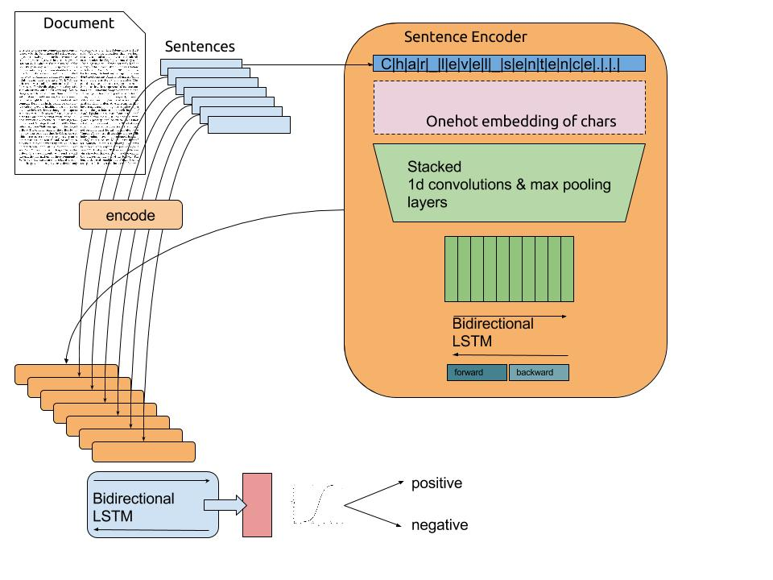

# 1 - RNN

# Problem with feedforward networks

::: {.columns}
::: {.column width=60%}

* **Feedforward neural networks** learn to associate an input vector to an output.

$$\mathbf{y} = F_\theta(\mathbf{x})$$


* If you present a sequence of inputs $\mathbf{x}_0, \mathbf{x}_1, \ldots, \mathbf{x}_t$ to a feedforward network, the outputs will be independent from each other:

$$\mathbf{y}_0 = F_\theta(\mathbf{x}_0)$$
$$\mathbf{y}_1 = F_\theta(\mathbf{x}_1)$$
$$\dots$$
$$\mathbf{y}_t = F_\theta(\mathbf{x}_t)$$


:::
::: {.column width=40%}


:::
:::


* Many problems depend on time series, such as predicting the future of a time series by knowing its past values.

$$x_{t+1} = F_\theta(x_0, x_1, \ldots, x_t)$$

* Example: weather prediction, financial prediction, predictive maintenance, natural language processing, video analysis...


# Input aggregation

* A naive solution is to **aggregate** (concatenate) inputs over a sufficiently long window and use it as a new input vector for the feedforward network.

$$\mathbf{X} = \begin{bmatrix}\mathbf{x}_{t-T} & \mathbf{x}_{t-T+1} & \ldots & \mathbf{x}_t \\ \end{bmatrix}$$

$$\mathbf{y}_t = F_\theta(\mathbf{X})$$

::: {.columns}
::: {.column width=50%}


:::
::: {.column width=50%}


* **Problem 1:** How long should the window be?

* **Problem 2:** Having more input dimensions increases dramatically the complexity of the classifier (VC dimension), hence the number of training examples required to avoid overfitting.

:::
:::


::: footer
<https://www.researchgate.net/publication/220827486_A_study_on_the_ability_of_Support_Vector_Regression_and_Neural_Networks_to_Forecast_Basic_Time_Series_Patterns>
:::


# Recurrent neural network

::: {.columns}
::: {.column width=30%}

{width=70%}

:::
::: {.column width=65%}

* A **recurrent neural network** (RNN) uses it previous output as an additional input (*context*).

* All vectors have a time index $t$ denoting the time at which this vector was computed.

* The input vector at time $t$ is $\mathbf{x}_t$, the output vector is $\mathbf{h}_t$:

$$
    \mathbf{h}_t = \sigma(W_x \times \mathbf{x}_t + W_h \times \mathbf{h}_{t-1} + \mathbf{b})
$$

* $\sigma$ is a transfer function, usually logistic or tanh.

* The input $\mathbf{x}_t$ and previous output $\mathbf{h}_{t-1}$ are multiplied by **learnable weights**:

    * $W_x$ is the input weight matrix.

    * $W_h$ is the recurrent weight matrix.

:::
:::


::: footer
Source: <http://colah.github.io/posts/2015-08-Understanding-LSTMs>
:::


# Recurrent neural networks


{width=80%}

* One can **unroll** a recurrent network: the output $\mathbf{h}_t$ depends on the whole history of inputs from $\mathbf{x}_0$ to $\mathbf{x}_t$.

$$
\begin{aligned}
    \mathbf{h}_t & = \sigma(W_x \times \mathbf{x}_t + W_h \times \mathbf{h}_{t-1} + \mathbf{b}) \\
                 & = \sigma(W_x \times \mathbf{x}_t + W_h \times \sigma(W_x \times \mathbf{x}_{t-1} + W_h \times \mathbf{h}_{t-2} + \mathbf{b})  + \mathbf{b}) \\
                 & = f_{W_x, W_h, \mathbf{b}} (\mathbf{x}_0, \mathbf{x}_1, \dots,\mathbf{x}_t) \\
\end{aligned}
$$

* A RNN is considered as part of **deep learning**, as there are many layers of weights between the first input $\mathbf{x}_0$ and the output $\mathbf{h}_t$.

* The only difference with a DNN is that the weights $W_x$ and $W_h$ are **reused** at each time step.


::: footer
Source: <http://colah.github.io/posts/2015-08-Understanding-LSTMs>
:::

# BPTT: Backpropagation through time

{width=80%}

$$
    \mathbf{h}_t = f_{W_x, W_h, \mathbf{b}} (\mathbf{x}_0, \mathbf{x}_1, \dots,\mathbf{x}_t) \\
$$

* The function between the history of inputs and the output at time $t$ is differentiable: we can simply apply gradient descent to find the weights!

* This variant of backpropagation is called **Backpropagation Through Time** (BPTT).

* Once the loss between $\mathbf{h}_t$ and its desired value is computed, one applies the **chain rule** to find out how to modify the weights $W_x$ and $W_h$ using the history $(\mathbf{x}_0, \mathbf{x}_1, \ldots, \mathbf{x}_t)$.

::: footer
Source: <http://colah.github.io/posts/2015-08-Understanding-LSTMs>
:::


# BPTT: Backpropagation through time

* Let's compute the gradient accumulated between $\mathbf{h}_{t-1}$ and $\mathbf{h}_{t}$:

$$
\begin{aligned}
    \mathbf{h}_{t} & = \sigma(W_x \times \mathbf{x}_{t} + W_h \times \mathbf{h}_{t-1} + \mathbf{b}) \\
\end{aligned}
$$

* As for feedforward networks, the gradient of the loss function is decomposed into two parts:

$$
    \frac{\partial \mathcal{L}(W_x, W_h)}{\partial W_x} =
    \frac{\partial \mathcal{L}(W_x, W_h)}{\partial \mathbf{h}_t} \times
    \frac{\partial \mathbf{h}_t}{\partial W_x}
$$

$$
    \frac{\partial \mathcal{L}(W_x, W_h)}{\partial W_h} =
    \frac{\partial \mathcal{L}(W_x, W_h)}{\partial \mathbf{h}_t} \times
    \frac{\partial \mathbf{h}_t}{\partial W_h}
$$

* The first part only depends on the loss function (mse, cross-entropy):

$$
    \frac{\partial \mathcal{L}(W_x, W_h)}{\partial \mathbf{h}_t} = - (\mathbf{t}_{t}- \mathbf{h}_{t})
$$

* The second part depends on the RNN itself.

# BPTT: Backpropagation through time

* Output of the RNN:

$$
\begin{aligned}
    \mathbf{h}_{t} & = \sigma(W_x \times \mathbf{x}_{t} + W_h \times \mathbf{h}_{t-1} + \mathbf{b}) \\
\end{aligned}
$$

* The gradients w.r.t the two weight matrices are given by this **recursive** relationship (product rule):

$$
\begin{aligned}
    \frac{\partial \mathbf{h}_t}{\partial W_x} & = \mathbf{h'}_{t} \times (\mathbf{x}_t + W_h \times \frac{\partial \mathbf{h}_{t-1}}{\partial W_x})\\
    & \\
    \frac{\partial \mathbf{h}_t}{\partial W_h} & = \mathbf{h'}_{t} \times (\mathbf{h}_{t-1} + W_h \times \frac{\partial \mathbf{h}_{t-1}}{\partial W_h})\\
\end{aligned}
$$

* The derivative of the transfer function is noted $\mathbf{h'}_{t}$:

$$
    \mathbf{h'}_{t} = \begin{cases}
        \mathbf{h}_{t} \, (1 - \mathbf{h}_{t}) \quad \text{ for logistic}\\
        (1 - \mathbf{h}_{t}^2) \quad \text{ for tanh.}\\
    \end{cases}
$$


# BPTT: Backpropagation through time

* If we **unroll** the gradient, we obtain:

$$
\begin{aligned}
    \frac{\partial \mathbf{h}_t}{\partial W_x} & = \mathbf{h'}_{t} \, (\mathbf{x}_t + W_h \times \mathbf{h'}_{t-1} \, (\mathbf{x}_{t-1} + W_h \times \mathbf{h'}_{t-2} \, (\mathbf{x}_{t-2} + W_h \times \ldots (\mathbf{x}_0))))\\
    & \\
    \frac{\partial \mathbf{h}_t}{\partial W_h} & = \mathbf{h'}_{t} \, (\mathbf{h}_{t-1} + W_h \times \mathbf{h'}_{t-1} \, (\mathbf{h}_{t-2} + W_h \times \mathbf{h'}_{t-2} \, \ldots (\mathbf{h}_{0})))\\
\end{aligned}
$$

* When updating the weights at time $t$, we need to store in memory:

    * the complete history of inputs $\mathbf{x}_0$, $\mathbf{x}_1$, ... $\mathbf{x}_t$.

    * the complete history of outputs $\mathbf{h}_0$, $\mathbf{h}_1$, ... $\mathbf{h}_t$.

    * the complete history of derivatives $\mathbf{h'}_0$, $\mathbf{h'}_1$, ... $\mathbf{h'}_t$.

before computing the gradients iteratively, starting from time $t$ and accumulating gradients **backwards** in time until $t=0$.

* Each step backwards in time adds a bit to the gradient used to update the weights.

# Truncated BPTT


* In practice, going back to $t=0$ at each time step requires too many computations, which may not be needed.

* **Truncated BPTT** only updates the gradients up to $T$ steps before: the gradients are computed backwards from $t$ to $t-T$. The partial derivative in $t-T-1$ is considered 0.

* This limits the **horizon** of BPTT: dependencies longer than $T$ will not be learned, so it has to be chosen carefully for the task.

* $T$ becomes yet another hyperparameter of your algorithm...

::: footer
<https://r2rt.com/styles-of-truncated-backpropagation.html>
:::

# Temporal dependencies

* BPTT is able to find **short-term dependencies** between inputs and outputs: perceiving the inputs $\mathbf{x}_0$ and $\mathbf{x}_1$ allows to respond correctly at $t = 3$.


::: footer
Source: <http://colah.github.io/posts/2015-08-Understanding-LSTMs>
:::


# Temporal dependencies


* But it fails to detect **long-term dependencies** because of:

    * the truncated horizon $T$ (for computational reasons).

    * the **vanishing gradient problem**.


::: footer
Source: <http://colah.github.io/posts/2015-08-Understanding-LSTMs>
:::


# Vanishing and exploding gradients

* Let's look at the gradient w.r.t to the input weights:

$$
\begin{aligned}
    \frac{\partial \mathbf{h}_t}{\partial W_x} & = \mathbf{h'}_{t} \, (\mathbf{x}_t + W_h \times \frac{\partial \mathbf{h}_{t-1}}{\partial W_x})\\
    & \\
\end{aligned}
$$

* At each iteration backwards in time, the gradients are multiplied by $W_h$.

* If you search how $\frac{\partial \mathbf{h}_t}{\partial W_x}$ depends on $\mathbf{x}_0$, you obtain something like:

$$
\begin{aligned}
    \frac{\partial \mathbf{h}_t}{\partial W_x} & \approx \prod_{k=0}^t \mathbf{h'}_{k} \, ((W_h)^t \, \mathbf{x}_0 + \dots) \\
\end{aligned}
$$

* If $|W_h| > 1$, $|(W_h)^t|$ increases exponentially with $t$: the gradient **explodes**.

* If $|W_h| < 1$, $|(W_h)^t|$ decreases exponentially with $t$:  the gradient **vanishes**.


# Vanishing and exploding gradients

* **Exploding gradients** are relatively easy to deal with: one just clips the norm of the gradient to a maximal value.

$$
    || \frac{\partial \mathcal{L}(W_x, W_h)}{\partial W_x}|| \gets \min(||\frac{\partial \mathcal{L}(W_x, W_h)}{\partial W_x}||, T)
$$

* But there is no solution to the **vanishing gradient problem** for regular RNNs: the gradient fades over time (backwards) and no long-term dependency can be learned.

* This is the same problem as for feedforward deep networks: a RNN is just a deep network rolled over itself.

* Its depth (number of layers) corresponds to the maximal number of steps back in time.

* In order to limit vanishing gradients and learn long-term dependencies, one has to use a more complex structure for the layer.

* This is the idea behind **long short-term memory** (LSTM) networks.

::: footer
S. Hochreiter. Untersuchungen zu dynamischen neuronalen Netzen. Diploma thesis, Institut f. Informatik, Technische Univ. Munich, 1991.
:::


# 2 - LSTM

# Regular RNN


::: footer
Source: <http://colah.github.io/posts/2015-08-Understanding-LSTMs>
:::

# LSTM


::: footer
Source: <http://colah.github.io/posts/2015-08-Understanding-LSTMs>
:::

# LSTM cell

::: {.columns}
::: {.column width=50%}


::: footer
Source: <http://colah.github.io/posts/2015-08-Understanding-LSTMs>
:::

:::
::: {.column width=50%}


* A **LSTM layer** is a RNN layer with the ability to control what it memorizes.

* In addition to the input $\mathbf{x}_t$ and output $\mathbf{h}_t$, it also has a **state** $\mathbf{C}_t$ which is maintained over time.

* The state is the memory of the layer (sometimes called context).

* It also contains three multiplicative **gates**:

    * The **input gate** controls which inputs should enter the memory.

    * The **forget gate** controls which memory should be forgotten.

    * The **output gate** controls which part of the memory should be used to produce the output.

:::
:::


# LSTM cell

::: {.columns}
::: {.column width=50%}


{width=80%}

*Not the same notation, but one sees better the gates...*

::: footer
Source: <http://eric-yuan.me/rnn2-lstm/>
:::

:::
::: {.column width=50%}


* The **state** $\mathbf{C}_t$ can be seen as an accumulator integrating inputs (and previous outputs) over time.

    * The **input gate** allows inputs to be stored.

        * *are they worth remembering?*

    * The **forget gate** "empties" the accumulator

        * *do I still need them?*

    * The **output gate** allows to use the accumulator for the output.

        * *should I respond now? Do I have enough information?*

* The gates **learn** to open and close through learnable weights.

:::
:::


# The cell state is propagated over time

::: {.columns}
::: {.column width=50%}


::: footer
Source: <http://colah.github.io/posts/2015-08-Understanding-LSTMs>
:::

:::
::: {.column width=50%}


* By default, the cell state $\mathbf{C}_t$ stays the same over time (*conveyor belt*).

* It can have the same number of dimensions as the output $\mathbf{h}_t$, but does not have to.

* Its content can be erased by multiplying it with a vector of 0s, or preserved by multiplying it by a vector of 1s.

* We can use a **sigmoid** to achieve this:

{width=30%}


# The forget gate

::: {.columns}
::: {.column width=50%}


::: footer
Source: <http://colah.github.io/posts/2015-08-Understanding-LSTMs>
:::

:::
::: {.column width=50%}


* Forget weights $W_f$ and a sigmoid function are used to decide if the state should be preserved or not.

$$
    \mathbf{f}_t = \sigma(W_f \times [\mathbf{h}_{t-1}; \mathbf{x}_t] + \mathbf{b}_f)
$$

* $[\mathbf{h}_{t-1}; \mathbf{x}_t]$ is simply the concatenation of the two vectors $\mathbf{h}_{t-1}$ and $\mathbf{x}_t$.

* $\mathbf{f}_t$ is a vector of values between 0 and 1, one per dimension of the cell state $\mathbf{C}_t$.

:::
:::


# The input gate

::: {.columns}
::: {.column width=50%}


::: footer
Source: <http://colah.github.io/posts/2015-08-Understanding-LSTMs>
:::

:::
::: {.column width=50%}


* Similarly, the input gate uses a sigmoid function to decide if the state should be updated or not.

$$
    \mathbf{i}_t = \sigma(W_i \times [\mathbf{h}_{t-1}; \mathbf{x}_t] + \mathbf{b}_i)
$$

* As for RNNs, the input $\mathbf{x}_t$ and previous output $\mathbf{h}_{t-1}$ are combined to produce a **candidate state** $\tilde{\mathbf{C}}_t$ using the tanh transfer function.


$$
    \tilde{\mathbf{C}}_t = \text{tanh}(W_C \times [\mathbf{h}_{t-1}; \mathbf{x}_t] + \mathbf{b}_c)
$$

:::
:::


# Updating the state

::: {.columns}
::: {.column width=50%}


::: footer
Source: <http://colah.github.io/posts/2015-08-Understanding-LSTMs>
:::

:::
::: {.column width=50%}


* The new state $\mathbf{C}_t$ is computed as a part of the previous state $\mathbf{C}_{t-1}$ (element-wise multiplication with the forget gate $\mathbf{f}_t$) plus a part of the candidate state $\tilde{\mathbf{C}}_t$ (element-wise multiplication with the input gate $\mathbf{i}_t$).

$$
    \mathbf{C}_t = \mathbf{f}_t \odot \mathbf{C}_{t-1} + \mathbf{i}_t \odot \tilde{\mathbf{C}}_t
$$

* Depending on the gates, the new state can be equal to the previous state (gates closed), the candidate state (gates opened) or a mixture of both.

:::
:::


# The output gate

::: {.columns}
::: {.column width=50%}


::: footer
Source: <http://colah.github.io/posts/2015-08-Understanding-LSTMs>
:::

:::
::: {.column width=50%}


* The output gate decides which part of the new state will be used for the output.

$$
    \mathbf{o}_t = \sigma(W_o \times [\mathbf{h}_{t-1}; \mathbf{x}_t] + \mathbf{b}_o)
$$

* The output not only influences the decision, but also how the gates will updated at the next step.

$$
    \mathbf{h}_t = \mathbf{o}_t \odot \text{tanh} (\mathbf{C}_t)
$$

:::
:::


# LSTM

::: {.columns}
::: {.column width=50%}


* The function between $\mathbf{x}_t$ and $\mathbf{h}_t$ is quite complicated, with many different weights, but everything is differentiable: BPTT can be applied.


::: footer
Source: <http://colah.github.io/posts/2015-08-Understanding-LSTMs>
:::


:::
::: {.column width=50%}


\begin{align}
    & \textbf{Forget gate} \\
    \mathbf{f}_t &= \sigma(W_f \times [\mathbf{h}_{t-1}; \mathbf{x}_t] + \mathbf{b}_f) \\
    & \\
    & \textbf{Input gate} \\
    \mathbf{i}_t &= \sigma(W_i \times [\mathbf{h}_{t-1}; \mathbf{x}_t] + \mathbf{b}_i) \\
    & \\
    & \textbf{Output gate} \\
    \mathbf{o}_t &= \sigma(W_o \times [\mathbf{h}_{t-1}; \mathbf{x}_t] + \mathbf{b}_o) \\
    & \\
    & \textbf{Candidate state} \\
    \tilde{\mathbf{C}}_t &= \text{tanh}(W_C \times [\mathbf{h}_{t-1}; \mathbf{x}_t] + \mathbf{b}_c) \\
    & \\
    & \textbf{New state} \\
    \mathbf{C}_t &= \mathbf{f}_t \odot \mathbf{C}_{t-1} + \mathbf{i}_t \odot \tilde{\mathbf{C}}_t \\
    & \\
    & \textbf{Output} \\
    \mathbf{h}_t &= \mathbf{o}_t \odot \text{tanh} (\mathbf{C}_t) \\
\end{align}

:::
:::


# How do LSTM solve the vanishing gradient problem?


* Not all inputs are remembered by the LSTM: the input gate controls what comes in.

* If only $\mathbf{x}_0$ and $\mathbf{x}_1$ are needed to produce $\mathbf{h}_{t+1}$, they will be the only ones stored in the state, the other inputs are ignored.

::: footer
Source: <http://colah.github.io/posts/2015-08-Understanding-LSTMs>
:::

# How do LSTM solve the vanishing gradient problem?


* If the state stays constant between $t=1$ and $t$, the gradient of the error will not vanish when backpropagating from $t$ to $t=1$, because nothing happens!

$$
    \mathbf{C}_t = \mathbf{C}_{t-1} \rightarrow \frac{\partial \mathbf{C}_t}{\partial \mathbf{C}_{t-1}} = 1
$$

* The gradient is multiplied by exactly one when the gates are closed.


::: footer
Source: <http://colah.github.io/posts/2015-08-Understanding-LSTMs>
:::

# LSTM networks

* LSTM are particularly good at learning long-term dependencies, because the gates protect the cell from vanishing gradients.

* Its problem is how to find out which inputs (e.g. $\mathbf{x}_0$ and $\mathbf{x}_1$) should enter or leave the state memory.

* Truncated BPTT is used to train all weights: the weights for the candidate state (as for RNN), and the weights of the three gates.

* LSTM are also subject to overfitting. Regularization (including dropout) can be used.

* The weights (also for the gates) can be convolutional.

* The gates also have a bias, which can be fixed (but hard to find).

* LSTM layers can be stacked to detect dependencies at different scales (deep LSTM network).

::: footer
 Hochreiter and Schmidhuber (1997). Long short-term memory. Neural computation, 9(8).
:::

# Peephole connections

::: {.columns}
::: {.column width=50%}


::: footer
Source: <http://colah.github.io/posts/2015-08-Understanding-LSTMs>
:::

:::
::: {.column width=50%}


* A popular variant of LSTM adds *peephole* connections, where the three gates have additionally access to the state $\mathbf{C}_{t-1}$.

\begin{align}
    \mathbf{f}_t &= \sigma(W_f \times [\mathbf{C}_{t-1}; \mathbf{h}_{t-1}; \mathbf{x}_t] + \mathbf{b}_f) \\
    &\\
    \mathbf{i}_t &= \sigma(W_i \times [\mathbf{C}_{t-1}; \mathbf{h}_{t-1}; \mathbf{x}_t] + \mathbf{b}_i) \\
    &\\
    \mathbf{o}_t &= \sigma(W_o \times [\mathbf{C}_{t}; \mathbf{h}_{t-1}; \mathbf{x}_t] + \mathbf{b}_o) \\
\end{align}

* It usually works better, but it adds more weights.

:::
:::


::: footer
Gers and Schmidhuber (2000). Recurrent nets that time and count. IJCNN.
:::


# GRU: Gated Recurrent Unit

* Another variant is called the **Gated Recurrent Unit** (GRU).

::: {.columns}
::: {.column width=50%}


* It uses directly the output $\mathbf{h}_t$ as a state, and the forget and input gates are merged into a single gate $\mathbf{r}_t$.

\begin{align}
    \mathbf{z}_t &= \sigma(W_z \times [\mathbf{h}_{t-1}; \mathbf{x}_t]) \\
    &\\
    \mathbf{r}_t &= \sigma(W_r \times [\mathbf{h}_{t-1}; \mathbf{x}_t]) \\
    &\\
    \tilde{\mathbf{h}}_t &= \text{tanh} (W_h \times [\mathbf{r}_t \odot \mathbf{h}_{t-1}; \mathbf{x}_t])\\
    & \\
    \mathbf{h}_t &= (1 - \mathbf{z}_t) \odot \mathbf{h}_{t-1} + \mathbf{z}_t \odot \tilde{\mathbf{h}}_t\\
\end{align}


:::
::: {.column width=50%}


:::
:::


* It does not even need biases (mostly useless in LSTMs anyway).

* Much simpler to train as the LSTM, and almost as powerful.

::: footer
Source: <http://colah.github.io/posts/2015-08-Understanding-LSTMs>
:::


::: footer
Chung, Gulcehre, Cho, Bengio (2014). "Empirical Evaluation of Gated Recurrent Neural Networks on Sequence Modeling". arXiv:1412.3555
:::

# Bidirectional LSTM

::: {.columns}
::: {.column width=50%}


::: footer
Source: http://www.paddlepaddle.org/doc/demo/sentiment_analysis/sentiment_analysis.html
:::

:::
::: {.column width=50%}


* A **bidirectional LSTM** learns to predict the output in two directions:

    * The **feedforward** line learns using the past context (classical LSTM).

    * The **backforward** line learns using the future context (inputs are reversed).

* The two state vectors are then concatenated at each time step to produce the output.

* Only possible offline, as the future inputs must be known.

* Works better than LSTM on many problems, but slower.

# 3 - word2vec

# Representing words

* The most famous application of RNNs is **Natural Language Processing** (NLP): text understanding, translation, etc...

* Each word of a sentence has to be represented as a vector $\mathbf{x}_t$ in order to be fed to a LSTM.

* Which representation should we use?

* The naive solution is to use **one-hot encoding**, one element of the vector corresponding to one word of the dictionary.

{width=40%}

::: footer
Source: <https://cdn-images-1.medium.com/max/1600/1*ULfyiWPKgWceCqyZeDTl0g.png>
:::


# Representing words

* One-hot encoding is not a good representation for words:

    * The vector size will depend on the number of words of the language:

        * English:  171,476 (Oxford English Dictionary), 470,000 (Merriam-Webster)... 20,000 in practice.
        * French: 270,000 (TILF).
        * German: 200,000 (Duden).
        * Chinese: 370,000 (Hanyu Da Cidian).
        * Korean:   1,100,373 (Woori Mal Saem)

    * Semantically related words have completely different representations ("endure" and "tolerate").

    * The representation is extremely **sparse** (a lot of useless zeros).

{width=65%}

::: footer
Source: <https://www.tensorflow.org/tutorials/representation/word2vec>
:::

# word2vec

* **word2vec** learns word **embeddings** by trying to predict the current word based on the context (CBOW, continuous bag-of-words) or the context based on the current word (skip-gram).

* It uses a three-layer autoencoder-like NN, where the hidden layer (latent space) will learn to represent the one-hot encoded words in a dense manner.

{width=50%}

::: footer
Tomas Mikolov, Ilya Sutskever, Kai Chen, Greg Corrado, and Jeffrey Dean. Distributed Representations of Words and Phrases and their Compositionality. In Proceedings of NIPS, 2013. <https://code.google.com/archive/p/word2vec/> <https://www.tensorflow.org/tutorials/representation/word2vec>
:::

::: footer
Source: <https://jaxenter.com/deep-learning-search-word2vec-147782.html>
:::


# word2vec

* **word2vec** has three parameters:

    * the **vocabulary size**: number of words in the dictionary.
    * the **embedding size**: number of neurons in the hidden layer.
    * the **context size**: number of surrounding words to predict.

* It is trained on huge datasets of sentences (e.g. Wikipedia).

::: {.columns}
::: {.column width=50%}


:::
::: {.column width=50%}


:::
:::


::: footer
Tomas Mikolov, Ilya Sutskever, Kai Chen, Greg Corrado, and Jeffrey Dean. Distributed Representations of Words and Phrases and their Compositionality. In Proceedings of NIPS, 2013. <https://code.google.com/archive/p/word2vec/> <https://www.tensorflow.org/tutorials/representation/word2vec>
:::

::: footer
Source: <https://www.analyticsvidhya.com/blog/2017/06/word-embeddings-count-word2veec/>
:::

# word2vec

* After learning, the hidden layer represents an **embedding vector**, which is a dense and compressed representation of each possible word (dimensionality reduction).

* Semantically close words ("endure" and "tolerate") tend to appear in similar contexts, so their embedded representations will be close (Euclidian distance).

* One can even perform arithmetic operations on these vectors!

> queen = king + woman - man


{width=70%}

::: footer
Source : <https://www.tensorflow.org/tutorials/representation/word2vec>
:::

# 4 - Applications of RNNs

# Classification of LSTM architectures


::: {.columns}
::: {.column width=50%}


* **One to One**: classical feedforward network.

    Image $\rightarrow$ Label.

* **One to Many**: single input, many outputs.

    Image $\rightarrow$ Text.

:::
::: {.column width=50%}


* **Many to One**: sequence of inputs, single output.

    Video / Text $\rightarrow$ Label.

* **Many to Many**: sequence to sequence.

    Text $\rightarrow$ Text.

    Video $\rightarrow$ Text.

:::
:::


::: footer
Source: http://karpathy.github.io/2015/05/21/rnn-effectiveness/
:::

# One to Many: image caption generation

* **Show and Tell** uses the last FC layer of a CNN to feed a LSTM layer and generate words.

* The pretrained CNN (VGG16, ResNet50) is used as a **feature extractor**.

* Each word of the sentence is encoded/decoded using word2vec.

* The output of the LSTM at time $t$ becomes its new input at time $t+1$.

{width=80%}

::: footer
Vinyals et al. (2015). Show and tell: A neural image caption generator. CVPR.
:::

# One to Many: image caption generation


::: footer
Xu et al. (2015). Show, Attend and Tell: Neural Image Caption Generation with Visual Attention. NIPS.
:::

# One to Many: image caption generation


::: {.columns}
::: {.column width=70%}

* **Show, attend and tell** uses attention to focus on specific parts of the image when generating the sentence.


:::
::: {.column width=30%}


:::
:::


::: footer
Xu et al. (2015). Show, Attend and Tell: Neural Image Caption Generation with Visual Attention. NIPS.
:::

::: footer
Source: http://kelvinxu.github.io/projects/capgen.html
:::

# Many to One: next character/word prediction

::: {.columns}
::: {.column width=70%}

```
PANDARUS:
Alas, I think he shall be come approached and the day
When little srain would be attain'd into being never fed,
And who is but a chain and subjects of his death,
I should not sleep.

Second Senator:
They are away this miseries, produced upon my soul,
Breaking and strongly should be buried, when I perish
The earth and thoughts of many states.

DUKE VINCENTIO:
Well, your wit is in the care of side and that.

Second Lord:
They would be ruled after this chamber, and
my fair nues begun out of the fact, to be conveyed,
Whose noble souls I'll have the heart of the wars.

Clown:
Come, sir, I will make did behold your worship.
```

:::
::: {.column width=30%}

* Characters or words are fed one by one into a LSTM.

* The desired output is the next character or word in the text.

* Example:

    * Inputs: **To, be, or, not, to**

    * Output: **be**

* The text on the left was generated by a LSTM having read the entire writings of William Shakespeare.

* Each generated word is used as the next input.

:::
:::


::: footer
http://karpathy.github.io/2015/05/21/rnn-effectiveness/
:::

# Many to one: Sunspring SciFi movie

<iframe width="1463" height="566" src="https://www.youtube.com/embed/LY7x2Ihqjmc" frameborder="0" allow="accelerometer; autoplay; encrypted-media; gyroscope; picture-in-picture" allowfullscreen></iframe>

More info: <http://www.thereforefilms.com/sunspring.html>


# Many to One: sentiment analysis

::: {.columns}
::: {.column width=70%}



:::
::: {.column width=30%}

* To obtain a vector from a sentence, **one-hot encoding** is used (alternative: word2vec).

* A 1D convolutional layers "slides" over the text.

* The bidirectional LSTM computes a state vector for the complete text.

* A classifier (fully connected layer) learns to predict the sentiment of the text (positive/negative).

:::
:::


::: footer
https://offbit.github.io/how-to-read/
:::

# Many to Many: Question answering / Scene understanding


* A LSTM can learn to associate an image (static) plus a question (sequence) with the answer (sequence).

* The image is abstracted by a CNN trained for object recognition.

# Many to Many: seq2seq

{width=60%}

* The **state vector** obtained at the end of a sequence can be reused as an initial state for another LSTM.

* The goal of the **encoder** is to find a compressed representation of a sequence of inputs.

* The goal of the **decoder** is to generate a sequence from that representation.

* **Sequence-to-sequence** (seq2seq) models are recurrent autoencoders.


::: footer
Sutskever, I., Vinyals, O., and Le, Q. V. (2014). Sequence to Sequence Learning with Neural Networks. arXiv:1409.3215
:::


# seq2seq for language translation

<video data-autoplay src="videos/jalammar/seq2seq_6.mp4" style="display:block; margin: 0 auto 10px 10px; width: 80%" loop allow="autoplay loop"></video>


* The **encoder** learns for example to encode each word of a sentence in French.

* The **decoder** learns to associate the **final state vector** to the corresponding English sentence.

* seq2seq allows automatic text translation between many languages given enough data.

* Modern translation tools are based on seq2seq, but with attention.

::: footer
<https://jalammar.github.io/visualizing-neural-machine-translation-mechanics-of-seq2seq-models-with-attention/>
:::


# References

* A great blog post by Christopher Olah to understand recurrent neural networks, especially LSTM:

<http://colah.github.io/posts/2015-08-Understanding-LSTMs>

* Shi Yan built on that post to explain it another way:

<https://medium.com/@shiyan/understanding-lstm-and-its-diagrams-37e2f46f1714#.m7fxgvjwf>