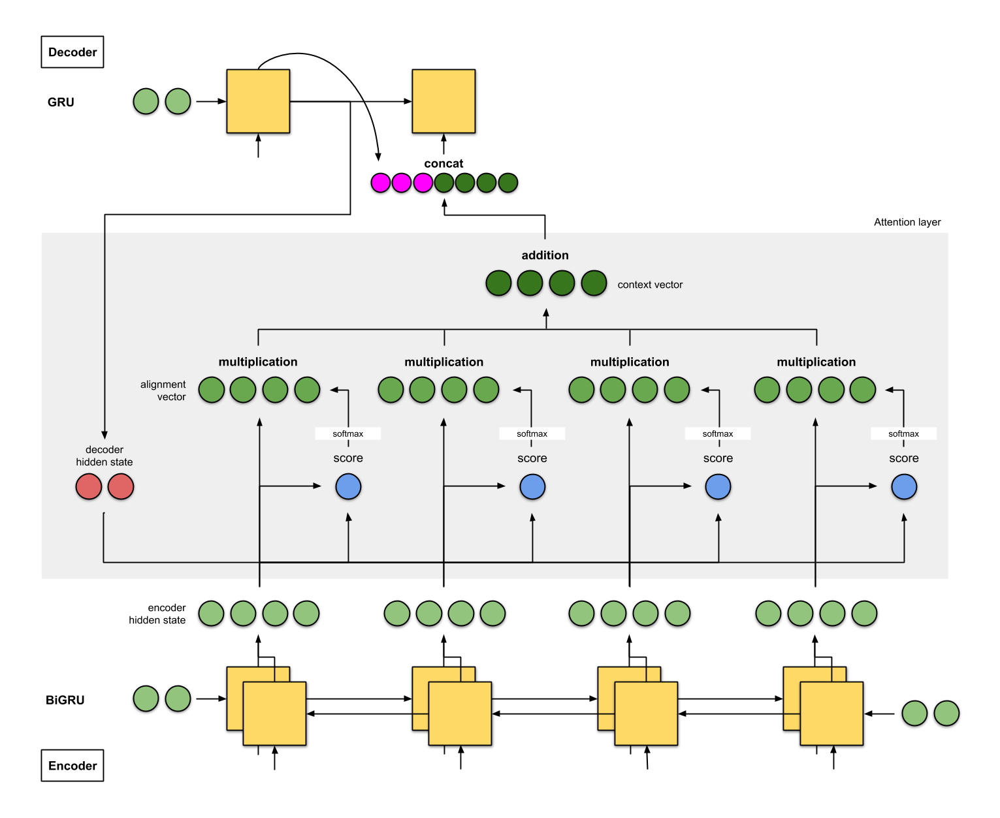
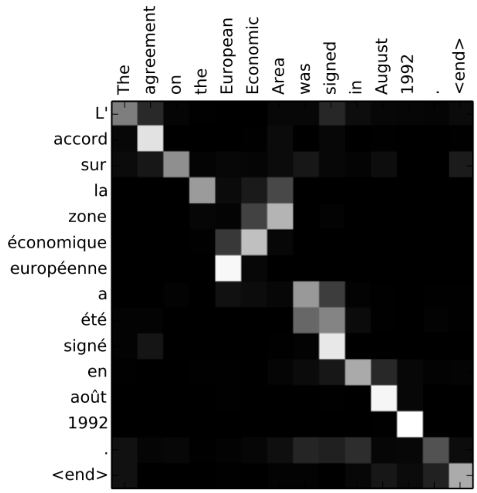

# 1 - Attentional recurrent networks

# Attentional recurrent networks

* The problem with seq2seq is that it **compresses** the complete input sentence into a single state vector.

<video data-autoplay src="videos/jalammar/seq2seq_6.mp4" style="display:block; margin: 0 auto 10px 10px; width: 80%" loop allow="autoplay loop"></video>

* For long sequences, the beginning of the sentence may not be present in the final state vector:

    * Truncated BPTT, vanishing gradients.

    * When predicting the last word, the beginning of the paragraph might not be necessary.

* Consequence: there is not enough information in the state vector to start translating.

::: footer
<https://jalammar.github.io/visualizing-neural-machine-translation-mechanics-of-seq2seq-models-with-attention/>
:::

# Attentional recurrent networks

* A solution would be to concatenate the **state vectors** of all steps of the encoder and pass them to the decoder.

<video data-autoplay src="videos/jalammar/seq2seq_7.mp4" style="display:block; margin: 0 auto 10px 10px; width: 80%" loop allow="autoplay loop"></video>

* **Problem 1:** it would make a lot of elements in the state vector of the decoder (which should be constant).

* **Problem 2:** the state vector of the decoder would depend on the length of the input sequence.

::: footer
<https://jalammar.github.io/visualizing-neural-machine-translation-mechanics-of-seq2seq-models-with-attention/>
:::

# Attentional recurrent networks

* Attentional mechanisms let the decoder decide (by learning) which state vectors it needs to generate each word at each step.

::: {.columns}
::: {.column width=50%}

* The **attentional context vector** of the decoder $A^\text{decoder}_t$ at time $t$ is a weighted average of all state vectors $C^\text{encoder}_i$ of the encoder. 

$$A^\text{decoder}_t = \sum_{i=0}^T a_i \, C^\text{encoder}_i$$

:::
::: {.column width=50%}

<video data-autoplay src="videos/jalammar/seq2seq_9.mp4" style="display:block; margin: 0 auto 10px 10px; width: 100%" loop allow="autoplay loop"></video>

:::
:::

* The coefficients $a_i$ are called the **attention scores** : how much attention is the decoder paying to each of the encoder's state vectors?

::: footer
Dzmitry Bahdanau, Kyunghyun Cho, Yoshua Bengio (2014). Neural Machine Translation by Jointly Learning to Align and Translate. arXiv:1409.0473
:::

::: footer
<https://jalammar.github.io/visualizing-neural-machine-translation-mechanics-of-seq2seq-models-with-attention/>
:::

# Attentional recurrent networks

* The attention scores $a_i$ are computed as a **softmax** over the scores $e_i$ (in order to sum to 1):

$$a_i = \frac{\exp e_i}{\sum_j \exp e_j} \Rightarrow A^\text{decoder}_t = \sum_{i=0}^T \frac{\exp e_i}{\sum_j \exp e_j} \, C^\text{encoder}_i$$

::: {.columns}
::: {.column width=60%}

<video data-autoplay src="videos/jalammar/attention_process.mp4" style="display:block; margin: 0 auto 10px 10px; width: 100%" loop allow="autoplay loop"></video>

::: footer
<https://towardsdatascience.com/day-1-2-attention-seq2seq-models-65df3f49e263>
:::

:::
::: {.column width=40%}

* The score $e_i$ is computed using:

    * the previous output of the decoder $\mathbf{h}^\text{decoder}_{t-1}$.

    * the corresponding state vector $C^\text{encoder}_i$ of the encoder at step $i$.

    * attentional weights $W_a$.

$$e_i = \text{tanh}(W_a \, [\mathbf{h}^\text{decoder}_{t-1}; C^\text{encoder}_i])$$

:::
:::

* Everything is differentiable, these attentional weights can be learned with BPTT.

# Attentional recurrent networks

* The attentional context vector $A^\text{decoder}_t$ is concatenated with the previous output $\mathbf{h}^\text{decoder}_{t-1}$ and used as the next input $\mathbf{x}^\text{decoder}_t$ of the decoder:

$$\mathbf{x}^\text{decoder}_t = [\mathbf{h}^\text{decoder}_{t-1} ; A^\text{decoder}_t]$$

<video data-autoplay src="videos/jalammar/attention_tensor_dance.mp4" style="display:block; margin: 0 auto 10px 10px; width: 90%" loop allow="autoplay loop"></video>

::: footer
<https://towardsdatascience.com/day-1-2-attention-seq2seq-models-65df3f49e263>
:::

---

{width=80%}

::: footer
<https://towardsdatascience.com/day-1-2-attention-seq2seq-models-65df3f49e263>
:::

# Attentional recurrent networks

* The attention scores or **alignment scores** $a_i$ are useful to interpret what happened. 

* They show which words in the original sentence are the most important to generate the next word.

{width=45%}

::: footer
Dzmitry Bahdanau, Kyunghyun Cho, Yoshua Bengio (2014). Neural Machine Translation by Jointly Learning to Align and Translate. arXiv:1409.0473
:::

# Attentional recurrent networks

* **Attentional mechanisms** are now central to NLP. 

* The whole **history** of encoder states is passed to the decoder, which learns to decide which part is the most important using **attention**.

* This solves the bottleneck of seq2seq architectures, at the cost of much more operations.

* They require to use fixed-length sequences (generally 50 words). 

::: footer
<https://towardsdatascience.com/day-1-2-attention-seq2seq-models-65df3f49e263>
:::

# Google Neural Machine Translation (GNMT)

*  Google Neural Machine Translation (GNMT) uses an attentional recurrent NN, with bidirectional GRUs, 8 recurrent layers on 8 GPUs for both the encoder and decoder.

::: footer
Wu, Y., Schuster, M., Chen, Z., Le, Q. V., Norouzi, M., Macherey, W., et al. (2016). Google’s Neural Machine Translation System: Bridging the Gap between Human and Machine Translation. arXiv:1609.08144v2
:::