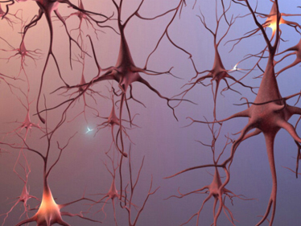

# Self-organization
  

{width=40%}

*  There are two complementary approaches to unsupervised learning: 

    * the **statistical approach**,  which tries to extract the most relevant information from the distribution of unlabeled data (autoencoders, etc).

    * **self-organization**, which tries to understand the principles of organization of natural systems and use them to create efficient algorithms.

* Self-organization is a generic process relying on four basic principles: locality of computations, learning, competition and cooperation.

# Self-organization

* **Self-organization** is observed in a wide range of natural processes: 

    * Physics: formation of crystals, star formation, chemical reactions...
    
    * Biology: folding of proteins, social insects, flocking behavior, brain functioning, Gaia hypothesis...
    
    * Social science: critical mass, group thinking, herd behavior... 
    
    * Computer science: cellular automata, multi-agents, random graphs...

::: {.columns}
::: {.column width=50%}

{width=70%}

:::
::: {.column width=50%}

{width=70%}

:::
:::

# Self-organization : locality of computations and learning
  

::: {.columns}
::: {.column width=50%}

Not self-organized:

:::
::: {.column width=50%}

Self-organized:

{width=60%}

:::
:::

* The self-organizing system is composed of elementary units (particles, cells, neurons, organs, individuals...) which all perform similar deterministic functions (rule of behavior) on a small part of the available information, be it external inputs or the activity of other units.

* There is **no central supervisor** or coordinator that knows everything and tells each unit what to do: 

    * they have their own rule of behavior and apply it to the information they receive.

* The units are able to adapt their behavior to the available information: principle of **localized learning**.

# Example: Conway's game of life.

::: {.columns}
::: {.column width=50%}

::: footer
<https://www.jakubkonka.com/2015/03/15/game-of-life.html>
:::

:::
::: {.column width=50%}

* The rules of Conway's **Game of Life** (1970) are extremely simple:

    * A cell is either **dead** or **alive**.

    * A living cell with less than 1 neighbor dies. 

    * A living cell with more than 4 neighbors dies. 

    * A dead cell with 3 neighbors relives. 

:::
:::

* Despite this simplicity, GoL can exhibit very complex patterns (fractals, spaceships, pulsars).

* The GoL is an example of self-organizing **cellular automata**.

::: footer
<https://en.wikipedia.org/wiki/Conway%27s_Game_of_Life>
:::

# Self-organization : Competition and cooperation

* As the basic units can perform only simple rules, they have to interact/communicate so that the global behavior of the self-organizing system becomes complex.

* One unit can interact with others in order to either facilitate their processing (sharing of knowledge, cooperation) or inhibit it (make sure that they won't process the same information). 

* **Competition** ensures that each unit specializes on different parts of the global information.

* **Collaboration** ensures that the global function of the system is more than the sum of its parts (emergence).

* A trade-off between competition and collaboration has to be found.

# 1 - k-means clustering

# Definition of clustering (Simon Haykin)

> Clustering is a form of unsupervised learning whereby a set of observations is partitioned into natural groupings or *clusters* of patterns in such a way that the measure of similarity between any pair of observations assigned to each cluster minimizes a specific cost function.

# K-means algorithm

::: {.columns}
::: {.column width=50%}

* The **K-means** algorithm assigns each data point to one of each $K$ cluster, whose center is defined in the input space. Let:

    * $X = \{ \mathbf{x}_i\}_{i=1}^N$ be the **data points**.

    * $\mathbf{\mu} = \{\mathbf{\mu_j}\}_{j=1}^K$ be the $K$ **cluster centers**.

    * $\mathbf{c} = \{c_i\}_{i=1}^N$ be the **encoder**.

* The encoder associates to each point $\mathbf{x}_i$ the index $\in [1, K]$ of its assigned cluster.

:::
::: {.column width=50%}

:::
:::

# K-means algorithm

::: {.columns}
::: {.column width=50%}

* The goal of the K-means algorithm is to minimize the **distortion function** (or total cluster variance):

$$
\text{minimize}_{\mathbf{\mu}, \mathbf{c}} \quad \mathcal{J}(\mathbf{\mu}, \mathbf{c}) = \sum_{i=1}^N \| \mathbf{x}_i - \mu_{c_i} \|^2
$$

* We want to minimize the squared distances (on average) between a point $\mathbf{x}_i$ and its assigned cluster center $\mu_{c_i}$.

* When the distortion function is minimal, the clustering is considered as optimal.

* We need to find two unknown variables: the cluster centers $\mathbf{\mu}$ and the encoder $\mathbf{c}$.

:::
::: {.column width=50%}

:::
:::

# K-means algorithm

* Initialize randomly the cluster centers $\mathbf{\mu} = \{\mu_1, \dots , \mu_K\}$

* **while** not converged:

$\qquad$ *# Expectation step :*

$\qquad$ **for all** points $\mathbf{x}_i$ :

$\qquad \qquad$ Assign the closest cluster center to the point (nearest neighbor):

$$\qquad \qquad c_i \gets \text{argmin}_j \quad \| x_i - \mu_j \|$$

$\qquad$ *# Maximization step :*

$\qquad$ **for all** clusters $\mu_j$ :

$\qquad \qquad$ Move the cluster center to the center of mass of its assigned points:

$$\qquad \qquad \mu_j \gets \frac{\sum_{i=1}^N 1\{c_i == j\} \cdot \mathbf{x}_i}{\sum_{i=1}^N 1\{c_i == j\}}$$

# K-means algorithm : example

{width=60%}

# K-means algorithm : example

{width=60%}

# K-means algorithm : example

{width=60%}

# K-means algorithm : example

{width=60%}

# K-means algorithm : example

{width=60%}

# K-means algorithm : example

{width=60%}

# K-means algorithm : example

{width=60%}

# K-means algorithm

* This class of algorithms is called an **expectation-maximization** (EM) algorithm.

*  The K-means algorithm minimizes the distortion function in two steps:

    1. finding the optimal encoder $\mathbf{c}$ (the **expectation** step) with the current estimated cluster centers.

    2. optimizing the cluster centers $\mathbf{\mu}$ (the **maximization** step) with the current estimated encoder.

* Each step minimizes locally the distortion function, using estimations of the other variable :

    * we need cluster centers to optimize the encoder, and an encoder to optimize the cluster centers.

* When done iteratively, the two steps converges towards a local minimum of the distortion function.

* EM is a very generic method for optimization problems.

# 2 - Neural Gas (NG)

# Neural Gas (Martinetz and Schulten, 1991)

* Clustering methods such as k-means provide no information about the density of the input distribution: the cluster centers have almost no influence on each other.

* Neural Gas (NG) works on a similar idea: $K$ neurons, representing a small portion of the input distribution (their receptive field), try to represent the best they can the density of the input distribution.

* However, they interact with each other so that learning in one neuron influences the learning in others.

::: footer
 T. M. Martinetz and K. J. Schulten. A "neural-gas" network learns topologies. In T. Kohonen, K. Mäkisara, O. Simula, and J. Kangas, editors, Artificial Neural Networks, pages 397-402. North-Holland, Amsterdam, 1991.
:::

# Neural Gas (Martinetz and Schulten, 1991)

* Initialize K neurons $(\mu_1, ..., \mu_K)$
    
* **Forall** new example $x$:

    * Rank all neurons $\mu_i$ according to their distance to $x$:

    $$\| \mu_{i_1} - x \| < \| \mu_{i_2} - x \| < ... < \| \mu_{i_K} - x \|$$

    * Move all neurons towards the new input proportionally to this ranking:
    
    $$\Delta\mu_{i_k} =  \epsilon \cdot e^{-k/\lambda} \cdot (x-\mu_{i_k}) $$

  
* The closest neuron to the example (the "winner") will be the most attracted. Neurons further away will see their position less modified.

* For the next example, another neuron will be attracted.

* At the end of learning, the neurons represent optimally the density of the input distribution. 

# Neural Gas (Martinetz and Schulten, 1991)

# Neural Gas (Martinetz and Schulten, 1991)

* In a neural gas, neurons both compete and cooperate to learn the new inputs: the closest neurons learn the most (competition), but they also attract the others (cooperation).

* This form of clustering is called \emph{vector quantization}. The density matching property of vector quantization is powerful, especially for identifying the density of large and high-dimensioned data. Since data points are represented by the index of their closest centroid, commonly occurring data have low error, and rare data high error. This is why VQ is suitable for lossy data compression. 

* The parameters $\epsilon$ and $\lambda$ are usually slowly decreased during learning: the neurons' receptive fields will move a lot at the beginning of learning and slowly stabilize.

* There is no objective function to minimize, hence no convergence criterium. One should find experimentally when to stop the algorithm.

* A neural gas matches the density of a distribution, but not its topology.

# Competitive Neural Gas (Martinetz and Schulten, 1994)
  
  \begin{center} 
    \includegraphics[width=0.7\textwidth]{img/competitiveneuralgas}
    \end{center}
  \begin{itemize}

* The idea of competitive neural gas is to learn not only the density of the distribution, but also its topology, i.e. the structural relationship between its different vectors.

* A competitive neural gas combines the idea of neural gases and competitive hebbian learning.

* It is also referred to as \emph{topology-learning network}. 

* The two mostly activated neurons (i.e. the two closest) build a connection through a correlation principle: the Hebbian learning rule.

::: footer
 T. M. Martinetz and K. J. Schulten. Topology representing networks. Neural Networks, 7(3):-522, 1994. 
:::

# Competitive Neural Gas (Martinetz and Schulten, 1994)

  \begin{algorithm}[H]
   \begin{center}
    \caption{Topology-learning network algorithm}
    \begin{algorithmic}
    \STATE Initialize K neurons $(\mu_1, ..., \mu_K)$
    \STATE Initialize the connection matrix $\mathcal{C}$ between the neurons to the empty set.
    \FORALL {new example $x$}
        \STATE Rank all neurons $\mu_i$ according to their distance to $x$
        \[
            \| \mu_{i_1} - x \| < \| \mu_{i_2} - x \| < ... < \| \mu_{i_K} - x \|
        \]
        \STATE Adapt all neurons towards the new input proportionally to this ranking:
        \[
            \Delta\mu_{i_k} =  \epsilon \cdot e^{-k/\lambda} \cdot (x-\mu_{i_k}) 
        \] 
        \STATE If the neurons $i_1$ and $i_2$ had no connections, create one ($C_{i_1, i_2}$).
        \STATE Set the age of this connection to 0:
        \[ \text{age}_{i_1, i_2} = 0 \]
        \STATE Increment the age of all existing connections:
        \[
        \text{age}_{i_k, i_l} += 1
        \]        
        \STATE If the age of a connection exceeds a threshold $a$, delete it. 
    \ENDFOR
    \end{algorithmic}
   \end{center}
  \end{algorithm}
   
    
# Competitive Neural Gas (Martinetz and Schulten, 1994)
  \begin{center} 
    \includegraphics[width=1.0\textwidth]{img/competitiveneuralgas2}
    \end{center}

# 3- Growing Neural Gas (GNG)

# Growing Neural Gas (Fritzke, 1995)
  
  \begin{center} 
    \includegraphics[width=0.7\textwidth]{img/competitiveneuralgas}
    \end{center}

* The competitive neural gas can learn both density and topology of an input distribution.

* However, the number of competing neurons has to be predetermined.

* The growing neural gas (GNG) algorithm is built on the competitive neural gas.

* It starts with two neurons and eventually inserts new neurons (or removes) when the local error becomes too high.

  
::: footer
B. Fritzke. A growing neural gas network learns topologies. In G. Tesauro, D. S. Touretzky, and T. K. Leen, editors, Advances in Neural Information Processing Systems 7, pages 625-632. MIT Press, Cambridge MA, 1995a. 
:::

# Growing Neural Gas (Fritzke, 1995)

  \begin{algorithm}[H]
   \begin{center}
    \caption{Growing Neural Gas algorithm}
    \begin{algorithmic}
    \STATE Initialize 2 neurons $(\mu_1, \mu_2)$ randomly.
    \FORALL {new example $x$}
        \STATE Find the two winning neurons, create/refresh their connection and update the age of the others.
        \STATE Adapt the winning neuron and its topological neighbours towards the input:
        \[
            \Delta\mu_{i_1} =  \epsilon_{\text{max}}\cdot (x-\mu_{i_1}) 
        \]       
        \[
            \Delta\mu_{i_k} =  \epsilon_{\text{neighbour}}\cdot (x-\mu_{i_k}) \quad \text{if} \quad C_{i_1, i_k} \quad \text{exists.}
        \] 
        \STATE Add the squared distance between the input signal and the winner to the local cumulated error variable of the winning neuron:
        \[ \Delta E_{i_1} += \| x - \mu_{i_1} \|^2 \]
        \STATE Every $\lambda$ steps, find the cell with the maximum cumulated error, and insert a new neuron between it and its neighbour with the maximal cumulated error. Create connections accordingly.
        \STATE If a new neuron has been inserted, decrease all cumulated errors.
    \ENDFOR
    \end{algorithmic}
   \end{center}
  \end{algorithm}
  
# Growing Neural Gas (Fritzke, 1995)
  
  \begin{center} 
    \includegraphics[width=1.0\textwidth]{img/growingneuralgas}
    \end{center}

# Growing Neural Gas (Fritzke, 1995)

* Growing neural gas inserts (or removes) neurons in the regions where the cumulated error is too big. 

* It allows to map the density and topology of a distribution very efficiently compared to NG and competitive NG.

* There are at least 6 free parameters in the model: applying it to a particular problem can become tricky.

* Insertion of new neurons should be stopped when their number reaches a threshold, or when some measurement of the cumulative error goes below a threshold.

* Applet: \url{http://sund.de/netze/applets/gng/full/GNG-U_0.html}

# 4 - Self-organizing maps (SOM)

# Self-organizing maps (Kohonen, 1982)

  \begin{center} 
    \includegraphics[width=0.7\textwidth]{img/som-topology}
    \end{center}

* In a self-organizing map (SOM, also called Kohonen maps), the topology is predefined (usually 1D or 2D).

* The only learning mechanism is therefore the update of the receptive field of the neuron.

* A SOM relies on both competition and cooperation: a \emph{winner-take-all} mechanism choses the neuron which is closer from a new example, and therefore learns the most (competition), but also attracts its neighbours towards the example (cooperation).

* The input distribution can be highly dimensional, but the topology of the network stays 1D or 2D: SOMs are used for highly dimensional data visualization.

::: footer
T. Kohonen. Self-organized formation of topologically correct feature maps. Biological Cybernetics, 43:-69, 1982.
:::

# Self-organizing maps (Kohonen, 1982)

  \begin{algorithm}[H]
   \begin{center}
    \caption{2D self-organizing map algorithm}
    \begin{algorithmic}
    \STATE Initialize N*N neurons $(\mu_1, ..., \mu_{N^2})$ randomly in the input space and create a rectangular grid pattern of connections $\mathcal{C}$ between them.
    \FORALL {new example $x$}
        \STATE Determine the winning neuron $n^*$ through the winner-take-all mechanism:
        \[ n^* = \text{argmin}_{i} \| x - \mu_i \| \]
        \STATE Update all neurons according to their distance to the winning neuron on the grid:
        \[  \Delta \mu_i = \eta \cdot \varphi(| i - n^* |) \cdot (x - \mu_i)\]
        where:
        \[ \varphi(x) = \exp(-\frac{x^2}{2\sigma^2} )\]
        is a neighbourhood function decreasing with the distance with the neurons and:
        \[ |i -j | \quad \text{is the Manhattan distance between two neurons of the grid.}\]
    \ENDFOR
    \end{algorithmic}
   \end{center}
  \end{algorithm}
  
# Self-organizing maps (Kohonen, 1982)

  \begin{center} 
    \includegraphics[width=1.0\textwidth]{img/kohonen}
    \end{center}

# Self-organizing maps (Kohonen, 1982)

  \begin{center} 
    \includegraphics[width=0.5\textwidth]{img/kohonen}
    \end{center}

* A SOM self-organize to represent the density of the input space, but the topology is forced by the network.

* SOMs find topological relationships in the higher-dimensional input space: neighbouring neurons represent similar inputs. 
    
* The output of the map can be itself clustered, allowing efficient classification of high-dimensional data.

* The width $\sigma$ of the neighbourhood function is usually decreased throughout learning to help convergence of the network, as well as the learning parameter.

* There also exist \emph{growing SOM} and \emph{kernel SOM} versions of the algorithm.

# Self-organizing maps: mapping the 3D colour space

  \begin{center} 
    \includegraphics[width=1.0\textwidth]{img/som-colour}
    \end{center}

# Self-organizing maps: finding similarities between images

  \begin{center} 
    \includegraphics[width=1.0\textwidth]{img/kohonen-cars}
    \end{center}

