# Reservoir computing

{width=60%}

* The concept of **Reservoir Computing** (RC) was developed simultaneously by two researchers at the beginning of the 2000s.

* RC builds on the idea of Hopfield networks but focuses on the dynamics rather than on the fixed points.

* Herbert Jaeger (Bremen) introduced **echo-state networks** (ESN) using rate-coded neurons.

* Wolfgang Maass (TU Graz) introduced **liquid state machines** (LSM) using spiking neurons.

::: footer
Jaeger, H. (2001). The “echo state” approach to analysing and training recurrent neural networks. Technical Report.
:::

::: footer
Maass, W., Natschläger, T., and Markram, H. (2002). Real-time computing without stable states: a new framework for neural computation based on perturbations. Neural computation 14, 2531–60. doi:10.1162/089976602760407955.
:::

# 1 - Echo-state networks

# Echo-state networks

* An ESN is a set of **recurrent** units (sparsely connected) exhibiting complex spatiotemporal dynamics.

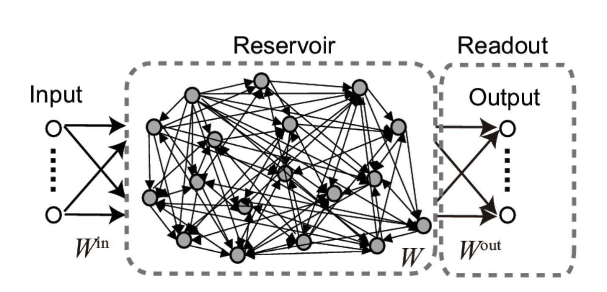{width=60%}


* Rate-coded neurons in the reservoir integrate inputs and recurrent connections using an ODE:

$$
    \tau \, \frac{dx_j(t)}{dt} + x_j(t) = \sum_i W^\text{IN}_{ij} \, I_i(t) + \sum_i W_{ij} \, r_i(t) + \xi(t)
$$

* The output of a neuron uses the tanh function (between -1 and 1):

$$
    r_j(t) = \tanh(x_j(t))
$$

::: footer
Tanaka, G., Yamane, T., Héroux, J. B., Nakane, R., Kanazawa, N., Takeda, S., et al. (2019). Recent advances in physical reservoir computing: A review. Neural Networks 115, 100–123. doi:10.1016/j.neunet.2019.03.005.
:::


# Reminder : The rate-coded neuron

::: {.columns}
::: {.column width=50%}


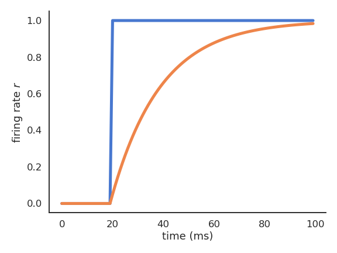

:::
::: {.column width=50%}


* Let's consider a simple rate-coded neuron taking a step signal $I(t)$ as input:

$$
    \tau \, \frac{d v(t)}{dt} + v(t) = I(t)
$$

$$
    r(t) = (v(t))^+
$$

* The "speed" of $v(t)$ is given by its temporal derivative:

$$
    \frac{d v(t)}{dt} = \frac{I(t) - v(t)}{\tau}
$$

:::
:::


* When $v(t)$ is quite different from $I(t)$, the membrane potential "accelerates" to reduce the difference.

* When $v(t)$ is similar to $I(t)$, the membrane potential stays constant.


# Reminder : The rate-coded neuron


* The membrane potential follows an exponential function which tries to "match" its input with a speed determined by the **time constant** $\tau$.

* The time constant $\tau$ determines how fast the rate-coded neuron matches its inputs.

* Biological neurons have time constants between 5 and 30 ms depending on the cell type.


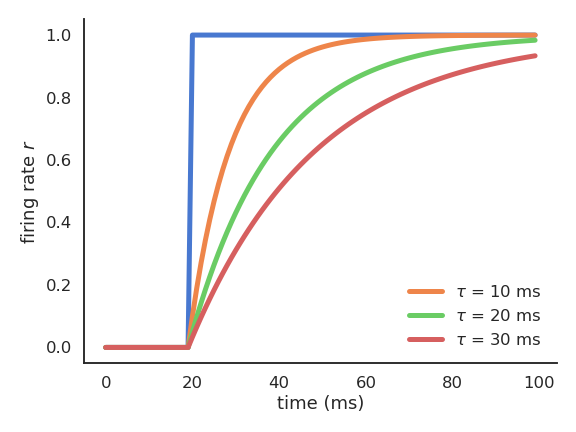{width=50%}


# Echo-state networks


{width=60%}


* **Readout neurons** (or output neurons) transform linearly the activity in the reservoir:

$$
    z_k(t) = \sum_j W^\text{OUT}_{jk} \, r_j(t) 
$$

* In the original version of the ESN, only the readout weights are learned, not the recurrent ones.

* One can use **supervised learning** to train the readout neurons to reproduce desired targets.

::: footer
Tanaka, G., Yamane, T., Héroux, J. B., Nakane, R., Kanazawa, N., Takeda, S., et al. (2019). Recent advances in physical reservoir computing: A review. Neural Networks 115, 100–123. doi:10.1016/j.neunet.2019.03.005.
:::


# Echo-state networks

{width=60%}

* Inputs $\mathbf{I}(t)$ bring the **recurrent units** in a given state (like the bias in Hopfield networks).

* The recurrent connections inside the reservoir create different **dynamics** $\mathbf{r}(t)$ depending on the strength of the weight matrix.

* Readout neurons **linearly** transform the recurrent dynamics into temporal outputs $\mathbf{z}(t)$. 

* **Supervised learning** (perceptron, LMS) trains the readout weights to reproduce a target $\mathbf{t}(t)$.

* It is similar to a MLP with one hidden layer, but the hidden layer has dynamics.


# Echo-state networks

* Reservoirs only need a few hundreds of units in the reservoir to learn complex functions (e.g. $N=200$).

* The recurrent weights are initialized randomly using a **normal distribution** with mean 0 and deviation $\frac{g}{\sqrt{N}}$:

$$w_{ij} \sim \mathcal{N}(0, \frac{g}{\sqrt{N}})$$

* $g$ is a **scaling factor** characterizing the strength of the recurrent connections, what leads to different dynamics.

* The recurrent weight matrix is often **sparse**: 

    * A subset of the possible connections $N \times N$ has non-zero weights.

    * Typically, only 10% of the possible connections are created.

* Depending on the value of $g$, the dynamics of the reservoir exhibit different attractors.

* Let's have a look at the activity of a few neurons after the presentation of a short input.


# Echo-state networks

* When $g<1$, the network has no dynamics: the activity quickly fades to 0 when the input is removed.

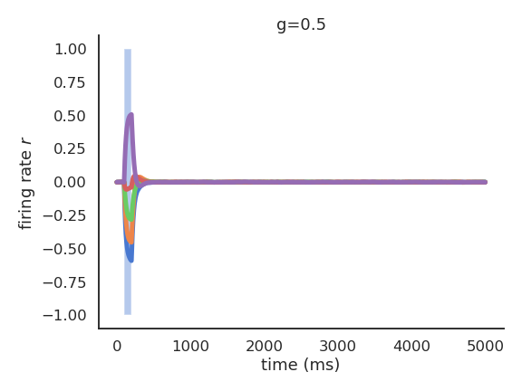

# Echo-state networks

* For $g=1$, the reservoir exhibits some **transcient dynamics** but eventually fades to 0 (echo-state property).

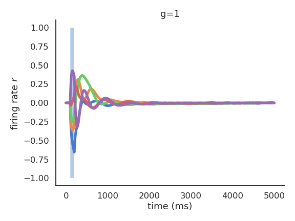

# Echo-state networks

* For $g=1.5$, the reservoir exhibits many **stable attractors** due to its rich dynamics (Hopfield-like).


# Echo-state networks

* For higher values of $g$, there are no stable attractors anymore: **chaotic behavior**.

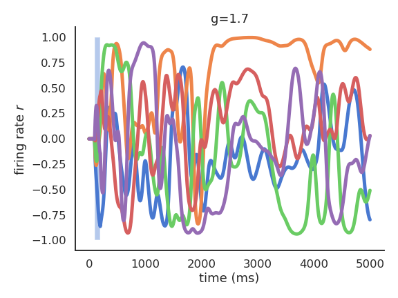

# Representational power at the edge of chaos

* For $g = 1.5$, different inputs (initial states) lead to different attractors.


# Apparition of stable attractors

* The weight matrix must have a scaling factor above 1 to exhibit non-zero attractors.

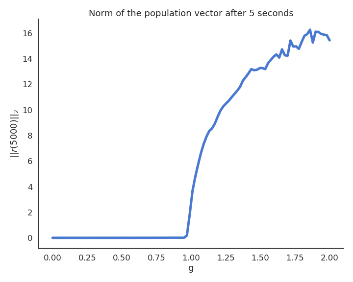

# Stable attractors at the edge of chaos

* For a single input, the attractor is always the same, even in the presence of noise or perturbations. 


# Chaotic behavior for high values of $g$

* In the chaotic regime, the slightest uncertainty on the initial conditions (or the presence of noise) produces very different trajectories on the long-term.

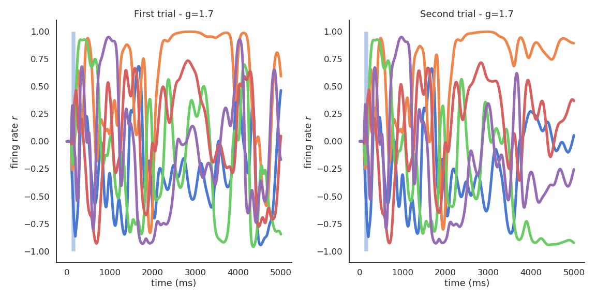

# Edge of chaos

* The chaotic regime appears for $g > 1.5$.

* $g=1.5$ is the **edge of chaos**: the dynamics are very rich, but the network is not chaotic yet.

{width=60%}

# Lorenz attractor

* The **Lorenz attractor** is a famous example of a chaotic attractor.

* The position $x, y, z$ of a particle is describe by a set of 3 **deterministic** ordinary differential equations:

::: {.columns}
::: {.column width=70%}

<video data-autoplay src="videos/lorenzattractor.mp4" style="display:block; margin: 0 auto 10px 10px;" controls allow="autoplay loop"></video>

:::
::: {.column width=30%}

$$\frac{dx}{dt} = \sigma \, (y -  x)$$
$$\frac{dy}{dt} = x \, (\rho - z) - y$$
$$\frac{dz}{dt} = x\, y - \beta \, z$$

:::
:::


* The resulting trajectories over time have complex dynamics and are **chaotic**: 

    * the slightest change in the initial conditions generates different trajectories.

::: footer
<https://www.youtube.com/watch?v=dP3qAq9RNLg>
:::


# Training the readout neurons

::: {.columns}
::: {.column width=50%}


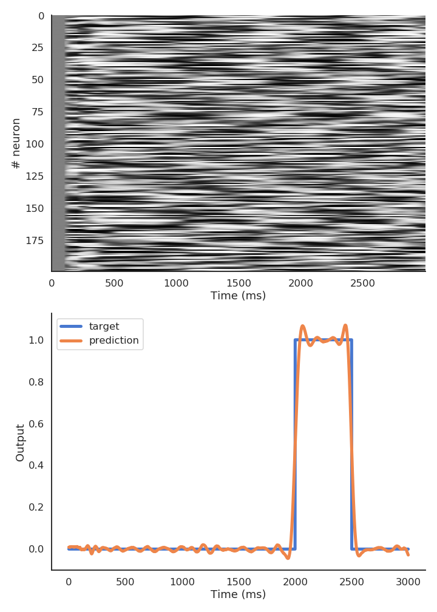

:::
::: {.column width=50%}


* Using the reservoir as input, the linear readout neurons can be trained to reproduce **any non-linear** target signal over time:

$$
    z_k(t) = \sum_j W^\text{OUT}_{jk} \, r_j(t) 
$$

* As it is a regression problem, the **delta learning rule** (LMS) is often enough.

$$
    \Delta W^\text{OUT}_{jk} = \eta \, (t_k(t) - z_k(t)) \, r_j(t) 
$$

```python
from sklearn import linear_model
reg = linear_model.LinearRegression()
reg.fit(r, t)
```

* Reservoirs are **universal approximators**: given enough neurons in the reservoir and dynamics at the edge of the chaos, a RC network can approximate any non-linear function between an input signal $\mathbf{I}(t)$ and a target signal $\mathbf{t}(t)$.

:::
:::


# Pattern separation

* The reservoir projects a low-dimensional input into a high-dimensional **spatio-temporal feature space** where trajectories becomes linearly separable.

* The reservoir increases the distance between the input patterns.

* Input patterns are separated in both space (neurons) and time: the readout neurons need much less weights than the equivalent MLP: **better generalization and faster learning**.

* The only drawback is that it does not deal very well with high-dimensional inputs (images).

{width=70%}

::: footer
Seoane, L. F. (2019). Evolutionary aspects of reservoir computing. Philosophical Transactions of the Royal Society B. doi:10.1098/rstb.2018.0377.
:::

# Feedback connections


* The output of the readout neurons can be **fed back** into the reservoir to stabilize the trajectories:

$$
    \tau \, \frac{dx_j(t)}{dt} + x_j(t) = \sum_i W^\text{IN}_{ij} \, I_i(t) + \sum_i W_{ij} \, r_i(t) + \sum_i W^\text{FB}_{kj} \, z_k(t) + \xi(t)
$$

::: {.columns}
::: {.column width=50%}


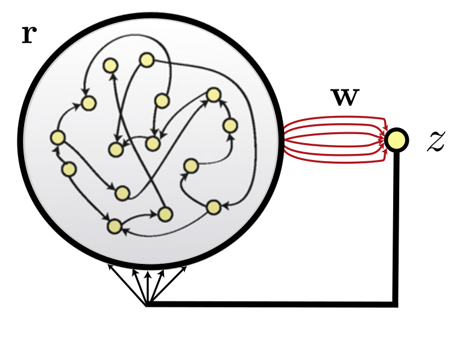

:::
::: {.column width=50%}


* This makes the reservoir much more robust to perturbations, especially at the edge of chaos.

* The trajectories are more stable (but still highly dynamical), making the job of the readout neurons easier.

:::
:::


# Applications of  Reservoir Computing

* **Forecasting**: ESN are able to predict the future of chaotic systems (stock market, weather) much better than static NN.

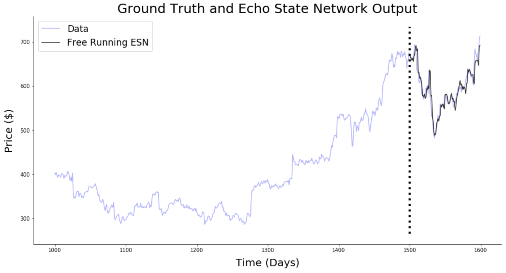

::: footer
<https://towardsdatascience.com/predicting-stock-prices-with-echo-state-networks-f910809d23d4>
:::

# Applications of  Reservoir Computing

* **Physics:** RC networks can be used to predict the evolution of chaotic systems (Lorenz, Mackey-Glass, Kuramoto-Sivashinsky) at very long time scales (8 times the Lyapunov time).


::: footer
Pathak, J., Hunt, B., Girvan, M., Lu, Z., and Ott, E. (2018). Model-Free Prediction of Large Spatiotemporally Chaotic Systems from Data: A Reservoir Computing Approach. Physical Review Letters 120, 024102–024102. doi:10.1103/PhysRevLett.120.024102.
:::

# Applications of  Reservoir Computing

* **NLP:** RC networks can grasp the dynamics of language, i.e. its **grammar**.

* RC networks can be trained to produce **predicates** ("hit(Mary, John)") from sentences ("Mary hit John" or "John was hit by Mary")

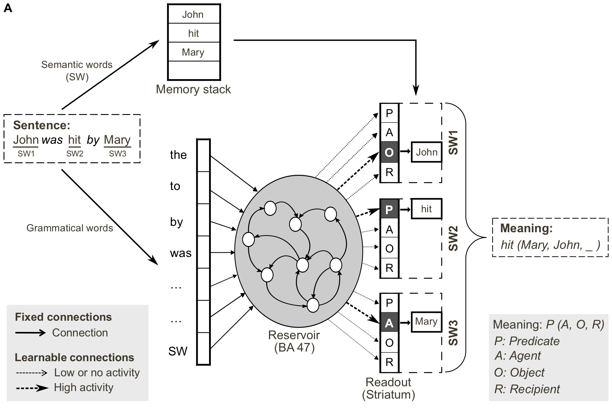{width=60%}

::: footer
Hinaut, X., and Dominey, P. F. (2013). Real-Time Parallel Processing of Grammatical Structure in the Fronto-Striatal System: A Recurrent Network Simulation Study Using Reservoir Computing. PLOS ONE 8, e52946. doi:10.1371/journal.pone.0052946.
:::

# Application of Reservoir Computing

<video data-autoplay src="videos/rc-iCub.mp4" style="display:block; margin: 0 auto 10px 10px; width: 600px" controls allow="autoplay loop"></video>

::: footer
<https://www.youtube.com/watch?v=AUbJAupkU4M>
:::

# Physical Reservoir Computing

::: {.columns}
::: {.column width=50%}


* The cool thing with reservoirs is that they do not have to be simulated by classical von Neumann architectures (CPU, GPU).

* Anything able to exhibit dynamics at the edge of chaos can be used:

    * VLSI (memristors), magnetronics, photonics (lasers), spintronics (nanoscale electronics)...

* This can limit drastically the energy consumption of ML algorithms (200W for a GPU).

* Even biological or physical systems can be used...

:::
::: {.column width=50%}


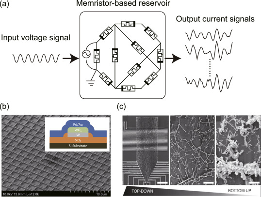

:::
:::


::: footer
Tanaka, G., Yamane, T., Héroux, J. B., Nakane, R., Kanazawa, N., Takeda, S., et al. (2018). Recent Advances in Physical Reservoir Computing: A Review. arXiv:1808.04962
:::

# Pattern recognition in a bucket

::: {.columns}
::: {.column width=40%}

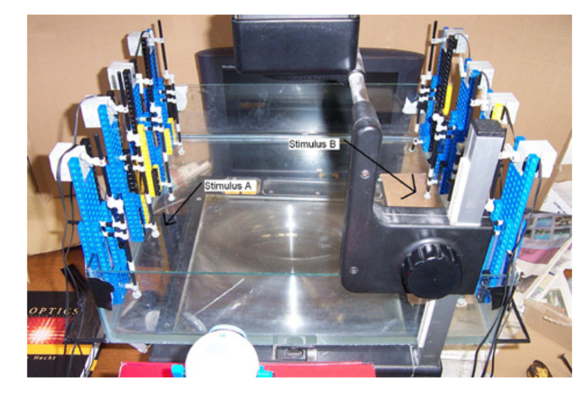

:::
::: {.column width=60%}

* A bucket of water can be used as a reservoir.

* Different motors provide inputs to the reservoir by creating weights.

* The surface of the bucket is recorded and used as an input to a linear algorithm.

* It can learn non-linear operations (XOR) or even speech recognition.

:::
:::


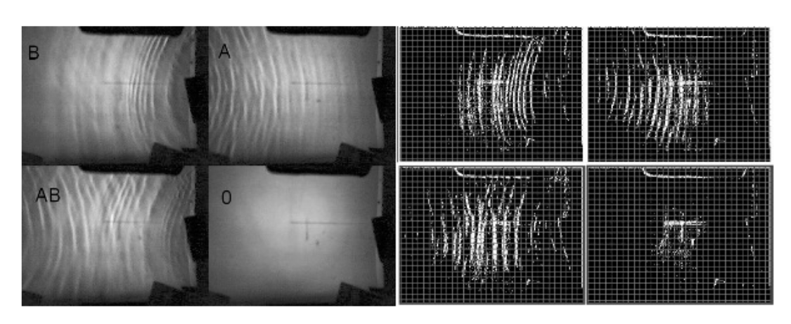{width=70%}

::: footer
Fernando, C., and Sojakka, S. (2003). Pattern Recognition in a Bucket. in Advances in Artificial Life Lecture Notes in Computer Science. doi:10.1007/978-3-540-39432-7_63.
:::

# RC with a in-silico culture of biological neurons

* Real biological neurons can be kept alive in a culture and stimulated /recorded to implement a reservoir.

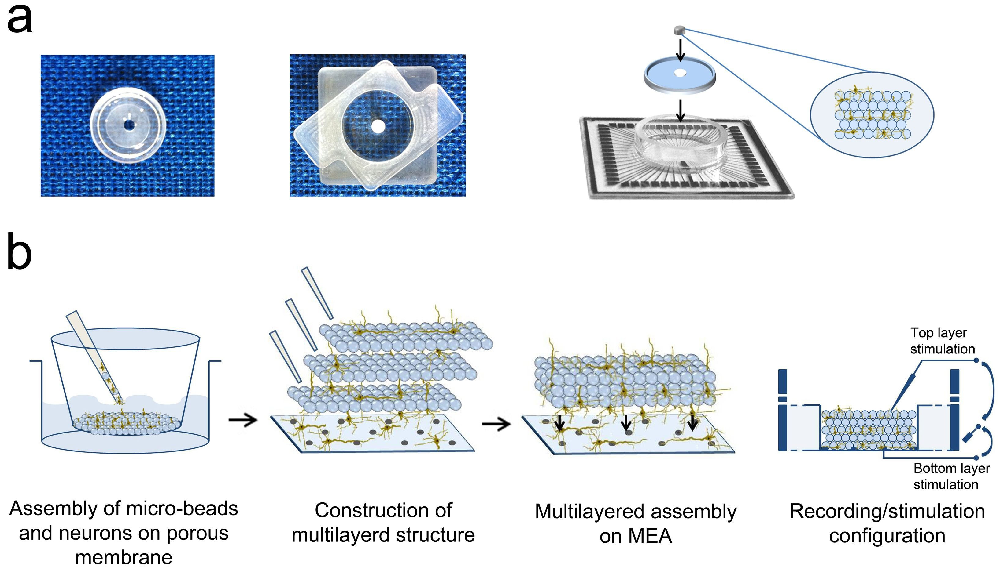

::: footer
Frega, M., Tedesco, M., Massobrio, P., Pesce, M., and Martinoia, S. (2014). Network dynamics of 3D engineered neuronal cultures: a new experimental model for in-vitro electrophysiology. Scientific Reports 4, 1–14. doi:10.1038/srep05489.
:::

# RC in cultures of E.Coli bacteria

::: {.columns}
::: {.column width=50%}


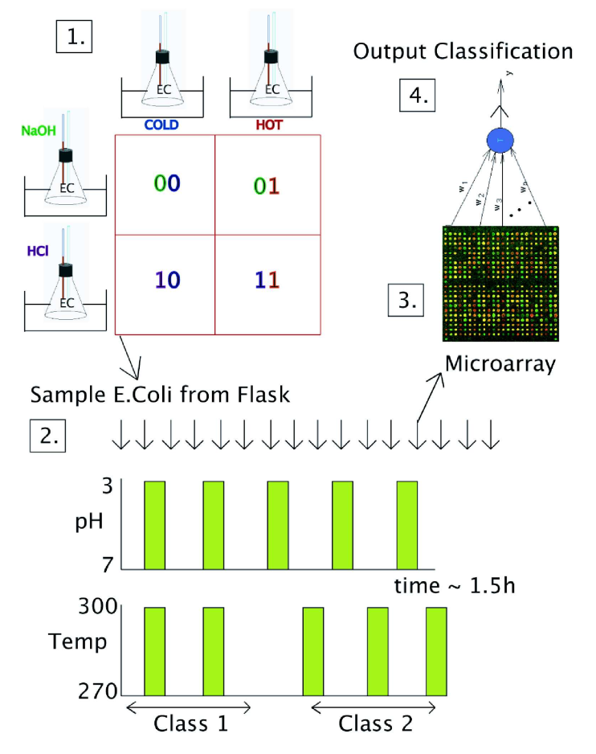

:::
::: {.column width=50%}


* Escherichia Coli bacteria change their mRNA in response to various external factors (temperature, chemical products, etc) and interact with each other.

* Their mRNA encode a dynamical trajectory reflecting the inputs.

* By placing them on a microarray, one can linearly learn to perform non-linear operations on the inputs.

:::
:::


::: footer
Jones, B., Stekel, D., Rowe, J., and Fernando, C. (2007). Is there a Liquid State Machine in the Bacterium Escherichia Coli? in 2007 IEEE Symposium on Artificial Life, 187–191. doi:10.1109/ALIFE.2007.367795.
:::

# Reservoirs of excitatory / inhibitory populations

{width=65%}

* ESN use the `tanh` activation function (between -1 and +1) and the weights can take any value.

* In the brain, neurons are either excitatory (positive outgoing weights) or inhibitory (negative outgoing weights), never both (**Dale's law**).

* Firing rates (outputs) are positive by definition.

* It is possible to build ESN with a ratio 80% / 20% of excitatory and inhibitory cells, using ReLU transfer functions. A bit less stable, but works.

::: footer
Mastrogiuseppe, F., and Ostojic, S. (2017). Intrinsically-generated fluctuating activity in excitatory-inhibitory networks. PLOS Computational Biology 13, e1005498–e1005498. doi:10.1371/journal.pcbi.1005498.
:::

# Reservoir as biologically realistic brain models

* RC networks can be used to model different areas, including the cerebellum, the olfactory system, the hippocampus, cortical columns, etc.

* The brain has a highly dynamical recurrent architecture, so RC provides a good model of brain dynamics.

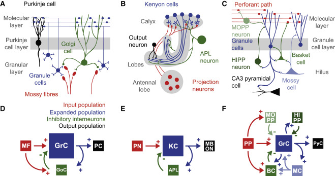

::: footer
Cayco-Gajic, N. A., and Silver, R. A. (2019). Re-evaluating Circuit Mechanisms Underlying Pattern Separation. Neuron 101, 584–602. doi:10.1016/j.neuron.2019.01.044.
:::

# 2 - Taming chaos by learning the recurrent weights


::: footer
Sussillo, D., Abbott, L. F. (2009). Generating coherent patterns of activity from chaotic neural networks. Neuron, 63(4), 544–557. doi:10.1016/j.neuron.2009.07.018
:::

# Taming chaos by learning the recurrent weights

::: {.columns}
::: {.column width=50%}


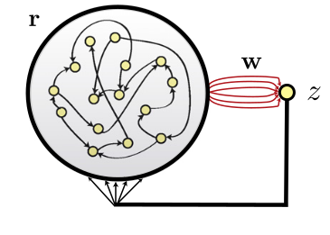


:::
::: {.column width=50%}


* In classical RC networks, the recurrent weights are fixed and only the readout weights are trained.

* The reservoir dynamics are fixed by the recurrent weights, we cannot change them.

* Dynamics can be broken by external perturbations or high-amplitude noise.

* The **edge of chaos** is sometimes too close.

* If we could learn the recurrent weights, we could force the reservoir to have fixed and robust trajectories.

:::
:::


::: footer
Sussillo, D., Abbott, L. F. (2009). Generating coherent patterns of activity from chaotic neural networks. Neuron, 63(4), 544–557. doi:10.1016/j.neuron.2009.07.018
:::

# Taming chaos by learning the recurrent weights

::: {.columns}
::: {.column width=70%}

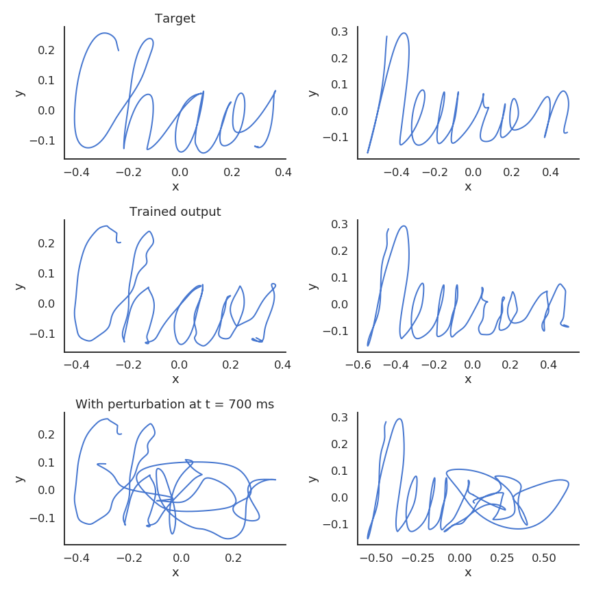

:::
::: {.column width=30%}

* Here a classical network is trained to reproduce handwriting.

* The two readout neurons produce a sequence of $(x, y)$ positions for the pen.

* It works quite well when the input is not perturbed.

* If some perturbation enters the reservoir, the trajectory is lost.

:::
:::


# Training the recurrent connections

{width=40%}

* We have an error signal $\mathbf{t}_t - \mathbf{z}_t$ at each time step.

* Why can't we just apply backpropagation (through time) on the recurrent weights?

$$\mathcal{L}(W, W^\text{OUT}) = \mathbb{E}_{t} [(\mathbf{t}_t - \mathbf{z}_t)^2]$$

* BPTT is too unstable: the slightest weight change impacts the whole dynamics.

# FORCE Learning

* In **FORCE learning**, complex optimization methods such as **recursive least squares** (RLS) have to be used.

* For the readout weights:

$$
    \Delta W^\text{OUT} = - \eta \, (\mathbf{t}_t - \mathbf{z}_t) \times P \times \mathbf{r}_t
$$

where $P$ is the inverse correlation matrix of the input :

$$
    P = (\mathbf{r}_t \times \mathbf{r}_t^T)^{-1}
$$

* For the recurrent weights, we need also an error term. 

* It is computed by recording the dynamics during an **initialization trial** $\mathbf{r}^*_t$ and force the recurrent weights to reproduce these dynamics in the learning trials:

$$
    \Delta W = - \eta \, (\mathbf{r}^*_t - \mathbf{r}_t) \times P \times \mathbf{r}_t
$$


* See <https://github.com/ReScience-Archives/Vitay-2016> for a reimplementation.

<br>

::: footer
Sussillo, D., Abbott, L. F. (2009). Generating coherent patterns of activity from chaotic neural networks. Neuron, 63(4), 544–557. doi:10.1016/j.neuron.2009.07.018
:::


# FORCE Learning

* This allows to stabilize trajectories in the chaotic reservoir (**taming chaos**) and generate complex patterns.


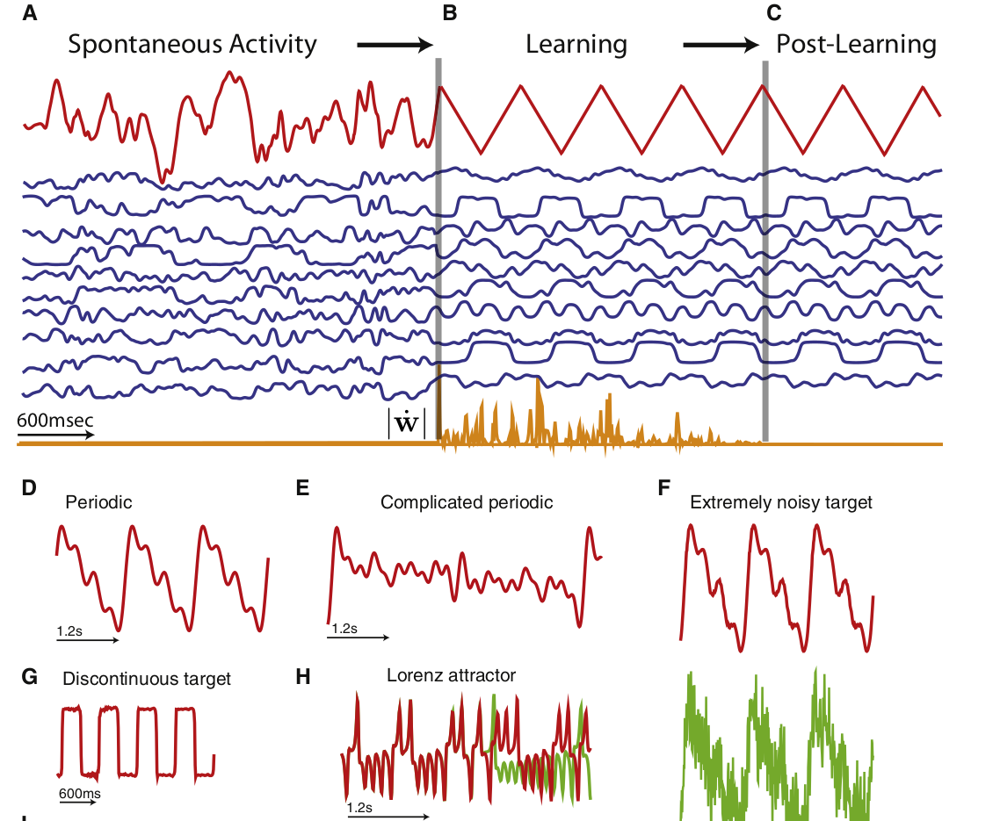{width=70%}

::: footer
Sussillo, D., Abbott, L. F. (2009). Generating coherent patterns of activity from chaotic neural networks. Neuron, 63(4), 544–557. doi:10.1016/j.neuron.2009.07.018
:::


# Taming Chaos in RC networks

* This allows to stabilize trajectories in the chaotic reservoir (**taming chaos**) and generate complex patterns.

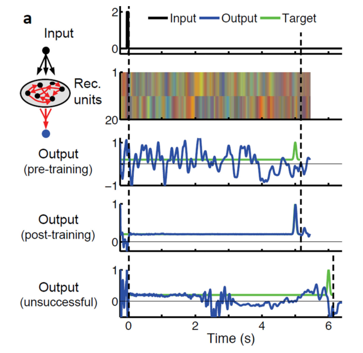{width=60%}


::: footer
Laje, R., Buonomano, D. V. (2013). Robust timing and motor patterns by taming chaos in recurrent neural networks. Nature Neuroscience, 16(7), 925–933. doi:10.1038/nn.3405
:::

# Taming Chaos in RC networks


::: footer
Laje, R., Buonomano, D. V. (2013). Robust timing and motor patterns by taming chaos in recurrent neural networks. Nature Neuroscience, 16(7), 925–933. doi:10.1038/nn.3405
:::

<!-- 

# 3 - Biologically plausible reward modulated learning in RC

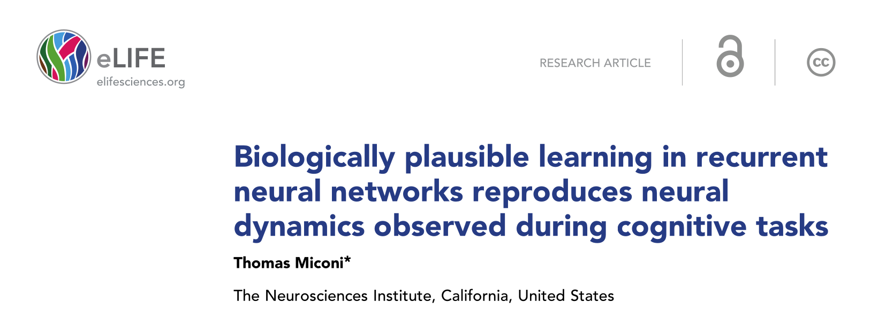

::: footer
Miconi T. (2017). Biologically plausible learning in recurrent neural networks reproduces neural dynamics observed during cognitive tasks. eLife 6:e20899. doi:10.7554/eLife.20899
:::

# Biologically plausible reward modulated learning in RC

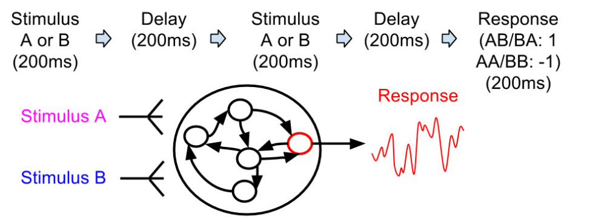{width=60%}

* Miconi proposed a realistic model of RL learning in a classical reservoir:

$$
    \tau \frac{dx(t)}{dt} + x(t) = \sum_\text{input} W^\text{IN} \, r^\text{IN}(t) + \sum_\text{rec} W \, r(t) + \xi(t)
$$

$$
    r(t) = \tanh(x(t))
$$

* However, there are NO readout neurons: a random neuron of the reservoir is picked as output neuron.

* Its activity at the end of a trial is used to provide a reward or not.

::: footer
Miconi T. (2017). Biologically plausible learning in recurrent neural networks reproduces neural dynamics observed during cognitive tasks. eLife 6:e20899. doi:10.7554/eLife.20899
:::


# Biologically plausible reward modulated learning in RC

::: {.columns}
::: {.column width=50%}


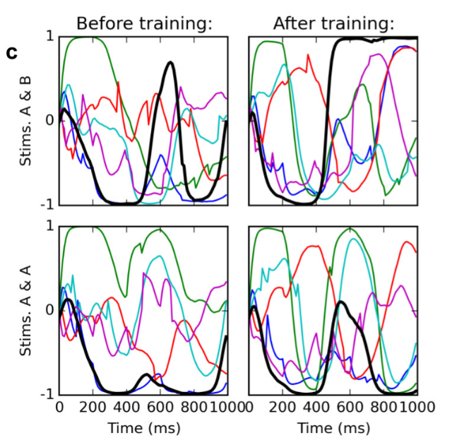

:::
::: {.column width=50%}


* **Delayed non-match-to-sample** (DNMS) task: respond $t = +1$ when the cue is different from the sample (AB or BA), $t=-1$ otherwise (AA, BB).

* It is a task involving **working memory**: the first item must be actively remembered in order to produce the response later.

* The response is calculated as the mean activity $y$ of the output neuron over the last 200 ms.

* The "reward" used is simply the difference between the desired value ($t=+1$ or $-1$) and the response:

$$
    r = - |t - y|
$$

:::
:::


* The goal is to maximize the reward (loss function), but we know its value only at the end of a trial.

* Actually supervised learning (minimizing the mean absolute error MAE), but from sparse feedbacks.

::: footer
Miconi T. (2017). Biologically plausible learning in recurrent neural networks reproduces neural dynamics observed during cognitive tasks. eLife 6:e20899. doi:10.7554/eLife.20899
:::

# Reward-modulated Hebbian learning

::: {.columns}
::: {.column width=50%}


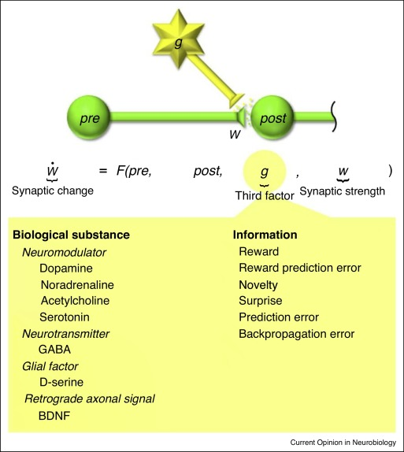

:::
::: {.column width=50%}


* **Reward-modulated Hebbian learning** changes weights according to the Hebbian product and the change in reward intake:

$$
    \Delta w_{ij} = \eta \, r_i \, r_j \, (r - \bar{r})
$$

* $\bar{r}$ can be a running average of the rewards:

$$\bar{r} \leftarrow \alpha \, \bar{r} + (1-\alpha) \, r$$

* If more reward than usual is received, the weights between correlated neurons should be increased.

* If less reward than usual is received, the weights between correlated neurons should be decreased.

* This does not work well with sparse rewards (at the end of a complex sequence).

:::
:::


::: footer
Kuśmierz, Ł., Isomura, T., and Toyoizumi, T. (2017). Learning with three factors: modulating Hebbian plasticity with errors. Current Opinion in Neurobiology 46, 170–177. doi:10.1016/j.conb.2017.08.020.
:::

# Weight perturbation

::: {.columns}
::: {.column width=50%}


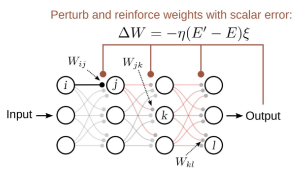

:::
::: {.column width=50%}


* A simple alternative to backpropagation would consist of adding a perturbation to some weights:

$$
    w_{ij} \rightarrow w_{ij} + \xi
$$

and observing the change of reward intake at the end of the episode:

$$
    \Delta r = r - \bar{r}
$$

:::
:::


* If the change is positive (the new network gets higher rewards than before), the weight change is conserved. Otherwise it is thrown away or reversed.

$$
    \Delta w_{ij} = \eta \, (r - \bar{r}) \, \xi
$$

* **Weight perturbation** is somehow a way to estimate the gradient of the loss function locally:

$$
    \frac{\partial r(\theta)}{\partial w_{ij}} \approx \frac{\Delta r}{\Delta w_{ij}} = \frac{r - \bar{r}}{ w_{ij} + \xi - w_{ij} }
$$

* Core principle of genetic algorithms for NN (e.g. NEAT), but not biologically realistic...

# Node-perturbation

* The post-synaptic potential $x_j$ depends linearly on the weights $w_{ij}$:

$$
    x_j = \ldots + w_{i,j} \, r_i + \ldots
$$

* So instead of perturbing the weight, one could perturb the post-synaptic activity $x_j$ by adding randomly some noise to it $\xi_j$ and observing the change in reward:

$$
    x_j \rightarrow x_j + \xi_j
$$

* If a higher postsynaptic activity leads to more reward, then weights from correlated pre-synaptic neurons should be increased:

$$
    \Delta w_{ij} = \eta \, (\sum_t r_i \, \xi_j) \, (r - \bar{r})
$$

* A trace of the perturbations must be maintained, as learning occurs only at the end of the trial.

* Still not biologically plausible: a synapse cannot access and store directly the perturbations, which may come from other neurons.

::: footer
Fiete IR, Seung HS, Sebastian Seung H. (2006). Gradient learning in spiking neural networks by dynamic perturbation of conductances. Physical Review Letters 97:048104. doi:10.1103/PhysRevLett.97.048104
:::

# Exploratory Hebbian (E-H) learning

::: {.columns}
::: {.column width=50%}


* Miconi's idea was to couple node-perturbation (Fiete et al. 2006) with **Exploratory-Hebbian** learning (Legenstein et al., 2010).

$$
    \Delta w_{ij} = \eta \, r_i \, (x_j - \bar{x_j}) \, (r - \bar{r})
$$

where $\bar{x_j}$ is a running average of the postsynaptic activity (a trace of its activity).

* The difference $x_j - \bar{x_j}$ contains information about the perturbation, but is local to the synapse (biologically realistic).

:::
::: {.column width=50%}


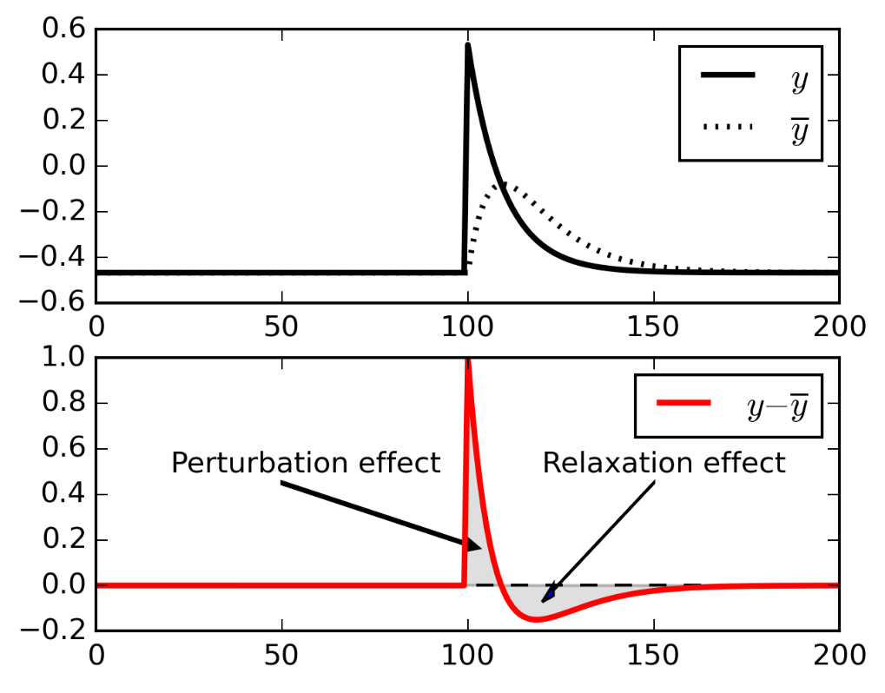

:::
:::


* However, the perturbation is canceled by the relaxation. Need for a non-linearity:

$$
    \Delta w_{ij} = \eta \, r_i \, (x_j - \bar{x_j})^3  \, (r - \bar{r})
$$

::: footer
Legenstein R, Chase SM, Schwartz AB, Maass W. (2010). A reward-modulated hebbian learning rule can explain experimentally observed network reorganization in a brain control task. Journal of Neuroscience 30:8400–8410. doi:10.1523/JNEUROSCI.4284-09.2010, PMID: 20573887
:::

# Miconi's learning rule

{width=60%}

1. Apply randomly at f=3Hz a perturbation of all the nodes in the reservoir.

$$
    x_j \rightarrow x_j + \xi_j
$$


2. Maintain a non-linear **eligibility trace** of the perturbation during the trial.

$$
    e_{ij} = e_{ij} + r_i \, (x_j - \bar{x_j})^3
$$

3. At the end of the trial, train all weights using the eligibility trace and the change in performance:

$$
    \Delta w_{ij} = \eta \, e_{ij} \, (r - \bar{r})
$$


# Results : DNMS task

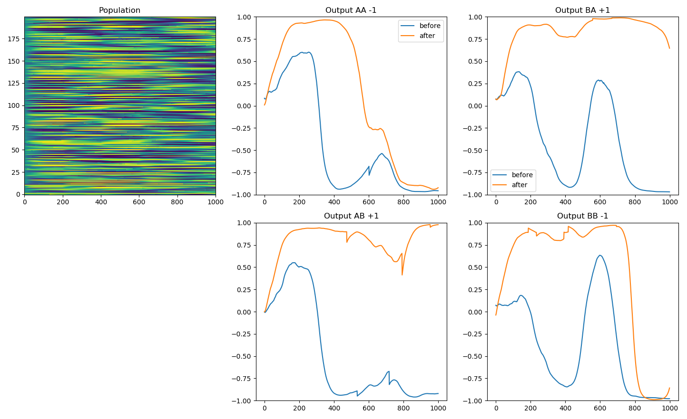

# Results : DNMS task

::: {.columns}
::: {.column width=50%}


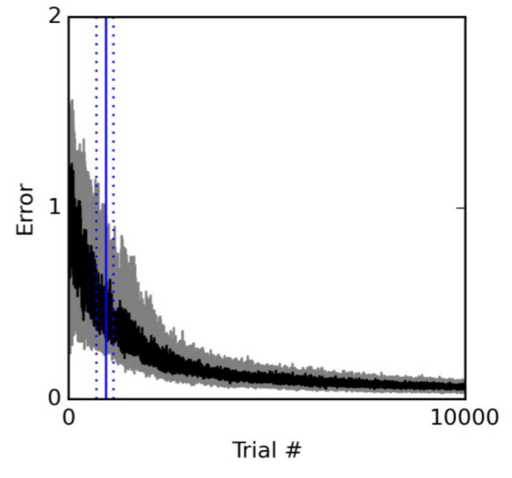

:::
::: {.column width=50%}


* Learning is quite slow (ca 1000 trials), but only from sparse rewards at the end of the trial.

* The power of the network does not lie in the readout neurons, but in the dynamics of the reservoir: trajectories are discovered and stabilized using RL.

* The only "imperfection" is that learning is actually error-driven:

$$
    r = - |t - y|
$$

* Still looking for a pure RL implementation.

:::
:::


# Results : controlling a robotic arm

::: {.columns}
::: {.column width=70%}

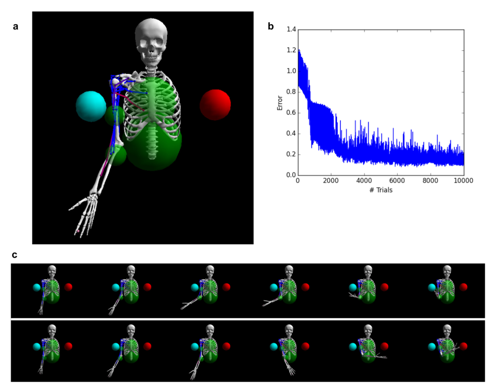

:::
::: {.column width=30%}

* 16 motor neurons to control the muscles of an arm.

* 2 inputs: left / right.

* Error is the remaining distance at the end of the trial.

:::
:::

 -->


# References

* Jaeger, H. (2001). The “echo state” approach to analysing and training recurrent neural networks. Available at: <http://www.faculty.jacobs-university.de/hjaeger/pubs/EchoStatesTechRep.pdf>.

* Maass, W., Natschläger, T., and Markram, H. (2002). Real-time computing without stable states: a new framework for neural computation based on perturbations. Neural computation 14, 2531–60. doi:10.1162/089976602760407955.

* An overview of RC by Mantas Lukosevicius and Herbert Jaeger:

<http://minds.jacobs-university.de/uploads/papers/2261_LukoseviciusJaeger09.pdf>

* Tanaka, G., Yamane, T., Héroux, J. B., Nakane, R., Kanazawa, N., Takeda, S., et al. (2018). Recent Advances in Physical Reservoir Computing: A Review. Available at: <https://arxiv.org/abs/1808.04962>.


# References

* Sussillo, D., Abbott, L. F. (2009). Generating coherent patterns of activity from chaotic neural networks. Neuron, 63(4), 544–557. doi:10.1016/j.neuron.2009.07.018

* Laje, R., Buonomano, D. V. (2013). Robust timing and motor patterns by taming chaos in recurrent neural networks. Nature Neuroscience, 16(7), 925–933. doi:10.1038/nn.3405

* Legenstein R, Chase SM, Schwartz AB, Maass W. (2010). A reward-modulated hebbian learning rule can explain experimentally observed network reorganization in a brain control task. Journal of Neuroscience 30:8400–8410. doi:10.1523/JNEUROSCI.4284-09.2010, PMID: 20573887

* Fiete IR, Seung HS, Sebastian Seung H. (2006). Gradient learning in spiking neural networks by dynamic perturbation of conductances. Physical Review Letters 97:048104. doi:10.1103/PhysRevLett.97.048104

* Miconi T. (2017). Biologically plausible learning in recurrent neural networks reproduces neural dynamics observed during cognitive tasks. eLife 6:e20899. doi:10.7554/eLife.20899