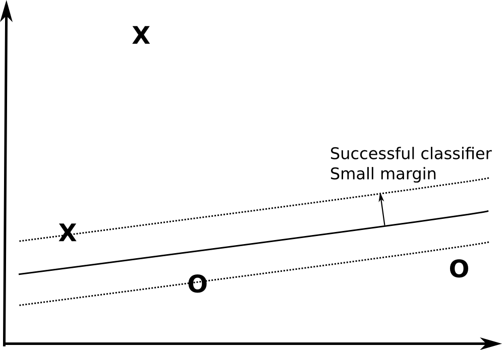
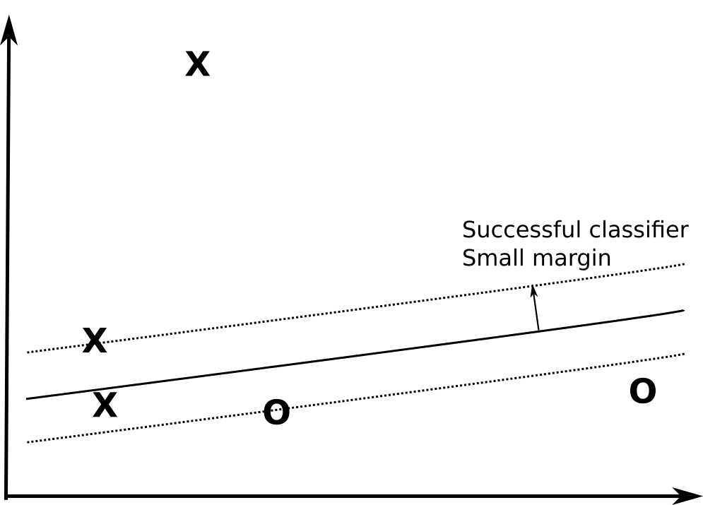
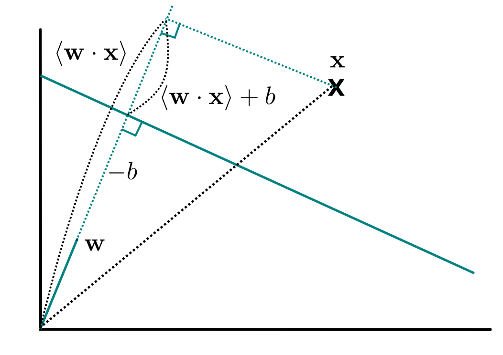
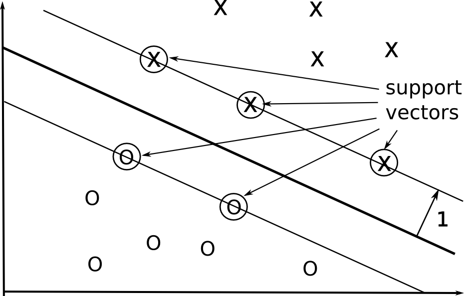
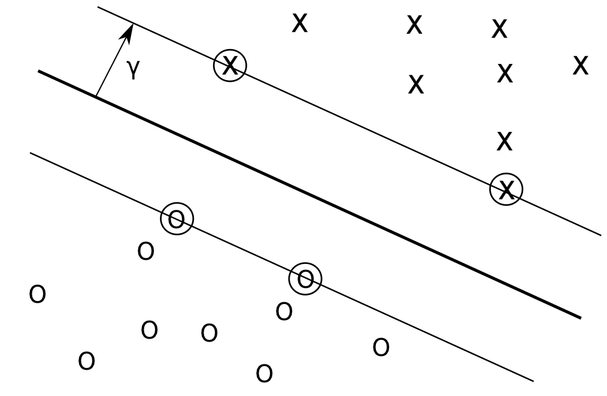
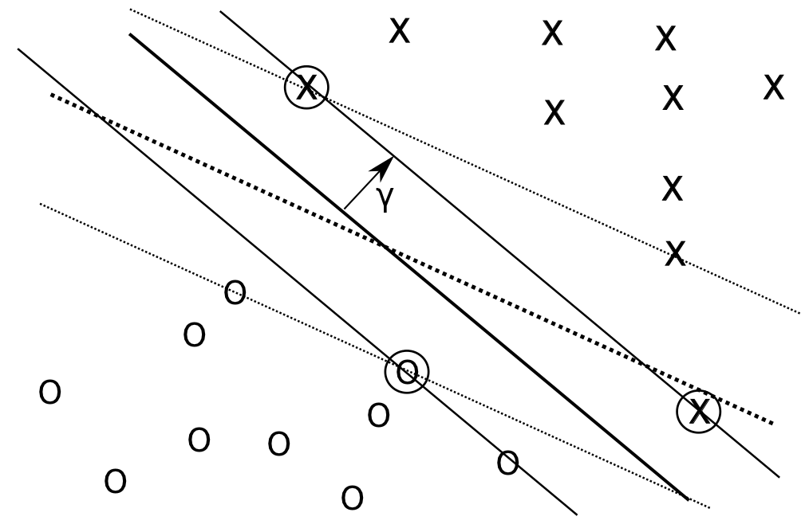
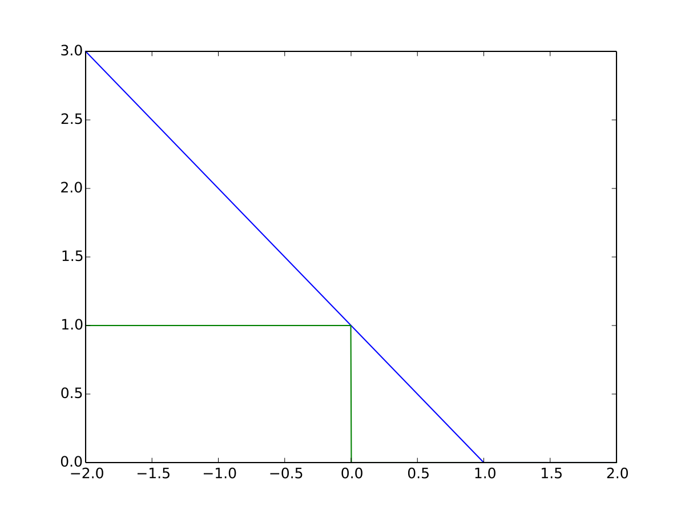
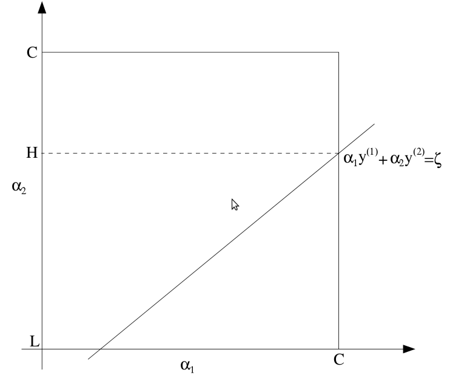

# Drawbacks of neural networks

* Neural networks are an empirical method to solve classification or regression problems: you add or remove some components and see whether it improves the performance or not.

* The number of layers/neurons in a NN is free: it has to be found through cross-validation.

* If the number of parameters increases, the training error becomes small, but the generalization error increases.

* The computational complexity of both learning and usage (inference) is quickly untractable if you have a low budget.

# Support-vector machines

* If one could work in a virtually infinite feature space but keep a finite VC dimension, the training and generalization errors would both be kept small.

$$
  \epsilon(h) \leq \hat{\epsilon}_{\mathcal{S}}(h) + \sqrt{\frac{\text{VC}_\text{dim} (\mathcal{H}) \cdot (1 + \log(\frac{2\cdot N}{\text{VC}_\text{dim} (\mathcal{H})})) - \log(\frac{\delta}{4})}{N}}
$$

* This is the main idea of *support-vector machines*, created by Vladimir Vapnik in the 60's, but developped and used in the 90's when coupled with the kernel trick.

* It is a nice mathematical framework explaining how and **why** the algorithm will converge.

::: footer
Support Vector Machines and other kernel-based learning methods, Nello Cristianini and John Shawe-Taylor, Cambridge Press.
:::

# 1 - Margins

# Margins

{width=70%}

Neural networks do not care about their generalization error: they only concentrate on the training set.

# Margins

{width=70%}

A successful classifier with a very small margin is an acceptable solution.

# Margins

{width=70%}

However, classifiers with small margins are more likely to make mistakes on new examples.

# Margins

{width=70%}

A classifier with a fat margin has the same success on the training set...

# Margins

{width=70%}

... but is much less likely to make a mistake on new examples: its generalization error is smaller.

# Effect of the margin on the VC dimension

* The VC dimension is linked the number of possible dichotomies learnable by a classifier on the training set.

{width=50%}

# Effect of the margin on the VC dimension

* Forcing a fat margin for a classifier reduces the number of possible dichotomies, therefore reduces its VC dimension, leading to better generalization.

{width=50%}

#  Binary linear classification

* In binary linear classification, $y_i = f_{\mathbf{w}, b}(\mathbf{x}_i) = \text{sign}( \langle \mathbf{w} . \mathbf{x}_i \rangle +b)$ is the **predicted output** for the input $\mathbf{x}_i$ by the hyperplane $(\mathbf{w}, b)$.

::: {.columns}
::: {.column width=50%}

:::
::: {.column width=50%}

* The predicted output allows to compute the **functional margin** $\hat{\gamma}_i$ of the example:

$$\hat{\gamma}_i = t_i \, (\langle \mathbf{w} . \mathbf{x}_i \rangle +b)$$

which determines how well is the example classified, knowing the ground truth $t_i$.

* If $\hat{\gamma}_i > 0$, the example is well classified ($t_i$ and $y_i$ have the same sign). Otherwise, it is badly classified.

* The highest $|\hat{\gamma}_i|$, the further away from the hyperplane is the example.

:::
:::

* A good linear classifier is an hyperplane where each example in the training set has a positive functional margin.

$$\hat{\gamma} = \min_i \hat{\gamma}_i = \min_i t_i \, (\langle \mathbf{w} . \mathbf{x}_i \rangle +b) > 0$$

# Functional and geometric margins

::: {.columns}
::: {.column width=50%}

{width=80%}

* The decision function $F(x) = \langle \mathbf{w} . \mathbf{x}\rangle + b$ is not influenced by the norm of the vector.

* For the same classification, the **functional margin** will be higher when the weight vector has a bigger norm.

* The **geometric margin** is a better measurement of the margin of a classifier.

:::
::: {.column width=45%}

* Margins for an example:

    * Functional margin:

    $$ \hat{\gamma}_i = t_i \cdot (\langle \mathbf{w} . \mathbf{x}_i \rangle +b) $$

    * Geometric margin:

    $$ \gamma_i = t_i \cdot ( \frac{\langle \mathbf{w} . \mathbf{x}_i \rangle +b}{\|\mathbf{w} \|}) $$

* Margins on the whole training set:

    * Functional margin:

    $$ \hat{\gamma} = \min_i \hat{\gamma}_i $$

    * Geometric margin:

    $$ \gamma = \min_i \gamma_i $$

:::
:::

# Maximal margin classifier for linearly separable data

::: {.columns}
::: {.column width=50%}

:::
::: {.column width=50%}

* The goal of a maximal margin classifier is the find the hyperplane $F(x) = \langle \mathbf{w} . \mathbf{x}\rangle + b$ which has the maximal geometric margin while correctly classifying every example:

$$
\begin{align*}
    \text{maximize}_{\mathbf{w}, b} \quad \gamma & = \min_i \, t_i \cdot ( \frac{\langle \mathbf{w} . \mathbf{x}_i \rangle +b}{\|\mathbf{w} \|}) \\
    &=  \frac{\hat{\gamma}}{\|\mathbf{w} \|}
\end{align*}
$$

$$
    \text{s.t.} \quad \hat{\gamma}_i = t_i \cdot (\langle \mathbf{w} . \mathbf{x}_i \rangle +b) \geq \hat{\gamma} \quad \forall i.
$$

:::
:::

# Maximal margin classifier for linearly separable data

::: {.columns}
::: {.column width=50%}

:::
::: {.column width=50%}

* Problem: the geometric margin is a non-convex function of $\mathbf{w}$, therefore very hard to optimize (local maxima).

* We can reformulate the problem by forcing the functional margin to be 1:

$$
    \text{maximize}_{\mathbf{w}, b} \quad \gamma = \frac{1}{\|\mathbf{w} \|}
$$
$$
    \text{s.t.} \quad \hat{\gamma}_i = t_i \cdot (\langle \mathbf{w} . \mathbf{x}_i \rangle +b) \geq 1 \quad \forall i.
$$

:::
:::

* For a given hyperplane, it is always possible to "re-normalize" the weight vector so that the functional margin becomes 1.

* This is only a convention to ease mathematical analysis, but it does not change the result of the classification.

# Maximal margin classifier for linearly separable data

* The optimization problem is now:

$$
    \text{maximize}_{\mathbf{w}, b} \quad \gamma = \frac{1}{\|\mathbf{w} \|}
$$

$$
    \text{s.t.} \quad t_i \cdot (\langle \mathbf{w} . \mathbf{x}_i \rangle +b) \geq 1 \quad \forall i.
$$

* Or alternatively:

$$
    \text{minimize}_{\mathbf{w}, b} \quad \frac{1}{2} \cdot \|\mathbf{w} \|^2 = \frac{1}{2} \cdot \langle \mathbf{w} . \mathbf{w} \rangle
$$

$$
    \text{s.t.} \quad t_i \cdot (\langle \mathbf{w} . \mathbf{x}_i \rangle +b) \geq 1 \quad \forall i.
$$

* The **maximal margin classifier** aims at finding the smallest weight vector having a functional margin of 1 on the training set.

* The optimization problem is now a quadratic optimization problem, having therefore only one solution and being very easy to compute.

* The linear inequality constraints restrict the correct values for the weight vector (a zero weight vector would have the minimal norm, but would not satisfy the constraints).

# 2 - Lagrange optimization

---

**Global optimization:**

$$
  \text{minimize}_{\mathbf{x}} \quad f(\mathbf{x}) \qquad \Longleftrightarrow \qquad \frac{\partial f}{\partial \mathbf{x}} (\mathbf{x}^*) = 0
$$

**Optimization under linear equality constraints:**

$$
  \text{minimize}_{\mathbf{x}} \quad f(\mathbf{x}) \qquad \text{s.t.} \quad g(\mathbf{x}) = 0
$$

We define the Lagrange function for the constrained optimization problem, parameterized by $\lambda$, called a Lagrange multiplier:

$$
\mathcal{L}(\mathbf{x}, \lambda) = f(\mathbf{x}) + \lambda \cdot g(\mathbf{x})
$$

and search for its minimum $(\mathbf{x}^*, \lambda^*)$:

$$
  \text{minimize}_{\mathbf{x}, \lambda} \quad \mathcal{L}(\mathbf{x}, \lambda) \qquad \Longleftrightarrow \qquad
  \begin{cases}
  \frac{\partial \mathcal{L}}{\partial \mathbf{x}} (\mathbf{x}^*, \lambda^*) = 0  \\
  \\
  \frac{\partial \mathcal{L}}{\partial \lambda} (\mathbf{x}^*, \lambda^*) = g(\mathbf{x}^*) = 0
  \end{cases}
$$

$\rightarrow \mathbf{x}^*$ is the minimum of $f$ on the subspace defined by $g(\mathbf{x}) = 0$

# Example

---

**Optimization under linear inequality constraints:**

$$
  \text{minimize}_{\mathbf{x}} \quad f(\mathbf{x}) \qquad \text{s.t.} \quad h(\mathbf{x}) \leq 0
$$

We define the generalized Lagrange function for the constrained optimization problem, with a parameter $\alpha \geq 0$ called the **Karush-Kuhn-Tucker** (KKT) multiplier:

$$
\mathcal{L}(\mathbf{x}, \alpha) = f(\mathbf{x}) + \alpha \cdot h(\mathbf{x})
$$

We then search $(\mathbf{x}^*, \alpha^*)$ respecting the *Karush-Kuhn-Tucker* conditions:

$$
\begin{cases}
  \frac{\partial \mathcal{L}}{\partial \mathbf{x}} (\mathbf{x}^*, \alpha^*) = 0  \\
  \\
  \alpha^* \cdot \frac{\partial \mathcal{L}}{\partial \alpha} (\mathbf{x}^*, \alpha^*) = 0 \quad \Leftrightarrow \quad \alpha^* \cdot h(\mathbf{x}^*) = 0\\
  \\
  \alpha^*  \geq 0 \\
  \\
  h(\mathbf{x}^*) \leq 0
\end{cases}
$$

$\rightarrow \mathbf{x}^*$ is the minimum of $f$ on the subspace defined by $h(\mathbf{x}) \leq 0$

---

**Optimization under linear inequality constraints:**

::: {.columns}
::: {.column width=50%}

$$
  \alpha^* \cdot \frac{\partial \mathcal{L}}{\partial \alpha} (\mathbf{x}^*, \alpha^*) = 0 \Leftrightarrow \alpha^* \cdot h(\mathbf{x}^*) = 0
$$

* We obtain a complex system to solve, but the only thing to remember is that:

    * Either $\alpha^* = 0$:

        * $h(\mathbf{x}^*)$ can take any (negative) value: the solution $\mathbf{x}^*$ can be anywhere in the half-space $h(\mathbf{x}) \leq 0$.

    * Or $\alpha^* > 0$:

        * the solution $\mathbf{x}^*$ **has** to respect $h(\mathbf{x}) = 0$ (on the "hyperplane").

:::
::: {.column width=45%}

* When $\alpha^* = 0$, the constraint is **free**.

* When $\alpha^* > 0$, the constraint is **saturated**.

:::
:::

# Optimization under constraints : example 1

* Goal: minimize the quadratic function in 2D

$$
  \text{minimize}_{x, y} \quad f(x, y) = x^2 + y^2
$$

* We only need to find where the partial derivates of this function are zero:

$$
\begin{cases}
\frac{\partial f}{\partial x} (x^*, y^*) = 2\cdot x^* = 0 \\
\frac{\partial f}{\partial y} (x^*, y^*) = 2\cdot y^* = 0 \\
\end{cases}
$$

* The minimum of this function is therefore obtained for $(x^*, y^*) =(0,0)$.

{width=40%}

# Optimization under constraints : example 2

* Goal: minimize the quadratic function in 2D under linear equality constraint:

$$
  \text{minimize}_{x, y} \quad f(x, y) = x^2 + y^2
$$

$$
  \text{s.t.}\quad g(x, y) = x + 2y +1 = 0
$$

{width=60%}

# Optimization under constraints : example 2

$$
  \text{minimize}_{x, y} \quad f(x, y) = x^2 + y^2
$$

$$
  \text{s.t.}\quad g(x, y) = x + 2y +1 = 0
$$

We define the Lagrange function of this optimization problem:

$$
\mathcal{L}(x, y, \lambda) = f(x, y) + \lambda \cdot g(x, y) = x^2 + y^2 + \lambda\cdot (x + 2y +1)
$$

and we search for its minimum $(x^*, y^*, \lambda^*)$:

$$
\frac{\partial \mathcal{L}}{\partial x} (x^*, y^*, \lambda^*) = 2\cdot x^* + \lambda^*= 0
$$
$$
\frac{\partial \mathcal{L}}{\partial y} (x^*, y^*, \lambda^*) = 2\cdot y^* +2\lambda^*= 0
$$
$$
\frac{\partial \mathcal{L}}{\partial \lambda} (x^*, y^*, \lambda^*) = x^* + 2y^* +1= 0
$$

We obtain a system of 3 linear equations with 3 variables. 

We obtain the only solution $(x^*, y^*, \lambda^*) = (-\frac{1}{5}, -\frac{2}{5}, \frac{2}{5})$. 

This solution verifies $x^* + 2y^* +1= 0$ and we have $f(x^*, y^*)= \frac{1}{5}$

# Optimization under constraints : example 3

* Goal: minimize the quadratic function in 2D under linear inequality constraint:

$$
  \text{minimize}_{x, y} \quad f(x, y) = x^2 + y^2
$$
$$
  \text{s.t.}\quad h(x, y) = x + 2y +1 \leq 0
$$

{width=60%}

# Optimization under constraints : example 3

$$
  \text{minimize}_{x, y} \quad f(x, y) = x^2 + y^2
$$
$$
  \text{s.t.}\quad h(x, y) = x + 2y +1 \leq 0
$$

We define the generalized Lagrangian of this optimization problem:

$$
\mathcal{L}(x, y, \alpha) = f(x, y) + \alpha \cdot h(x, y) = x^2 + y^2 + \alpha\cdot (x + 2y +1)
$$

and we search for a tuple $(x^*, y^*, \alpha^*)$ satisfying the Karush-Kuhn-Tucker conditions:

$$
\begin{cases}
\frac{\partial \mathcal{L}}{\partial x} (x^*, y^*, \alpha^*) = 2\cdot x^* + \alpha^*= 0 \\
\frac{\partial \mathcal{L}}{\partial y} (x^*, y^*, \alpha^*) = 2\cdot y^* +2\alpha^*= 0 \\
\alpha^* \cdot  h(x^*, y^*) = \alpha^* \cdot  (x^* + 2y^* +1)= 0 \\
\alpha^* \geq 0 \\
 h(x^*, y^*) = x^* + 2y^* +1 \leq 0 \\
\end{cases}
$$

# Optimization under constraints : example 3

$$
  \text{minimize}_{x, y} \quad f(x, y) = x^2 + y^2
$$
$$
  \text{s.t.}\quad h(x, y) = x + 2y +1 \leq 0
$$

The third KKT condition admits two cases:

$$
\alpha^* \cdot  h(x^*, y^*) = \alpha^* \cdot  (x^* + 2y^* +1)= 0
$$

* $\alpha^* = 0$ : it implies $(x^* + 2y^* +1)$ can have any value. The two first conditions become:
$$
2\cdot x^* + \alpha^*= 2\cdot x^* = 0 $$
$$
2\cdot y^* + 2\alpha^*= 2\cdot y^* = 0
$$

which have the solution $(x^*, y^*) = (0, 0)$ but which is in conflict with the last KKT condition $x^* + 2y^* +1 \leq 0$. The system is then not solvable, and it is not possible that $\alpha^* = 0$.

# Optimization under constraints : example 3

$$
  \text{minimize}_{x, y} \quad f(x, y) = x^2 + y^2
$$
$$
  \text{s.t.}\quad h(x, y) = x + 2y +1 \leq 0
$$

The third KKT condition admits two cases:

$$
\alpha^* \cdot  h(x^*, y^*) = \alpha^* \cdot  (x^* + 2y^* +1)= 0
$$

* $\alpha^* > 0$ : it implies $x^* + 2y^* +1 = 0$. We now have the system:
$$
2\cdot x^* + \alpha^* = 0
$$
$$
2\cdot y^* + 2\alpha^* = 0
$$
$$
x^* + 2y^* +1 = 0
$$

which has the solution $(x^*, y^*, \alpha^*) = (-\frac{1}{5}, -\frac{2}{5}, \frac{2}{5})$. This solution verifies $x^* + 2y^* +1 = 0 \leq 0$.

When $\alpha$ is strictly positive, it means the solution is on the border of the inequality: the constraint is said "saturated".

# Optimization under constraints : example 4

* Goal: minimize the quadratic function in 2D under linear inequality constraint:

$$
  \text{minimize}_{x, y} \quad f(x, y) = x^2 + y^2
$$
$$
  \text{s.t.}\quad h(x, y) = -x - 2\, y -1 \leq 0
$$

{width=50%}

# Optimization under constraints : example 4

$$
  \text{minimize}_{x, y} \quad f(x, y) = x^2 + y^2
$$
$$
  \text{s.t.}\quad h(x, y) = -x - 2 \, y -1 \leq 0
$$

We define the generalized Lagrangian of this optimization problem:

$$
\mathcal{L}(x, y, \alpha) = f(x, y) + \alpha \cdot h(x, y) = x^2 + y^2 + \alpha\cdot (-x - 2y -1)
$$

and we search for a tuple $(x^*, y^*, \alpha^*)$ satisfying the Karush-Kuhn-Tucker conditions:

$$
\begin{cases}
\frac{\partial \mathcal{L}}{\partial x} (x^*, y^*, \alpha^*) = 2\cdot x^* + \alpha^*= 0 \\
\frac{\partial \mathcal{L}}{\partial y} (x^*, y^*, \alpha^*) = 2\cdot y^* +2\alpha^*= 0 \\
\alpha^* \cdot  h(x^*, y^*) = \alpha^* \cdot  (-x^* - 2y^* -1)= 0 \\
\alpha^* \geq 0 \\
 h(x^*, y^*) = - x^* - 2y^* -1 \leq 0 \\
\end{cases}
$$

# Optimization under constraints : example 4

$$
  \text{minimize}_{x, y} \quad f(x, y) = x^2 + y^2
$$
$$
  \text{s.t.}\quad h(x, y) = -x - 2y -1 \leq 0
$$

The third KKT condition admits two cases:

$$
\alpha^* \cdot  h(x^*, y^*) = \alpha^* \cdot  (-x^* - 2y^* -1)= 0
$$

* $\alpha^* = 0$ : it implies $(x^* + 2y^* +1)$ can have any value. The two first conditions become:

$$
2\cdot x^* + \alpha^*= 2\cdot x^* = 0 $$
$$
2\cdot y^* + 2\alpha^*= 2\cdot y^* = 0
$$

which have the solution $(x^*, y^*) = (0, 0)$. This solution now fits with the last KKT condition $-x^* -2y^* -1 \leq 0$. This is an admissible solution.

# Optimization under constraints : example 4

$$
  \text{minimize}_{x, y} \quad f(x, y) = x^2 + y^2
$$
$$
  \text{s.t.}\quad h(x, y) = -x - 2y -1 \leq 0
$$

The third KKT condition admits two cases:

$$
\alpha^* \cdot  h(x^*, y^*) = \alpha^* \cdot  (-x^* - 2y^* -1)= 0
$$

* $\alpha^* > 0$ : it implies $-x^* - 2y^* - 1 = 0$. We now have the system:

$$
2\cdot x^* - \alpha^* = 0
$$
$$
2\cdot y^* - 2\alpha^* = 0
$$
$$
x^* + 2y^* +1 = 0
$$

which has the solution $(x^*, y^*, \alpha^*) = (-\frac{1}{5}, -\frac{2}{5}, - \frac{2}{5})$. This solution is in conflict with the KKT condition $\alpha^* > 0$. It is therefore not valid.

When $\alpha$ is zero, it means the solution is largely within the inequality constraint: the constraint is said "free".

---

**Generalized Lagrange Method**

* We can have as many linear equalities and inequalities as we want:

$$
  \text{minimize}_{\mathbf{x}} \quad f(\mathbf{x})
$$
$$
  \text{s.t.}\quad g_i (\mathbf{x}) = 0 \quad  \forall i \in [1, l]
$$
$$
  \text{s.t.}\quad h_j (\mathbf{x}) \leq 0 \quad  \forall j \in [1, k]
$$

* We only need to write the **generalized Lagrangian function**:

$$
\mathcal{L}(\mathbf{x}, \lambda_1, ... , \lambda_l, \alpha_1, ... , \alpha_k) = f(\mathbf{x}) + \sum_{i=1}^l \lambda_i \cdot g_i(\mathbf{x}) + \sum_{j=1}^{k}\alpha_j \cdot h_j(\mathbf{x})
$$

with one parameter per contraint.

---

**Generalized Lagrange Method**

$$
  \text{minimize}_{\mathbf{x}} \quad f(\mathbf{x})
$$
$$
  \text{s.t.}\quad g_i (\mathbf{x}) = 0 \quad  \forall i \in [1, l]
$$
$$
  \text{s.t.}\quad h_j (\mathbf{x}) \leq 0 \quad  \forall j \in [1, k]
$$

* We then find the variables $(\mathbf{x}^*, \lambda_1^*, ... , \lambda_l^*, \alpha_1^*, ... , \alpha_k^*)$ which satisfy the KKT confitions:

$$
\begin{cases}
  \frac{\partial \mathcal{L}}{\partial \mathbf{x}} (\mathbf{x}^*, \lambda_1^*, ... , \lambda_l^*, \alpha_1^*, ... , \alpha_k^*) = 0  \\
  \\
  \frac{\partial \mathcal{L}}{\partial \lambda_i} (\mathbf{x}^*, \lambda_1^*, ... , \lambda_l^*, \alpha_1^*, ... , \alpha_k^*) = 0 \quad  \forall i \in [1, l]\\
  \\
  \alpha_j^* \cdot \frac{\partial \mathcal{L}}{\partial \alpha_j} (\mathbf{x}^*, \lambda_1^*, ... , \lambda_l^*, \alpha_1^*, ... , \alpha_k^*) = 0 \quad  \forall j \in [1, k]\\
  \\
  \alpha_j^* \geq 0 \quad  \forall j \in [1, k]\\
  \\
  h_j(\mathbf{x}^*) \leq 0 \quad  \forall j \in [1, k]
\end{cases}
$$

# 3 - Maximal Margin Classifier

---

**Primal form of the maximal margin classifier**

Given a linearly separable training set:

$$\mathcal{S} = \{(\mathbf{x}_1, y_1), ... , (\mathbf{x}_N, y_N) \}$$

the optimal hyperplane $(\mathbf{w}^*, b^*)$ that solves the optimization problem:

$$
\text{minimize}_{\mathbf{w}, b} \quad \frac{1}{2} \cdot \|\mathbf{w} \|^2 = \frac{1}{2} \cdot \langle \mathbf{w} . \mathbf{w} \rangle
$$

$$
\text{s.t.} \quad 1 - t_i \cdot (\langle \mathbf{w} . \mathbf{x}_i\rangle +b) \leq 0 \quad \forall i \in [1, N]
$$

realizes the maximal margin hyperplane with geometric margin:

$$
\gamma = \frac{1}{\|\mathbf{w} \|}
$$

# Lagrangian of the maximal margin classifier

$$
\mathcal{L}(\mathbf{w}, b, \alpha_1, .. , \alpha_N) = \frac{1}{2} \cdot \langle \mathbf{w} . \mathbf{w} \rangle + \sum_{i=1}^N \alpha_i \cdot (1 - t_i \cdot (\langle \mathbf{w} . \mathbf{x}_i\rangle +b))
$$

* The optimal solution $(\mathbf{w}^*, b^*, \alpha_1^*, .. , \alpha_N^*)$ satisfies the Karush-Kuhn-Tucker conditions:

$$
\begin{cases}
  \frac{\partial \mathcal{L}}{\partial \mathbf{w}} (\mathbf{w}^*, b^*, \alpha_1^*, .. , \alpha_N^*) = \mathbf{w}^* - \sum_{i=1}^N \alpha_i^* \cdot t_i \cdot \mathbf{x}_i = 0  \\
  \\
  \frac{\partial \mathcal{L}}{\partial b} (\mathbf{w}^*, b^*, \alpha_1^*, .. , \alpha_N^*) = - \sum_{i=1}^N \alpha_i^* \cdot  t_i  = 0  \\
  \\
  \alpha_i^* \cdot (1 - t_i \cdot (\langle \mathbf{w}^* . \mathbf{x}_i\rangle +b^*)) = 0 \quad  \forall i \in [1, N]\\
  \\
  \alpha_i^* \geq 0 \quad  \forall i \in [1, N]\\
  \\
  (1 - t_i \cdot (\langle \mathbf{w}^* . \mathbf{x}_i\rangle +b^*)) \leq 0 \quad  \forall i \in [1, N]
\end{cases}
$$

# The weight vector depends on the data

* The first KKT condition tells us that the optimal weight vector will be a linear combination of the training data:

$$
\mathbf{w}^* = \sum_{i=1}^N \alpha_i^* \cdot t_i \cdot \mathbf{x}_i
$$

* If we know the $\alpha$ values, we do not need the weight vector anymore to compute the decision function:

$$
    F(\mathbf{x}) = \sum_{i=1}^{N} \alpha_i^* \cdot t_i \cdot  \langle \mathbf{x}_i . \mathbf{x}\rangle + b^*
$$

* The intercept term $b^*$ disappeared from the conditions, but can be found through:

$$
b^* = - \frac{\max_{i \in \mathcal{C}^-} \langle \mathbf{w}^* . \mathbf{x}_i\rangle + \min_{i \in \mathcal{C}^+} \langle \mathbf{w}^* . \mathbf{x}_i\rangle}{2}
$$

# Dual form of the Perceptron algorithm

* Primal form of the learning rule: $\mathbf{w} \gets \textbf{w} + \eta \cdot (t_i - f_{\mathbf{w}}( \mathbf{x}_i)) \cdot \mathbf{x}_i$

* If $\mathbf{w}(0) = 0$, the weight vector converges towards a linear combination  of the examples:

$$ \mathbf{w} = \sum_{j=1}^{N} \alpha_j \cdot y_j \cdot \mathbf{x_j}
$$

* $\alpha_j$ is proportional to the number of times when the example was misclassified: embedding strength.

* The hypothesis can be rewritten in the dual form:

\begin{eqnarray*}
        f_{\mathbf{w}}( \mathbf{x})   &=& \text{sign}( \langle \mathbf{w} . \mathbf{x}\rangle ) \\
                        &=& \text{sign}( \langle \sum_{j=1}^{N} \alpha_j \cdot y_j \cdot \mathbf{x_j} . \mathbf{x}\rangle ) \\
                        &=& \text{sign}( \sum_{j=1}^{N} \alpha_j \cdot y_j \cdot  \langle \mathbf{x_j} . \mathbf{x}\rangle ) \\
\end{eqnarray*}

# Dual form of the Perceptron algorithm

$\mathbf{\alpha} \gets 0^N$

$\textbf{while } \hat{\gamma} < 0 :$

$\qquad \textbf{forall } \text{ examples } (\mathbf{x}_i, t_i) :$

$\qquad \qquad \hat{\gamma}_i = t_i \cdot \sum_{j=1}^{N} \alpha_j \cdot y_j \cdot  \langle \mathbf{x}_j . \mathbf{x}_i \rangle$

$\qquad \qquad \textbf{if } \hat{\gamma}_i < 0 :$

$\qquad \qquad \qquad \alpha_i = \alpha_i + 1$

$\qquad \hat{\gamma} = \min_{i} \hat{\gamma}_i$

The dual form of an algorithm only relies on the Gram matrix of the training examples:

$$ G = X^T \cdot X = ( \langle x_i . x_j \rangle)_{i,j=1..N} $$

# Dual form of the maximal margin classifier

* We are searching for $(\mathbf{w}^*, b^*, \alpha_1^*, .. , \alpha_N^*)$, but $\mathbf{w}^*$ is entirely defined by the $\alpha_i$.

* If we plug back the known value of $\mathbf{w}^*= \sum_{i=1}^N \alpha_i^* \cdot t_i \cdot \mathbf{x}_i$ into the Lagrangian, we obtain:

\begin{eqnarray*}
\mathcal{L}(\alpha_1, .. , \alpha_N) &=& \frac{1}{2} \cdot \langle \mathbf{w} . \mathbf{w} \rangle + \sum_{i=1}^N \alpha_i \cdot (1 - t_i \cdot (\langle \mathbf{w} . \mathbf{x}_i\rangle +b)) \\
            &=& \frac{1}{2} \cdot \langle (\sum_{i=1}^N \alpha_i \cdot t_i \cdot \mathbf{x}_i) . (\sum_{j=1}^N \alpha_j \cdot y_j \cdot \mathbf{x_j}) \rangle \\
            && + \sum_{i=1}^N \alpha_i \cdot (1 - t_i \cdot (\langle (\sum_{j=1}^N \alpha_j \cdot y_j \cdot \mathbf{x_j}) . \mathbf{x}_i\rangle +b)) \\
            &=& \sum_{i=1}^N \alpha_i - \frac{1}{2} \cdot \sum_{i=1}^N \sum_{j=1}^N \alpha_i \cdot \alpha_j \cdot t_i \cdot y_j \cdot \langle x_i . x_j \rangle
\end{eqnarray*}

---

**Dual form of the maximal margin classifier**

Given a linearly separable training set $\mathcal{S} = \{(\mathbf{x}_1, y_1), ... , (\mathbf{x}_N, y_N) \}$, the parameters $(\alpha_1, ..., \alpha_N)$ that solve the optimization problem:

$$
\text{maximize}_{\alpha_1, .. , \alpha_N} \quad \mathcal{Q}(\alpha_1, .. , \alpha_N) = \sum_{i=1}^N \alpha_i - \frac{1}{2} \cdot \sum_{i=1}^N \sum_{j=1}^N \alpha_i \cdot \alpha_j \cdot t_i \cdot y_j \cdot \langle \mathbf{x}_i . \mathbf{x}_j \rangle
$$$$
\text{s.t.} \quad \sum_{i=1}^N \alpha_i \cdot t_i = 0
$$$$
\text{s.t.} \quad \alpha_i \geq 0 \quad \forall i \in [1, N]
$$

define a decision rule $\text{sign}(F(\mathbf{x}))$ where:

$$F(\mathbf{x}) = \sum_{i=1}^{N} \alpha_i \cdot t_i \cdot  \langle \mathbf{x}_i . \mathbf{x}\rangle +b$$

that is equivalent to the maximal margin hyperplane with the geometric margin $\gamma = \frac{1}{\sqrt{\sum_{i=1}^{N} \alpha_i}}$.

# Support vectors

* For both the primal and dual forms of the maximal margin classifier, we are searching for the KKT multiplier $\alpha_i$ of each training example.

::: {.columns}
::: {.column width=40%}

:::
::: {.column width=55%}

* The weight vector of the hyperplane is entirely defined by the $\alpha_i$ and the training data:

$$\mathbf{w}^*= \sum_{i=1}^N \alpha_i^* \cdot t_i \cdot \mathbf{x}_i$$

* However, only the training examples whose constraint is saturated:

$$t_i \cdot (\langle \mathbf{w}^* . \mathbf{x}_i\rangle +b^*) = 1$$

will have a KKT multiplier $\alpha_i^*$ different from 0.

:::
:::

* Examples with a functional margin of 1 (the "closest" to the hyperplane) will have a strictly positive $\alpha_i$, all others will have 0.

* The examples with non-zero KKT multipliers are called **support vectors**.

# Support vectors

::: {.columns}
::: {.column width=40%}

:::
::: {.column width=55%}

* The $N_{SV} << N$ support vectors and their KKT multipliers are the only relevant information after learning:

$$
\mathbf{w}^* = \sum_{i=1}^{N_{SV}} \alpha_i^* \cdot t_i \cdot \mathbf{x}_i
$$

$$
b^* = 1 -  \sum_{i=1}^{N_{SV}} \alpha_i \cdot t_i \cdot \langle \mathbf{x}_i . \mathbf{x}_{\text{SV}}^+ \rangle
$$

:::
:::

* The decision function only depends on the support vectors, not the weight vector:

$$
    F(\mathbf{x}) = \sum_{i=1}^{N_{SV}} \alpha_i \cdot t_i \cdot  \langle \mathbf{x}_i . \mathbf{x}\rangle + 1 -  \sum_{i=1}^{N_{SV}} \alpha_i \cdot t_i \cdot \langle \mathbf{x}_i . \mathbf{x}_{\text{SV}}^+ \rangle
$$

* The support vectors "support" or "carry" the hyperplane, i.e. they are sufficient to define it entirely.

# Maximal margin classifier : generalization

::: {.columns}
::: {.column width=40%}

:::
::: {.column width=55%}

$$
F(\mathbf{x}) = \sum_{i=1}^{N_{SV}} \alpha_i \cdot t_i \cdot  \langle \mathbf{x}_i . \mathbf{x}\rangle +b^*
$$

$$
 \sum_{i=1}^{N_{SV}} \alpha_i \cdot t_i = 0
$$

$$
 \alpha_i > 0 \quad \forall i \in [1, N_{SV}]
$$

:::
:::

* The decision function does not depend on the weights, but only on the support vectors and their multipliers.

* The complexity of the classifier is therefore only dependent on the number of support vectors.

* **If we have less support vectors than input dimensions, we have reduced the number of free parameters!**

* The training examples which are not support vectors are useless after learning: they can be suppressed without changing the result.

# Maximal margin classifier : generalization

::: {.columns}
::: {.column width=40%}

:::
::: {.column width=55%}

$$
F(\mathbf{x}) = \sum_{i=1}^{N_{SV}} \alpha_i \cdot t_i \cdot  \langle \mathbf{x}_i . \mathbf{x}\rangle +b^*
$$

$$
 \sum_{i=1}^{N_{SV}} \alpha_i \cdot t_i = 0
$$

$$
 \alpha_i > 0 \quad \forall i \in [1, N_{SV}]
$$

:::
:::

* Generalization error with probability (1-$\delta$):
$$
\epsilon (F) \leq \frac{1}{N - N_{SV}} \cdot (N_{SV}\cdot (1 - \log \frac{N_{SV}}{N}) + \log \frac{N}{\delta} )
$$

* Expected generalization error:
$$
 \epsilon = \frac{N_{SV}}{N}
$$

* **The fewer support vectors, the simpler the model, the better is the generalization.**

# Maximal margin classifier : generalization

::: {.columns}
::: {.column width=40%}

:::
::: {.column width=55%}

$$
F(\mathbf{x}) = \sum_{i=1}^{N_{SV}} \alpha_i \cdot t_i \cdot  \langle \mathbf{x}_i . \mathbf{x}\rangle +b^*
$$

$$
 \sum_{i=1}^{N_{SV}} \alpha_i \cdot t_i = 0
$$

$$
 \alpha_i > 0 \quad \forall i \in [1, N_{SV}]
$$

:::
:::

* Vapnik and Chervonenkis were able to define a bound on the VC dimension:

$$
    \text{VC}_\text{dim}(\text{SVM}) = \min ( \lceil  \frac{\max_{(i, j) \in [1, N_{\text{SV}}]^2} \|\mathbf{x}_i - \mathbf{x}_j \|^2}{2 \cdot \gamma}\rceil, d) + 1
$$

* By normalizing the input and controlling the geometric margin $\gamma = \frac{1}{\sqrt{\sum_{i=1}^{N} \alpha_i}}$, one can obtain a classifier of smaller VC dimension that the equivalent linear classifier.

# Maximal margin classifier : summary

::: {.columns}
::: {.column width=40%}

:::
::: {.column width=55%}

* The **maximal margin classifier** tries to find the smallest weight vector with a functional margin of 1.

* The primal and dual forms of the algorithm associate a KKT multiplier $\alpha_i$ to each training example.

* Only a few examples will have a non-zero KKT multiplier: they are the closest points to the hyperplane and are called **support vectors**.

:::
:::

* The support vectors define completely the hyperplane:

$$
    F(\mathbf{x}) = \sum_{i=1}^{N_{SV}} \alpha_i \cdot t_i \cdot  \langle \mathbf{x}_i . \mathbf{x}\rangle + 1 -  \sum_{i=1}^{N_{SV}} \alpha_i \cdot t_i \cdot \langle \mathbf{x}_i . \mathbf{x}_{\text{SV}}^+ \rangle
$$

* The complexity of the maximal margin classifier does not depend on the input dimensions, but on the number of support vectors.

* Reducing the number of support vectors leads to better generalization.

# 4 - Soft Margin Classifier

---

---

---

# Soft margin classifier: introducing slack variables

::: {.columns}
::: {.column width=40%}

:::
::: {.column width=50%}

* The limit on the functional margin for a maximal margin classifier is hard:

$$
   t_i \cdot (\langle \mathbf{w} . \mathbf{x}_i\rangle +b) \geq 1
$$

* This limit is violated when the data is noisy (the classification is still correct, but the geometric margin is small) or when there exist outliers (the classification can not be correct as the data is not linearly separable).

:::
:::

* The soft-margin classifier adds some flexibility to the optimization algorithm by allowing some points to violate the functional margin condition.

$$
            t_i \cdot (\langle \mathbf{w} . \mathbf{x}_i\rangle +b) \geq 1 - \xi_i \quad \forall i \in [1, N]
$$

# Soft margin classifier: introducing slack variables

::: {.columns}
::: {.column width=40%}

:::
::: {.column width=50%}

* The limit on the functional margin is now variable:

$$
            t_i \cdot (\langle \mathbf{w} . \mathbf{x}_i\rangle +b) \geq 1 - \xi_i \quad \forall i \in [1, N]
$$

* The parameters $\xi_i \geq 0$ are called the **slack variables**: they tell how much each example violates the functional margin.

    * $\xi_i = 0$ : no problem
    * $0 < \xi_i < 1$ : good classification but inside the margin
    * $\xi_i >1$ : misclassification.

:::
:::

# Soft margin classifier: introducing slack variables

{width=40%}

* The slack variables can be expressed using the **Hinge loss** function:

$$
    \xi_i = \max(0, 1 - t_i \cdot (\langle \mathbf{w} . \mathbf{x}_i\rangle +b))
$$

$$t_i \cdot (\langle \mathbf{w} . \mathbf{x}_i\rangle +b) > 1 \rightarrow \xi_i = 0$$

$$t_i \cdot (\langle \mathbf{w} . \mathbf{x}_i\rangle +b) < 1 \rightarrow \xi_i > 0$$

::: footer
Source: <https://en.wikipedia.org/wiki/Hinge_loss>
:::

# Primal form of the 1-norm soft-margin optimization

::: {.columns}
::: {.column width=40%}

:::
::: {.column width=50%}

* The goal of a soft-margin classifier is to **maximize the geometric margin** (or minimize the norm of the weight vector) while **minimizing the slack variables**.

* This trade-off between two conflicting objectives is called **regularization**. Same principle as for NN: the main goal is to have a small training error, but adding a constraint on the free parameters forces a better generalization.

:::
:::

**Primal form the soft margin classifier**

$$
\text{minimize}_{\mathbf{w}, b} \qquad \frac{1}{2} \cdot \langle \mathbf{w} . \mathbf{w} \rangle  + C \cdot \sum_{i=1}^N \xi_i
$$

$$
\text{s.t.} \quad (1 - \xi_i) - t_i \cdot (\langle \mathbf{w} . \mathbf{x}_i\rangle +b) \leq 0 \quad \forall i \in [1, N]
$$

$$
\text{s.t.} \quad \xi_i \geq 0 \quad \forall i \in [1, N]
$$

# Soft margin classification uses regularization

::: {.columns}
::: {.column width=50%}

:::
::: {.column width=50%}

$$
\text{minimize}_{\mathbf{w}, b} \qquad \frac{1}{2} \cdot \langle \mathbf{w} . \mathbf{w} \rangle  + C \cdot \sum_{i=1}^N \xi_i
$$

$$
\text{s.t.} \quad (1 - \xi_i) - t_i \cdot (\langle \mathbf{w} . \mathbf{x}_i\rangle +b) \leq 0 \quad \forall i \in [1, N]
$$

$$
\text{s.t.} \quad \xi_i \geq 0 \quad \forall i \in [1, N]
$$

:::
:::

* The user-defined parameter $C$ controls the trade-off between the complexity of the machine (its number of support vectors) and the number on non-separable examples.

* If $C$ is high, the slack variables will be minimized in priority, so the soft-margin classifier behaves like a maximal margin classifier.

* If $C$ is low, the slack variables can grow, leading to misclassifications, but obtaining a fat margin.

::: footer
Source: <https://stats.stackexchange.com/questions/31066/what-is-the-influence-of-c-in-svms-with-linear-kernel>
:::

---

**Dual form of the 1-norm soft-margin optimization**

$$
    \text{maximize}_{\alpha_1, ... , \alpha_N} \qquad \mathcal{Q}(\alpha_1, .. , \alpha_N) = \sum_{i=1}^N \alpha_i - \frac{1}{2} \cdot \sum_{i=1}^N \sum_{j=1}^N \alpha_i \cdot \alpha_j \cdot t_i \cdot y_j \cdot \langle \mathbf{x}_i . \mathbf{x}_j \rangle
$$

$$
\text{s.t.} \quad \sum_{i=1}^N \alpha_i \cdot t_i = 0
$$

$$
\text{s.t.} \quad 0 \leq \alpha_i \leq C \quad \forall i \in [1, N]
$$

* The dual form leads to the same optimization problem as for the maximal-margin classifier, except that the KKT multipliers $\alpha_i$ are now upper-bounded by C.

# Dual form of the 1-norm soft-margin optimization

{width=30%}

* The examples where $\alpha_i = C$ lie within the margin of separation, i.e. they have a non-zero slack variable.

* The support vectors are characterized by $0 < \alpha_i < C$, they still have a functional margin of exactly one.

* The decision function is computed using the support vectors only, not the examples with a functional margin smaller than one.

* **Regularization reduces the number of support vectors** by tolerating some misclassifications, hence decreasing the complexity of the model and increasing the geometric margin.

#  5 - Kernel trick

# Use of a feature space

* The methods seen before only work for (almost) linearly separable problems.

* For non-linear problems, we can project the input data into a higher dimensional **feature space** through a function $\varphi$, and hope that the problem becomes there linearly separable by a soft-margin classifier.

{width=50%}

# Kernel function to project on a feature space

* The soft margin classifier depends on the dot product between an input $\mathbf{x}$ and the support vectors $\mathbf{x}_i$:

$$
F(\mathbf{x}) = \sum_{i=1}^{N_{SV}} \alpha_i \cdot t_i \cdot  \langle \mathbf{x}_i . \mathbf{x} \rangle + b
$$

* When working in the feature space, it becomes:

$$
\begin{align*}
F(\mathbf{x}) &= \sum_{i=1}^{N_{SV}} \alpha_i \cdot t_i \cdot  \langle \varphi(\mathbf{x}_i) . \varphi(\mathbf{x}) \rangle + b   \\
    &= \sum_{i=1}^{N_{SV}} \alpha_i \cdot t_i \cdot  K( \mathbf{x}_i,  \mathbf{x}) +b  \\
\end{align*}
$$

* The function $K(\mathbf{x}, \mathbf{z}) = \langle \varphi(\mathbf{x}) . \varphi(\mathbf{z}) \rangle$ is called a **kernel**.

* It implicitely performs the dot product between two feature representations $\varphi(\mathbf{x})$ and $\varphi(\mathbf{z})$, but using the original vectors $\mathbf{x}$ and $\mathbf{z}$.

# Example of the polynomial kernel

::: {.columns}
::: {.column width=50%}

* Let's consider the quadratic kernel in $\Re^3$:

\begin{eqnarray*}
\forall (x, z) \in \Re^3 \times \Re^3 && \\
&& \\
  K(x,z) &=& ( \langle x . z \rangle)^2 \\
                                            &=&  (\sum_{i=1}^3 x_i \cdot z_i) \cdot (\sum_{j=1}^3 x_j \cdot z_j) \\
                                            &=&  \sum_{i=1}^3 \sum_{j=1}^3 (x_i \cdot x_j) \cdot ( z_i \cdot z_j) \\
                                            &=&  \langle \varphi(x) . \varphi(z) \rangle
\end{eqnarray*}

:::
::: {.column width=50%}

$$
  \text{with:} \qquad  \varphi(x) = \begin{bmatrix}
                            x_1 \cdot x_1 \\
                            x_1 \cdot x_2 \\
                            x_1 \cdot x_3 \\
                            x_2 \cdot x_1 \\
                            x_2 \cdot x_2 \\
                            x_2 \cdot x_3 \\
                            x_3 \cdot x_1 \\
                            x_3 \cdot x_2 \\
                            x_3 \cdot x_3 \end{bmatrix}
$$

:::
:::

* The quadratic kernel implicitely transforms an input space with three dimensions into a feature space of 9 dimensions.

# Example of the polynomial kernel

* More generally, the polynomial kernel in $\Re^d$ of degree $p$:

$$
\begin{align*}
\forall (x, z) \in \Re^d \times \Re^d \qquad  K(x,z) &= ( \langle x . z \rangle)^p \\
                                            &=  \langle \varphi(x) . \varphi(z) \rangle
\end{align*}
$$

transforms the input from a space with $d$ dimensions into a feature space of $d^p$ dimensions.

* While the inner product in the feature space would require $O(d^p)$ operations, the calculation of the kernel directly in the input space only requires $O(d)$ operations.

* This is called the **kernel trick**: when a linear algorithm only relies on the inner product between input vectors, it can be safely projected into a higher dimensional feature space through a kernel function, without increasing too much its computational complexity, and without ever computing the values in the feature space.

---

**Definition of the support vector machine**

For a valid kernel function $K$ and a training set $\mathcal{S} = \{(\mathbf{x}_1, y_1), ... , (\mathbf{x}_N, y_N) \}$, the KKT multipliers that solve the 1-norm optimization problem:

$$ \text{maximize}_{\alpha_1, ... , \alpha_N} \qquad \mathcal{Q}(\alpha_1, .. , \alpha_N) = \sum_{i=1}^N \alpha_i - \frac{1}{2} \cdot \sum_{i=1}^N \sum_{j=1}^N \alpha_i \cdot \alpha_j \cdot t_i \cdot y_j \cdot K(\mathbf{x}_i,  \mathbf{x}_j)
$$
$$
\text{s.t.} \quad \sum_{i=1}^N \alpha_i \cdot t_i = 0
$$
$$
\text{s.t.} \quad 0 \leq \alpha_i \leq C \quad \forall i \in [1, N]
$$

realize a decision function that can correctly classify the training set
$$
  F(\mathbf{x}) = \sum_{i=1}^{N_{SV}} \alpha_i \cdot t_i \cdot  K( \mathbf{x}_i,  \mathbf{x}) +b^*
$$

# What is a valid kernel?

**Mercer's theorem (1909)**

Let $K : \Re^d \times \Re^d \rightarrow \Re$ be a function and $\{\mathbf{x}_1,  ... , \mathbf{x}_N \}$ a set of points in $\Re^d$. $K$ is a valid kernel if the Kernel matrix $\mathcal{K}$ defined by:

$$
\mathcal{K} = \{ K(\mathbf{x}_i, \mathbf{x}_j)_{(i,j) \in [1, N]^2}\}
$$

is symmetric positive semi-definite.

$$
    \forall \mathbf{x} \in \Re^d, \qquad \mathbf{x}^T \cdot \mathcal{K} \cdot \mathbf{x} \geq 0
$$

* The validity of a kernel depends on the feature mapping itself, but also on the data set. The kernel matrix can be tested on the training data before learning in order to know if the SVM will converge or not.

* Any valid kernel can be used in a SVM to classify the training data. Only the generalization error will depend on the choice of the Kernel function.

# Examples of kernels used in SVMs

* **Linear kernel**: dimension of the feature space = $d$.

$$
K(\mathbf{x},\mathbf{z}) = \langle \mathbf{x} \cdot \mathbf{z} \rangle
$$

* **Polynomial kernel**: dimension of the feature space = $d^p$.

$$
K(\mathbf{x},\mathbf{z}) = (\langle \mathbf{x} \cdot \mathbf{z} \rangle)^p
$$

* **Gaussian kernel** (or RBF kernel): dimension of the feature space= $\infty$.

$$
K(\mathbf{x},\mathbf{z}) = \exp(-\frac{\| \mathbf{x} - \mathbf{z} \|^2}{2\sigma^2})
$$

* **Hyperbolic tangent kernel**: dimension of the feature space = $\infty$

$$
k(\mathbf{x},\mathbf{z})=\tanh(\langle \kappa \mathbf{x} \cdot \mathbf{z} \rangle +c)
$$

# Examples of kernels used in SVMs

* In practice, the choice of the kernel family depends more on the nature of data (text, image...) and its distribution than on the complexity of the learning problem.

* RBF kernels tend to "group" positive examples together.

* Polynomial kernels are more like "distorted" hyperplanes.

* Kernels have parameters ($p$, $\sigma$...) which have to found using cross-validation.

::: footer
Source: <http://beta.cambridgespark.com/courses/jpm/05-module.html>
:::

# Why SVMs are a brilliant idea

* Using a kernel, we can simply project the input data to a feature space with many dimensions (e.g. Gaussian kernel: $+\infty$), ensuring a small training according to Cover's theorem.

* The VC dimension depends on the **geometric margin** $\gamma = \frac{1}{\sqrt{\sum_{i=1}^{N_{SV}} \alpha_i}}$, i.e. on the number and strength of the support vectors:

$$
  \begin{align*}
    \text{VC}_\text{dim}(\text{SVM}) &= \min ( \lceil  \frac{\max_{(i, j) \in [1, N_{\text{SV}}]^2} \|\mathbf{x}_i - \mathbf{x}_j \|^2}{2 \cdot \gamma}\rceil, d) + 1 \\
    & \approx  \frac{1}{\gamma} = \sqrt{\sum_{i=1}^{N_{SV}} \alpha_i} \\
  \end{align*}
$$

* The soft-margin **regularization** parameter $C$ can control the number and strength of support vectors: $\gamma$ can be increased by tolerating some training errors, reducing the VC dimension.

* **SVMs can work in a feature space with infinite dimensions, while keeping the VC dimension finite!**

* Both the training error and the generalization error can be kept small, depending on the value of C.

# 6 - Learning procedures in a SVM

# Optimization procedure for the primal form

* In the primal form of the soft-margin classifier, we had the following optimization problem:

$$
\text{minimize}_{\mathbf{w}, b} \quad \frac{1}{2} \cdot \|\mathbf{w} \|^2 + C \, \sum_{i=1}^N \xi_i
$$

$$
\text{s.t.} \quad 1 - \xi_i - t_i \cdot (\langle \mathbf{w} . \mathbf{x}_i\rangle +b) \leq 0 \quad \forall i \in [1, N]
$$

* It can be rewritten as a simple optimisation problem without constraint:

$$
\text{minimize}_{\mathbf{w}, b} \quad \frac{1}{2} \cdot \|\mathbf{w} \|^2 + C \, \sum_{i=1}^N \max(0, 1 - t_i \cdot (\langle \mathbf{w} . \mathbf{x}_i\rangle +b))
$$

* Minimizing $\max(0, 1 - t_i \cdot (\langle \mathbf{w} . \mathbf{x}_i\rangle +b))$ implies making sure that $1 - t_i \cdot (\langle \mathbf{w} . \mathbf{x}_i\rangle +b)$ is negative, i.e. that the functional margin is higher than 1.

* It is the same as minimizing the slack variables directly, but we do not need to care about the constraints!

# Hinge loss

* For a single example, $\mathcal{l}_i(\mathbf{w}, b) = \max(0, 1 - t_i \cdot (\langle \mathbf{w} . \mathbf{x}_i\rangle +b))$ is called the **Hinge loss**:

$$
\text{minimize}_{\mathbf{w}, b} \quad \frac{1}{2} \cdot \|\mathbf{w} \|^2 + C \, \sum_{i=1}^N \mathcal{l}_i(\mathbf{w}, b)
$$

::: {.columns}
::: {.column width=50%}

:::
::: {.column width=50%}

* The Hinge loss is positive for examples with a functional margin smaller than 1, and zero otherwise.

* Its gradient w.r.t the weight vector is known:

$$
    \frac{\partial \mathcal{l}_i(\mathbf{w}, b)}{\partial \mathbf{w}} = \begin{cases} - t_i \, \mathbf{x}_i \qquad \text{if} \quad \langle \mathbf{w} . \mathbf{x}_i\rangle +b < 1 \\
    0 \qquad \text{otherwise.}
    \end{cases}
$$

* We can simply apply **gradient descent** to find the weight vector!

:::
:::

# Regularization : comparison with neural networks

* Remember the loss function for **neural networks** with L2 regularization:

$$
\text{minimize}_{\theta} \quad  \frac{1}{2} \, \sum_{i=1}^N ||\mathbf{t}_i - \mathbf{y}_i||^2 + \frac{\lambda}{2} \cdot ||\theta||^2
$$

* Training the primal form of a soft-margin classifier obeys to the same logic:

$$
\text{minimize}_{\mathbf{w}, b} \quad \frac{1}{2} \cdot \|\mathbf{w} \|^2 + C \, \sum_{i=1}^N \max(0, 1 - t_i \cdot (\langle \mathbf{w} . \mathbf{x}_i\rangle +b))
$$

* One part of the function to minimize punishes the **misclassifications** (mse / cross-entropy / Hinge).

* The other **regularizes** learning, by forcing the free parameters to be kept small.

* **But** things get uglier when using kernels (local optima, long convergence times...). See <http://www.kyb.mpg.de/fileadmin/user_upload/files/publications/attachments/primal_%5b0%5d.pdf> for a discussion.

# Optimization procedure for the dual form

* For the dual form of the SVM, we only need to find the $\alpha_i$ value of each training example that maximize the objective function:

$$ \text{maximize}_{\alpha_1, ... , \alpha_N} \qquad \mathcal{Q}(\alpha_1, .. , \alpha_N) = \sum_{i=1}^N \alpha_i - \frac{1}{2} \cdot \sum_{i=1}^N \sum_{j=1}^N \alpha_i \cdot \alpha_j \cdot t_i \cdot y_j \cdot K(\mathbf{x}_i,  \mathbf{x}_j)
$$
$$
\text{s.t.} \quad \sum_{i=1}^N \alpha_i \cdot t_i = 0
$$
$$
\text{s.t.} \quad 0 \leq \alpha_i \leq C \quad \forall i \in [1, N]
$$

* The functional $\mathcal{Q}(\mathbf{\alpha})$ is quadratic in $\alpha$ (convex), so learning should always converge efficiently if the kernel is valid.

# Naive stochastic gradient ascent

$$
    \mathcal{Q}(\alpha_1, .. , \alpha_N) = \sum_{i=1}^N \alpha_i - \frac{1}{2} \cdot \sum_{i=1}^N \sum_{j=1}^N \alpha_i \cdot \alpha_j \cdot t_i \cdot y_j \cdot K(\mathbf{x}_i,  \mathbf{x}_j)
$$

::: {.columns}
::: {.column width=35%}

* The easiest way to maximize the functional is to use **gradient ascent** to iteratively modify each KKT multiplier:

$$
  \Delta \alpha_i = \eta \cdot \frac{\partial \mathcal{Q}(\alpha_1, .. , \alpha_N)}{\partial \alpha_i}
$$

* After applying the update rule, we make sure that each KKT multiplier is bounded by 0 and $C$.

:::
::: {.column width=60%}

**Algorithm:**

$\mathbf{\alpha} \gets 0^N$

$\textbf{while } \text{not converged:}$

$\qquad \textbf{forall } \text{examples}\quad (\mathbf{x}_i, t_i)$

$\qquad \qquad \alpha_i \gets \alpha_i +  \eta_i \cdot (1 - t_i\cdot \sum_{j=1}^N \alpha_j \cdot y_j \cdot K(\mathbf{x}_i, \mathbf{x_j}) )$

$\qquad \qquad \textbf{if} \quad \alpha_i < 0 \quad : \quad \alpha_i \gets 0$

$\qquad \qquad \textbf{else if} \quad \alpha_i > C \quad : \quad  \alpha_i \gets C$

:::
:::

# Naive stochastic gradient ascent

*  This algorithm does not care about the constraint:

$$
\sum_{i=1}^N \alpha_i \cdot t_i = 0
$$

as it would be impossible to modify only one $\alpha_i$ at a time. The solution will not be optimal.

* The value of $b^*$ is unknown and must be found by another algorithm.

* The stopping criterion can be computed by checking all the KKT conditions. When they are all achieved within a certain tolerance criterion, the algorithm stops.

* The drawback of this algorithm is that it needs to store the Kernel Matrix in memory: can become a problem when the number of examples increases.

* A good choice for the individual learning rates $\eta_i$ is $\frac{1}{K(\mathbf{x}_i, \mathbf{x}_i)}$

* It is better to sort the training examples during each epoch in the descending order of their $\alpha_i$.

# Chunking algorithm for the 1-norm margin

* The idea is to leave out as soon as possible the examples which will never acquire a positive $\alpha$, in order to save memory space.

$\mathbf{\alpha} \gets 0^N$

$\text{Select a working subset } \hat{\mathcal{S}} \text{ of } \mathcal{S}$

$\textbf{while } \text{not converged}:$

$\qquad \text{Solve optimization problem on } \hat{\mathcal{S}}$

$\qquad \text{Leave out all the non-support vectors from } \hat{\mathcal{S}}$

$\qquad \text{Test the found classifier on the rest of } \mathcal{S}$

$\qquad \text{Add the } M \text{ points which violates the most the KKT conditions to } \hat{\mathcal{S}}$

* This heuristic works better in practice than the online version and needs less memory.

# Sequential Minimal Optimization (SMO)

* Stochastic gradient ascent can not consider the KKT constraint:

$$
  \sum_{i=1}^N \alpha_i \cdot t_i = 0
$$

because it updates the $\alpha_i$ values one after another. Each $\alpha_i$ is constrained by the other values:

$$
  \alpha_j = - y_j \cdot \sum_{i\neq j} \alpha_i \cdot t_i
$$

* The idea of SMO is to select two examples from the dataset using an adequate heuristic (e.g. the two examples that would modify the most the functional $\mathcal{Q}(\mathbf{\alpha})$) and update the $\alpha$ values only for these two examples, the others being fixed.

$$
  y_1 \cdot \alpha_1 + y_2 \cdot \alpha_2 = - \sum_{i \geq 3} \alpha_i \cdot t_i = \xi
$$

$$
  \alpha_2 = y_2 \cdot ( \xi -  y_1 \cdot \alpha_1 )
$$

# Sequential Minimal Optimization (SMO)

$$ \text{maximize}_{\alpha_1, \alpha_2} \qquad \mathcal{Q}(\alpha_1, \alpha_2) = a\cdot \alpha_1^2 + b\cdot \alpha_2^2 + c\cdot \alpha_1 \cdot \alpha_2 + d\cdot \alpha_1 + e\cdot \alpha_2 + f
$$

$$
\text{s.t.} \quad y_1 \cdot \alpha_1 + y_2 \cdot \alpha_2 = \xi
$$

$$
\text{s.t.} \quad 0 \leq \alpha_1 \leq C
$$

$$
\text{s.t.} \quad 0 \leq \alpha_2 \leq C
$$

{width=50%}

# Sequential Minimal Optimization (SMO)

::: {.columns}
::: {.column width=50%}

:::
::: {.column width=50%}

$\mathbf{\alpha} \gets 0^N$

$\textbf{while } \text{not converged:}$

$\qquad \text{Select two examples } (\alpha_1, \alpha_2) \text{ according}$
$\qquad \qquad \text{ to a heuristic.}$

$\qquad \text{Optimize the functional } \mathcal{Q}(\alpha_1, \alpha_2) \text{ only}$
$\qquad \qquad \text{ regarding } (\alpha_1, \alpha_2) \text{, the other } \alpha_i \text{ being fixed, }$
$\qquad \qquad \text{ while ensuring that:}$

$$y_1 \cdot \alpha_1 + y_2 \cdot \alpha_2 = \xi $$

$$ 0 \leq \alpha_1 \leq C $$

$$ 0 \leq \alpha_2 \leq C $$

:::
:::

# Summary of SVM

* The dual form of a SVM always finds a global and efficient maxima, unlike neural networks (NN).

* The solution found by a SVM can be made sparse (small number of support vectors) through **regularization**.

* The complexity (VC dimension) of a SVM does not depend on the dimension of the input space: typical choice for high-dimensional data.

* The training time can become prohibitive for large datasets.

* There exists a version of SVM for regression: SVR, which is slightly different conceptually.

* For a discussion on whether to optimize the primal or the dual, see <http://www.kyb.mpg.de/fileadmin/user_upload/files/publications/attachments/primal_%5b0%5d.pdf>.

* The mathematical foundation of SVM is strong, but rather complicated. However, already-implemented algorithms with various optimizations are freely available. Don't code your own SVM! Example: SVMlight, libsvm, scikit-learn...

* SVMs were the standard classification method before deep learning arrived, but are still a weapon of choice for small datasets.

::: footer
<http://cs229.stanford.edu/notes/cs229-notes3.pdf>
:::

